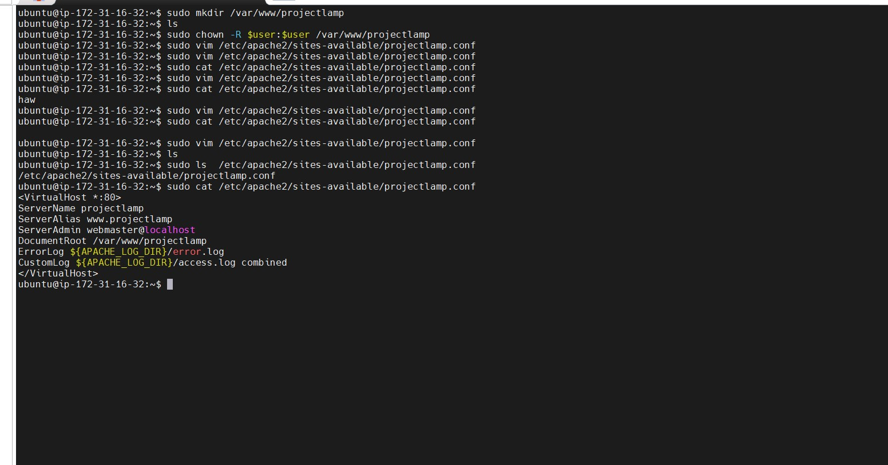

# Web stack(LAMP) Implimentation IN AWS

LAMP is an acronym that stands for four open-source software components commonly used to build dynamic websites and web applications:

- **Linux**: The operating system that provides the foundation for the server environment.
- **Apache HTTP Server**: The web server software that processes incoming requests from web browsers and delivers the requested content (HTML, images, etc.).
- **MySQL**: The relational database management system (RDBMS) that stores website data. MySQL offers a structured way to organize and manage website content, user information, application data, and more.
- **PHP (or Perl/Python)**: The server-side scripting language used to create dynamic web pages. PHP scripts can interact with the MySQL database to retrieve or manipulate data, generate customized content based on user input, and perform various server-side tasks. Perl and Python can also be used as alternatives in LAMP stacks, although PHP is the most common choice.

1. ### aws account setup and provisioning an Ubuntu Server

---

create Aws aacount to access aws console to run over all action Ec2
**EC2 Dashboard**


**Instance summary**


2. ### Connect to Ec2 Instance

---

First get private key[gashaw_key.pem] of EC2 instance server by download and give permission

```
chmod 400 "gashaw_key.pem"
```

The connect the instance using instance Public Ip Addresss

```
ssh -i melkamu_key.pem ubuntu@34.229.199.16
```


3. ### Install Apache and Updating Firewall

---

```
sudo apt update
```

```
sudo apt install apache2
```

**Verify Installation**

```
sudo systemctl status apache2
```


**Check acccess locally**

```
curl http://localhost:80
```

```
curl http://127.0.0.1:80
```

**Add Inbound Rule using Port 80**


**Test in browser using public IP Address**

```
http://3.88.103.206/
```


4. ### Installing MYSQL

---

```
sudo apt install mysql-server
```

**Login To MYSQL**

```
sudo mysql
```


Set a password for root user using mysql_native_password as default authentication method

```
ALTER USER 'root'@'localhost' IDENTIFIED WITH mysql_native_password BY 'PassWord.1';
```

Start the interactive script by running:

```
sudo mysql_secure_installation
```


5. ### Installing PHP

---

```
sudo apt  install php libapache2-mod-php  php-mysql
```

**Confirm php version**

```
php -v
```


6. ### Creating Virtual Host For Your Website using Apache

---

1. Create directory projectlamp inside /var/www

```
sudo mkdir /var/www/projectlamp

```

2. Give Ownerhip for current User

```
sudo chown -R $user:$user /var/www/projectlamp
```

3. Create Virtual Host Configuration File and edit using editor

```
sudo vim /etc/apache2/sites-available/projectlamp.conf
```



4. see available files in sites-available folder

```
sudo ls /etc/apache2/sites-available

```


5. Enable new virtual host

```
sudo a2ensite projectlamp

```

6. Disable default website

```
sudo a2dissite 000-default
```

7. Check Syntax error

```
sudo apache2ctl configtest
```


8. Reload Apache to change effect

```
sudo systemctl reload apache2
```

9. create index file to the root folder

```
sudo bash -c '
TOKEN=$(curl -X PUT "http://169.254.169.254/latest/api/token" -H "X-aws-ec2-metadata-token-ttl-seconds:21600")
HOSTNAME=$(curl -H "X-aws-ec2-metadata-token: $TOKEN" -S http://169.254.169.254/latest/meta-data/public-hostname)
IP=$(curl -H "X-aws-ec2-metadata-token: $TOKEN" -S http://169.254.169.254/latest/meta-data/public-ipv4)
echo "Hello LAMP from hostname $HOSTNAME with public IP $IP" > /var/www/projectlamp/index.html
'
```


10. Browse the website

[3.88.103.206 - Website URL](http://3.88.103.206/)

7. ### Enable PHP ON Website

---

**Change the behavior by edit dir.conf**

```
vim /etc/apache2/mods-enabled/dir.conf

```


**New updatedcode**


**system restart**

```
sudo systemctl reload apache2
```

**Create custom Php script for test**

```
 sudo vim /var/www/projectlamp/index.php

```


**Access using browser**


**Finally remove index.php file because it contain sensitive information**

```
sudo rm /var/www/projectlamp/index.php
```

## End of LAMP stack

The LAMP stack is a popular open-source web development platform that consists of four key components **Linux**, **Apache**, **MySQL (or MariaDB)**, and **PHP** (or Perl or Python). By following the above guideline you can set up and deploye a LAMP environment effectively in AWS Environment.
