LEMP is an open-source web application stack used to develop web applications. The term LEMP is an acronym that represents **L** for the Linux Operating system, Nginx (pronounced as engine-x, hence the **E** in the acronym) web server, **M** for MySQL database, and **P** for PHP scripting language.
## The LEMP stack is a combination of four open-source technologies that are used in web development. These technologies include:

- **Linux:** The operating system that runs the web server.
- **Nginx:** The web server software that handles HTTP requests.
- **MySQL:** The relational database management system that stores the website’s data.
- **PHP:** The programming language used to build dynamic web applications.

## Project 2: LEMP STACK Web Development
Project 2 covers similar concepts as Project 1 and help to cement your skill of deploying Web solutions using LA(E)MP stacks

**1. Launch instance in AWS Console**
The first step in implementing this project is launch an instance in AWS console

create an instance in the default region us-east-1 and enter instance name **LEMP STACK Web Server**

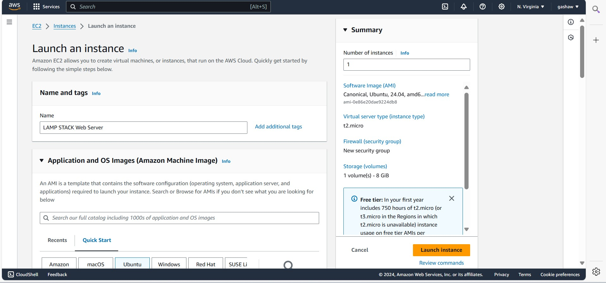
- Next we select ubuntu operating system for an instance
  
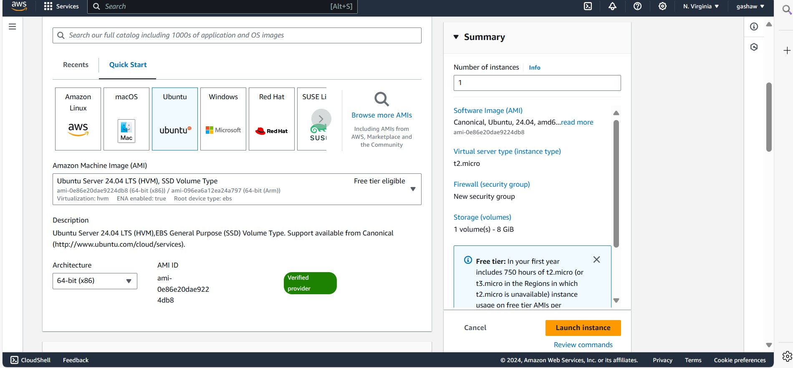

- Create or use existing  private key to log into the instance created
  
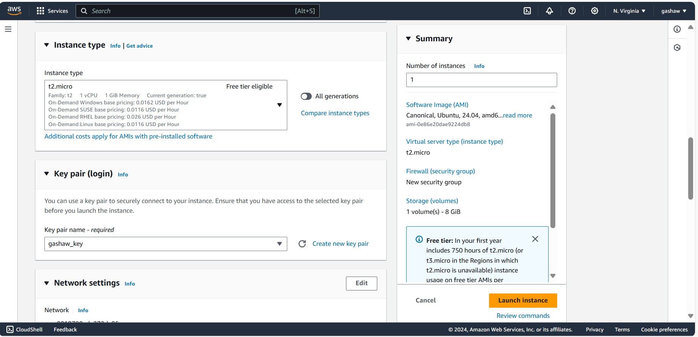

- Choose the **volume size** and **type** for the instance created

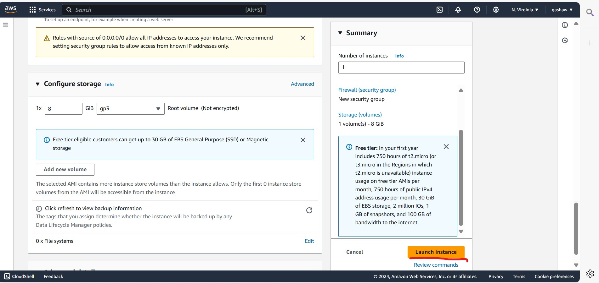

- Configuring the security group in AWS EC2
  
A security group in AWS acts as a virtual firewall for your EC2 instances. It controls both inbound and outbound traffic to ensure only the permitted traffic reaches your instance. Each EC2 instance must be associated with at least one security group. The security group rules can be customized to define the type of traffic that is allowed to connect to the instance, including protocols, ports, and IP addresses.

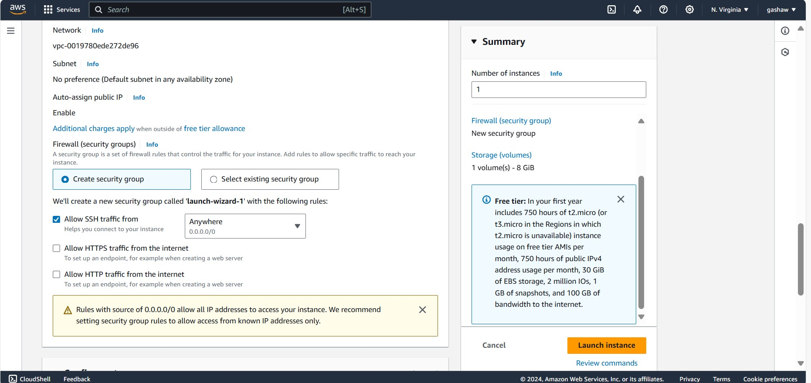

- View the status of instance created

  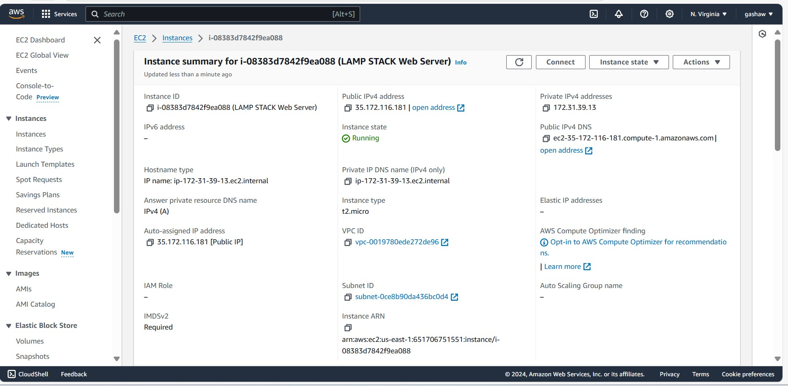
- View Instance Details

  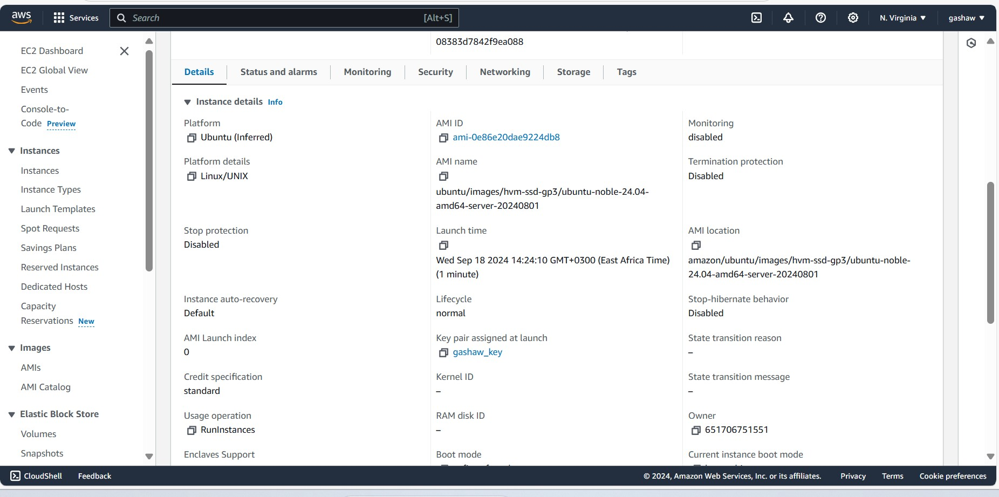
- Configuring Security Group with Specific Inbound Rules
  When setting up a security group for your EC2 instance, you can control which traffic reaches your instance through inbound rules.

For SSH (port 22), this rule allows secure shell access to your instance. By default, SSH is open to any IP address (0.0.0.0/0), which is useful for testing but insecure for production. It's recommended to restrict this access to trusted IPs to reduce exposure to unauthorized login attempts.

For HTTP (port 80), this rule allows web traffic from anywhere on the internet. This is essential if you're hosting a public-facing website or web service that users can access over HTTP.

For HTTPS (port 443), this rule enables secure web traffic. Like HTTP, HTTPS traffic is generally allowed from anywhere on the internet, ensuring encrypted access for your users. This is crucial for secure communication, especially for websites dealing with sensitive data.

By configuring these rules, your instance will allow SSH access for management and handle both HTTP and HTTPS traffic, making it accessible to the public while still maintaining necessary security measures.

  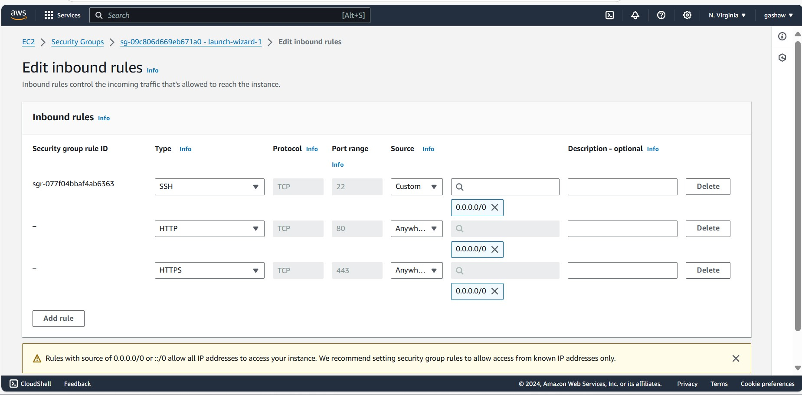
- Connect to instance from ssh client

   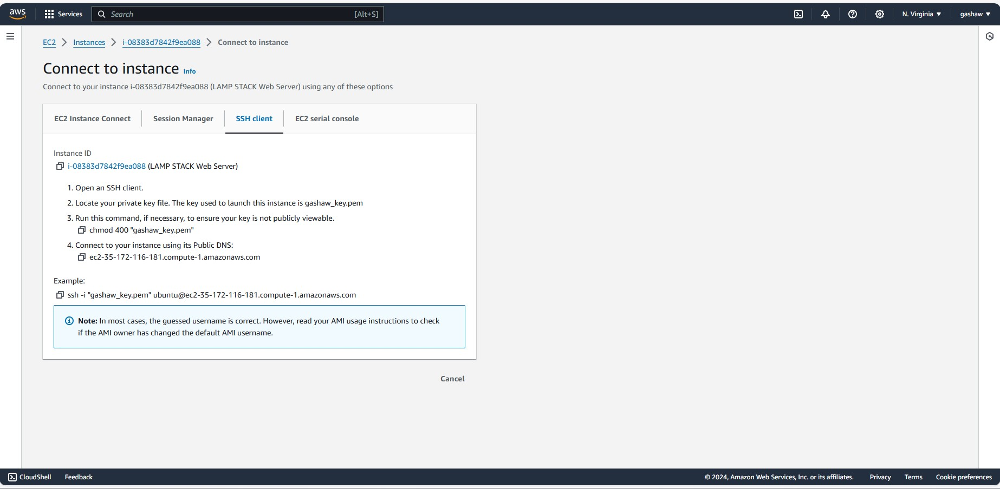
**Give Permission for the Private SSH Key**
  
  This command ensures that this  private SSH key has the correct permissions before using it to connect to your instance.

  ```
  chmod 400 "gashaw_key.pem"
  ```
**Connecting to the Instance via SSH**

Once the private key file has the correct permissions, you can use SSH to connect to your EC2 instance using its public IP address or domain name.
```
ssh -i "gashaw_key.pem" ubuntu@ec2-54-226-142-99.compute-1.amazonaws.com
```
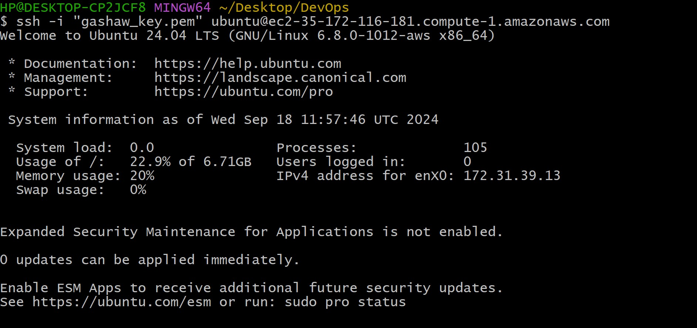

## Step 1 – Installing the Nginx Web Server
in order to display web pages to our site visitors, we are going to employ Nginx, a high-performance web server. We’ll use the apt package manager to install this package.

Since this is our first time using apt for this session, start off by updating your server’s package index. Following that, you can use apt install to get Nginx installed:

```
sudo apt update
```
```
sudo apt install nginx
```

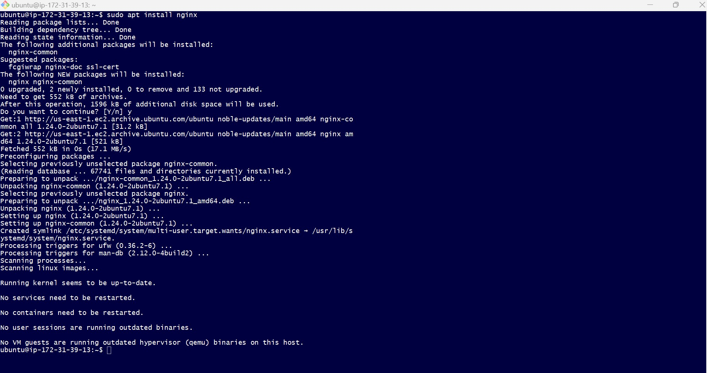
