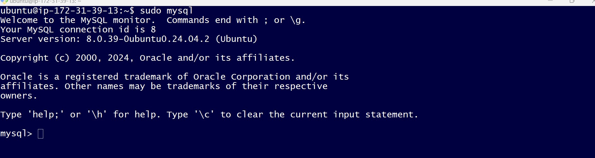

LEMP is an open-source web application stack used to develop web applications. The term LEMP is an acronym that represents **L** for the Linux Operating system, Nginx (pronounced as engine-x, hence the **E** in the acronym) web server, **M** for MySQL database, and **P** for PHP scripting language.
## The LEMP stack is a combination of four open-source technologies that are used in web development. These technologies include:

- **Linux:** The operating system that runs the web server.
- **Nginx:** The web server software that handles HTTP requests.
- **MySQL:** The relational database management system that stores the website’s data.
- **PHP:** The programming language used to build dynamic web applications.

## Project 2: LEMP STACK Web Development
Project 2 covers similar concepts as Project 1 and help to cement your skill of deploying Web solutions using LA(E)MP stacks

**1. Launch instance in AWS Console**
The first step in implementing this project is launch an instance in AWS console

create an instance in the default region us-east-1 and enter instance name **LEMP STACK Web Server**


- Next we select ubuntu operating system for an instance
  


- Create or use existing  private key to log into the instance created
  


- Choose the **volume size** and **type** for the instance created


- Configuring the security group in AWS EC2
  
A security group in AWS acts as a virtual firewall for your EC2 instances. It controls both inbound and outbound traffic to ensure only the permitted traffic reaches your instance. Each EC2 instance must be associated with at least one security group. The security group rules can be customized to define the type of traffic that is allowed to connect to the instance, including protocols, ports, and IP addresses.


- View the status of instance created

  
- View Instance Details

  
- Configuring Security Group with Specific Inbound Rules
  When setting up a security group for your EC2 instance, you can control which traffic reaches your instance through inbound rules.

For SSH (port 22), this rule allows secure shell access to your instance. By default, SSH is open to any IP address (0.0.0.0/0), which is useful for testing but insecure for production. It's recommended to restrict this access to trusted IPs to reduce exposure to unauthorized login attempts.

For HTTP (port 80), this rule allows web traffic from anywhere on the internet. This is essential if you're hosting a public-facing website or web service that users can access over HTTP.

For HTTPS (port 443), this rule enables secure web traffic. Like HTTP, HTTPS traffic is generally allowed from anywhere on the internet, ensuring encrypted access for your users. This is crucial for secure communication, especially for websites dealing with sensitive data.

By configuring these rules, your instance will allow SSH access for management and handle both HTTP and HTTPS traffic, making it accessible to the public while still maintaining necessary security measures.

  
- Connect to instance from ssh client

   
**Give Permission for the Private SSH Key**
  
  This command ensures that this  private SSH key has the correct permissions before using it to connect to your instance.

  ```
  chmod 400 "gashaw_key.pem"
  ```
**Connecting to the Instance via SSH**

Once the private key file has the correct permissions, you can use SSH to connect to your EC2 instance using its public IP address or domain name.
```
ssh -i "gashaw_key.pem" ubuntu@ec2-54-226-142-99.compute-1.amazonaws.com
```


## Step 1 – Installing the Nginx Web Server
in order to display web pages to our site visitors, we are going to employ Nginx, a high-performance web server. We’ll use the apt package manager to install this package.

Since this is our first time using apt for this session, start off by updating your server’s package index. Following that, you can use apt install to get Nginx installed:

```
sudo apt update
```
```
sudo apt install nginx
```


**verify that nginx was successfully installed and is running**

```
sudo systemctl status nginx
```


Our server is running and we can access it locally and from the Internet (Source 0.0.0.0/0 means 'from any IP address').

First, let us try to check how we can access it locally in our Ubuntu shell, run:
```
curl http://localhost:80
```


**or**
```
curl http://127.0.0.1:80
```


**est Our Nginx server on the Internet in browser using public ip address or domain name**

**Using public address [http://35.172.116.181/](http://35.172.116.181/)**


## Step 2— Installing MySQL
Now that you have a web server up and running, you need to install a Database Management System (DBMS) to be able to store and manage data for your site in a relational database. MySQL is a popular relational database management system used within PHP environments, so we will use it in our project.

Again, use 'apt' to acquire and install this software:

```
sudo apt install mysql-server
```


**log in to the MySQL console by typing:**

```
sudo mysql
```



Set a password for the root user, using mysql_native_password as default authentication method. We’re defining this user’s password as **PassWord.1**.

```
ALTERUSER'root'@'localhost' IDENTIFIED WITH mysql_native_password BY'PassWord.1';
```
Exit the MySQL shell with:

```
exit
```

Start the interactive script by running:

```
sudo mysql_secure_installation
```


When you’re finished, test if you’re able to log in to the MySQL console by typing:

```
sudo mysql -p
```


Exit the MySQL console, type:

```
exit
```

## Step 3– Installing PHP
Nginx is installed to serve your content and MySQL installed to store and manage your data. Now you can install PHP to process code and generate dynamic content for the web server.

While Apache embeds the PHP interpreter in each request, Nginx requires an external program to handle PHP processing and act as a bridge between the PHP interpreter itself and the web server. This allows for a better overall performance in most PHP-based websites, but it requires additional configuration. You’ll need to install php-fpm, which stands for “PHP fastCGI process manager”, and tell Nginx to pass PHP requests to this software for processing. Additionally, you’ll need php-mysql, a PHP module that allows PHP to communicate with MySQL-based databases. Core PHP packages will automatically be installed as dependencies.

**To install these 2 packages at once, run:**

```
sudo apt install php-fpm php-mysql
```
**Verify instalation using the command** 

```
php -v
```


## Step 4 — Configuring Nginx to Use PHP Processor

When using the Nginx web server, we can create server blocks (similar to virtual hosts in Apache) to encapsulate configuration details and host more than one domain on a single server. 

**Create the root web directory for your_domain as follows:**

```
sudo mkdir /var/www/projectLEMP
```


- assign ownership of the directory with the $USER environment variable, which will reference your current system user:

```
sudo chown -R $USER:$USER /var/www/projectLEMP
```
- open a new configuration file in Nginx’s sites-available directory using your preferred nano editor.

```
sudo nano /etc/nginx/sites-available/projectLEMP
```
- Paste in the following bare-bones configuration in nano editor

```
#/etc/nginx/sites-available/projectLEMP

server {
    listen 80;
    server_name projectLEMP www.projectLEMP;
    root /var/www/projectLEMP;

    index index.html index.htm index.php;

    location / {
        try_files $uri $uri/ =404;
    }

    location ~ \.php$ {
        include snippets/fastcgi-php.conf;
        fastcgi_pass unix:/var/run/php/php8.3-fpm.sock;
     }

    location ~ /\.ht {
        deny all;
    }

}
```


**Here’s what each of these directives and location blocks do:**

- **listen** — Defines what port Nginx will listen on. In this case, it will listen on port 80, the default port for HTTP.
- **root** — Defines the document root where the files served by this website are stored.
- **index** — Defines in which order Nginx will prioritize index files for this website. It is a common practice to list index.html files with a higher precedence than index.php files to allow for quickly setting up a maintenance landing page in PHP applications. You can adjust these settings to better suit your application needs.
- **server_name** — Defines which domain names and/or IP addresses this server block should respond for. Point this directive to your server’s domain name or public IP address.
- **location /** — The first location block includes a try_files directive, which checks for the existence of files or directories matching a URI request. If Nginx cannot find the appropriate resource, it will return a 404 error.
- **location ~ \.php$**— This location block handles the actual PHP processing by pointing Nginx to the fastcgi-php.conf configuration file and the php7.4-fpm.sock file, which declares what socket is associated with php-fpm.
- **location ~ /\.ht** — The last location block deals with .htaccess files, which Nginx does not process. By adding the deny all directive, if any .htaccess files happen to find their way into the document root ,they will not be served to visitors.

**Activate the configuration by linking to the config file from Nginx’s sites-enabled directory**

```
sudo ln -s /etc/nginx/sites-available/projectLEMP /etc/nginx/sites-enabled/
```
- Test  configuration for syntax errors by typing the following command


- Disable default Nginx host that is currently configured to listen on port 80, for this run:

```
sudo unlink /etc/nginx/sites-enabled/default
```
-  Reload Nginx to apply the changes:

```
sudo systemctl reload nginx
```
- Your new website is now active, but the web root /var/www/projectLEMP is still empty. Create an index.html file in that location so that we can test that your new server block works as expected:

```
sudo echo 'Hello LEMP from hostname' $(TOKEN=`curl -X PUT "http://169.254.169.254/latest/api/token" -H "X-aws-ec2-metadata-token-ttl-seconds: 21600"` && curl -H "X-aws-ec2-metadata-token: $TOKEN" -s http://169.254.169.254/latest/meta-data/public-hostname) 'with public IP' $(TOKEN=`curl -X PUT "http://169.254.169.254/latest/api/token" -H "X-aws-ec2-metadata-token-ttl-seconds: 21600"` && curl -H "X-aws-ec2-metadata-token: $TOKEN" -s http://169.254.169.254/latest/meta-data/public-ipv4) > /var/www/projectLEMP/index.html
```

- open your website URL using IP address:

```
http://35.172.116.181:80
```


**Or using public DNS name**

```
http://ec2-100-24-55-126.compute-1.amazonaws.com/
```


## Step 5 – Testing PHP with Nginx

- Create a test PHP file in your document root. Open a new file called info.php within your document root in your text editor:

```
nano /var/www/projectLEMP/info.php
```

- Type or paste the following lines into the new file. This is valid PHP code that will return information about your server:

```
<?php
phpinfo();
```


- Access this page in the web browser by visiting the domain name or public IP address we’ve set up in your Nginx configuration file, followed by /info.php:

```

````


- Remove the file you created as it contains sensitive information about your PHP environment and your Ubuntu server. You can use rm to remove that file:

```
sudo rm /var/www/your_domain/info.php
```


