# MERN Stack Development

**MERN** stack development is a full-stack web development approach using **MongoDB**, **Express.js**, **React**, and **Node.js**, all based on JavaScript. MongoDB serves as the NoSQL database, while Express.js and Node.js handle the server-side logic, with React powering the dynamic user interface. 

This stack allows developers to build modern, scalable applications with a unified language, streamlining development across both frontend and backend. It is highly suitable for building single-page applications, offering efficiency through reusable React components, and enabling high performance with the asynchronous nature of Node.js.

## MERN Web Stack Components:

- **MongoDB**: A document-based, No-SQL database used to store application data in the form of documents.
- **Express.js**: A server-side web application framework for Node.js.
- **React.js**: A frontend framework developed by Facebook, based on JavaScript, used to build User Interface (UI) components.
- **Node.js**: A JavaScript runtime environment, used to run JavaScript on a machine rather than in a browser.

## Key Benefits:
- Single language (JavaScript) across the stack.
- Highly scalable and suitable for modern web applications.
- Efficient, with reusable React components and an asynchronous, event-driven backend.

## Getting Started a MERN STACK Project

**1. Launch instance in AWS Console**
The first step in implementing this project is to launch an instance in the AWS Console.

create an instance in the default region us-east-1 and enter instance name **MERN STACK WEB SERVER**

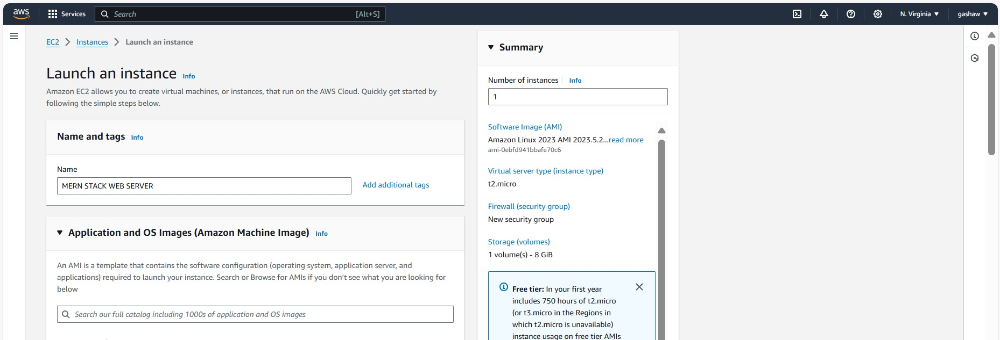
- Next we select ubuntu operating system for an instance
  
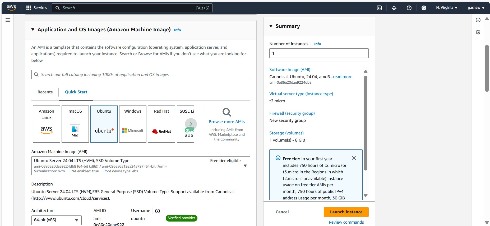

- Create or use existing  private key pair to log into the instance created
  
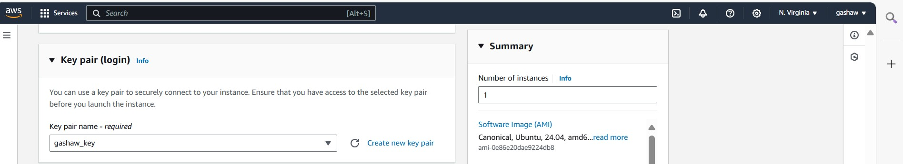

- Choose the **volume size** and **type** for the instance created

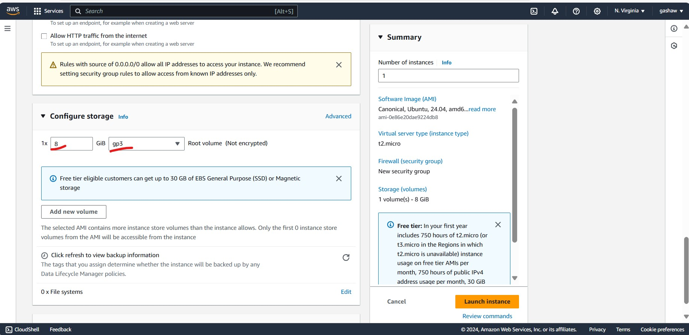

- Configuring the security group in AWS EC2
  
A security group in AWS acts as a virtual firewall for your EC2 instances. It controls both inbound and outbound traffic to ensure only the permitted traffic reaches your instance. Each EC2 instance must be associated with at least one security group. The security group rules can be customized to define the type of traffic that is allowed to connect to the instance, including protocols, ports, and IP addresses.

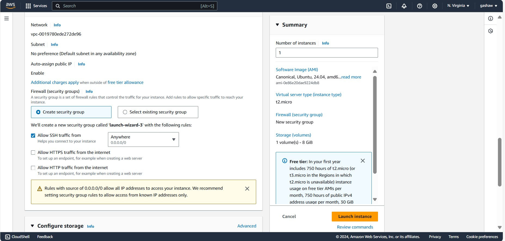

- View the status of instance created

  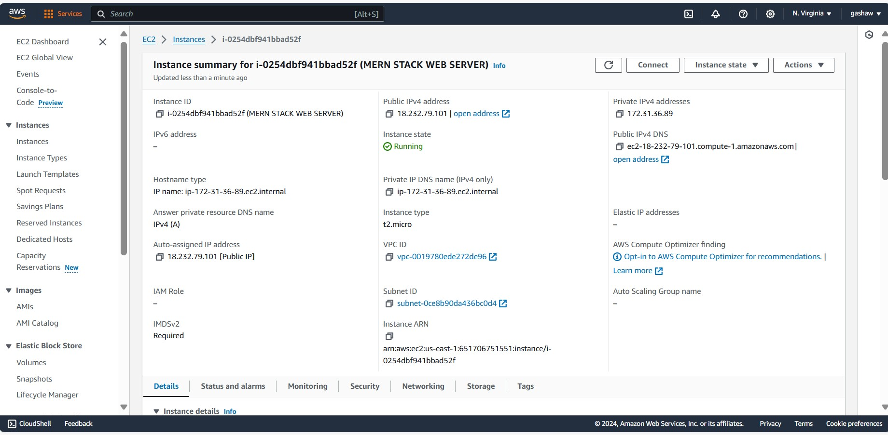

- View Instance Details

  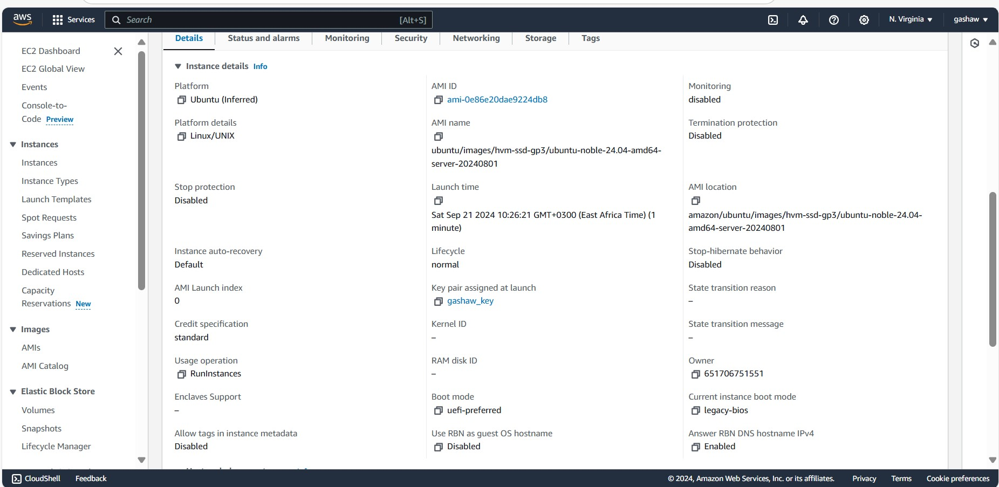

- Configuring Security Group with Specific Inbound Rules
  When setting up a security group for your EC2 instance, you can control which traffic reaches your instance through inbound rules.

For SSH (port 22), this rule allows secure shell access to your instance. By default, SSH is open to any IP address (0.0.0.0/0), which is useful for testing but insecure for production. It's recommended to restrict this access to trusted IPs to reduce exposure to unauthorized login attempts.

For HTTP (port 80), this rule allows web traffic from anywhere on the internet. This is essential if you're hosting a public-facing website or web service that users can access over HTTP.

For HTTPS (port 443), this rule enables secure web traffic. Like HTTP, HTTPS traffic is generally allowed from anywhere on the internet, ensuring encrypted access for your users. This is crucial for secure communication, especially for websites dealing with sensitive data.

By configuring these rules, your instance will allow SSH access for management and handle both HTTP and HTTPS traffic, making it accessible to the public while still maintaining necessary security measures.

  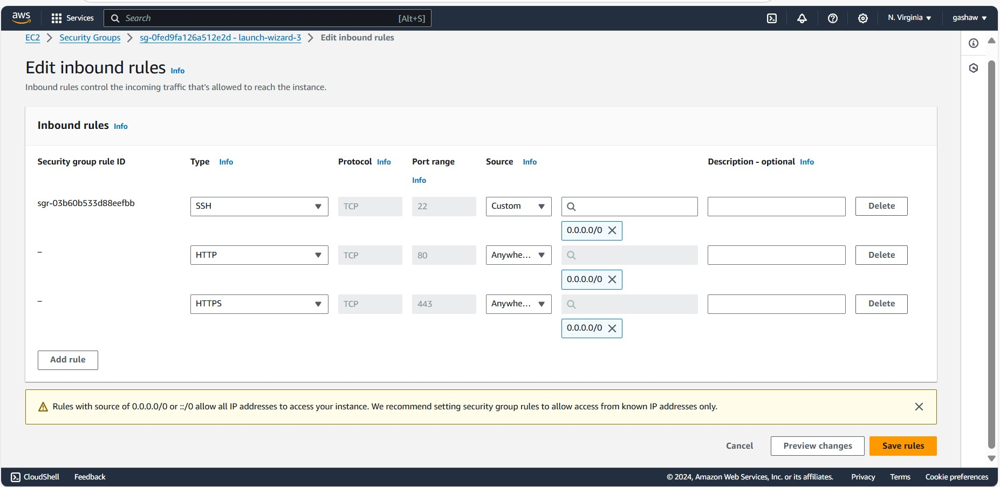
- Connect to instance from ssh client

   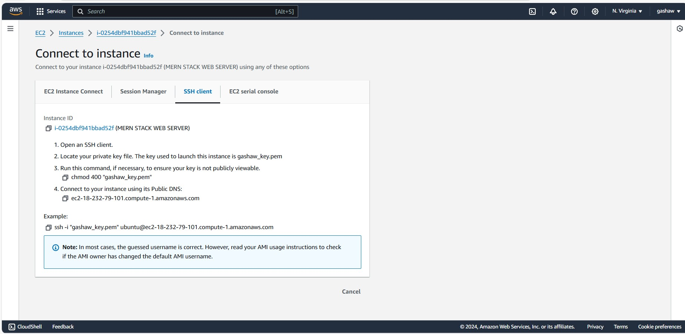
**Give Permission for the Private SSH Key**
  
  This command ensures that this  private SSH key has the correct permissions before using it to connect to your instance.

  ```
  chmod 400 "gashaw_key.pem"
  ```
  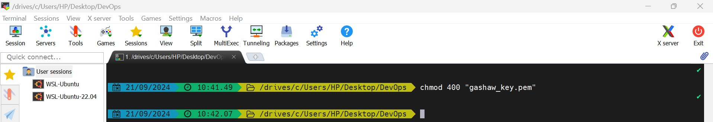
**Connecting to the Instance via SSH**

Once the private key file has the correct permissions, you can use SSH to connect to your EC2 instance using its public IP address or domain name.
```
ssh -i "gashaw_key.pem" ubuntu@ec2-54-226-142-99.compute-1.amazonaws.com
```
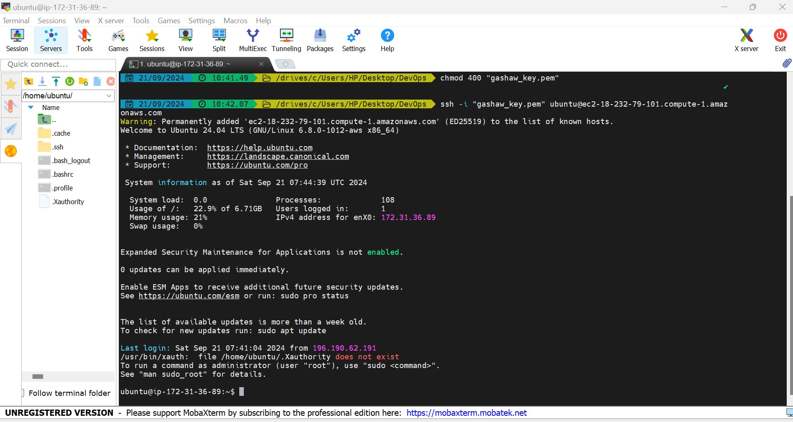
## Step 1 - Backend configuration
- Update ubuntu

```
sudo apt update
```

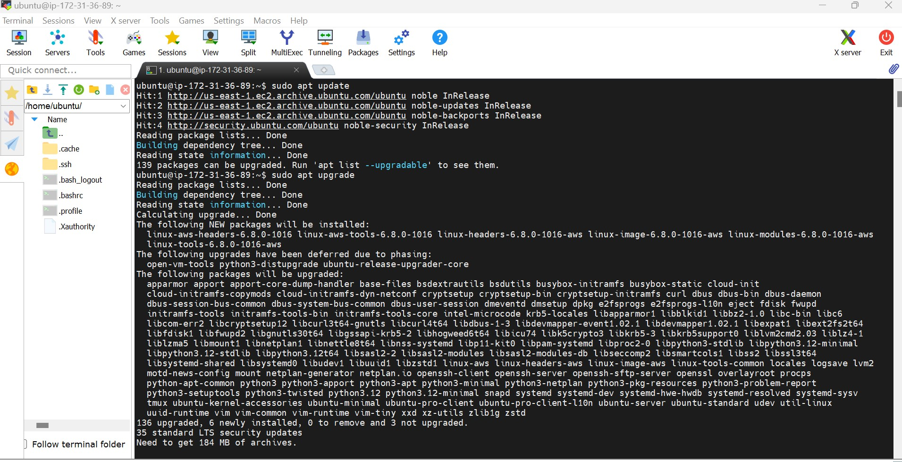


Lets get the location of Node.js software from Ubuntu repositories.

```
curl -fsSL https://deb.nodesource.com/setup_18.x | sudo -E bash -
```

- **Install Node.js on the server**

```
sudo apt-get install -y nodejs
```
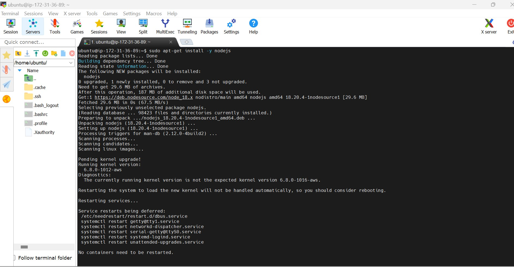

- Verify the node installation with the command below
```
node -v 
```

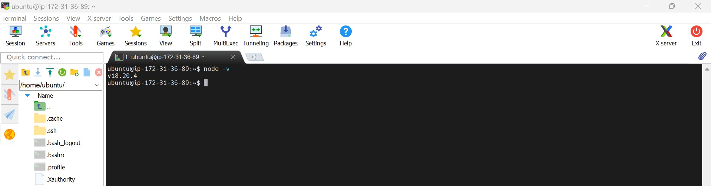

 - **Application Code Setup**

Create a new directory for your To-Do project:

```
mkdir Todo
```

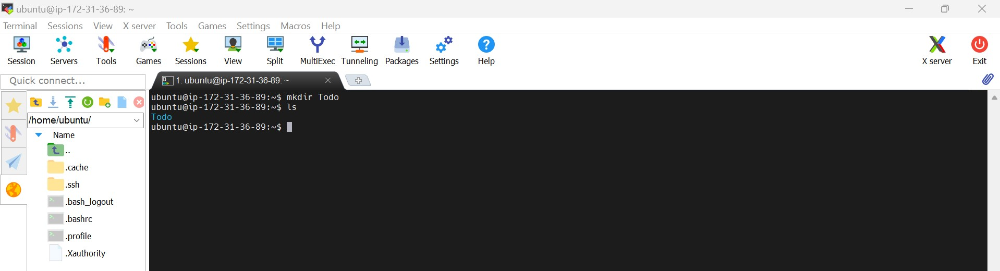

Now change your current directory to the newly created one:

```
 cd Todo
 ```

Next, you will use the command npm init to initialise your project, so that a new file named package.json will be created. This file will normally contain information about your application and the dependencies that it needs to run. Follow the prompts after running the command. You can press Enter several times to accept default values, then accept to write out the package.json file by typing yes.

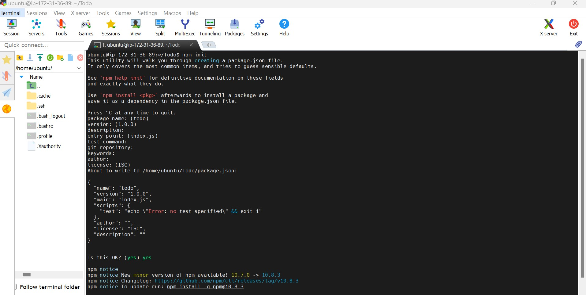

## Install ExpressJS

Express.js is a lightweight and flexible web application framework for Node.js, designed to simplify building server-side applications and APIs. It offers features for handling routing, middleware, and HTTP requests, making it ideal for creating scalable and efficient web applications.

- To use express, install it using npm:

```
npm install express
```
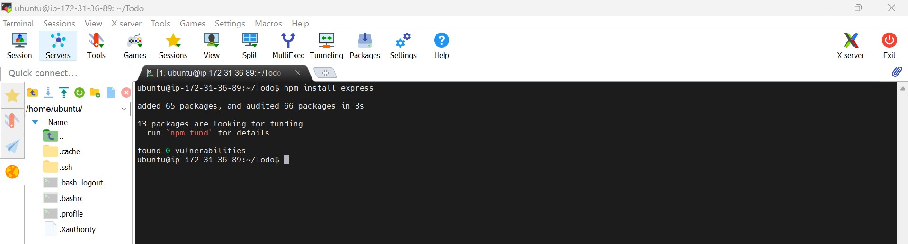

- Create a file **index.js** with the command below

```
 touch index.js
```
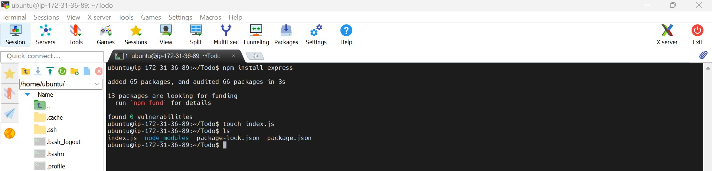

- Install the dotenv module

```
npm install dotenv
```
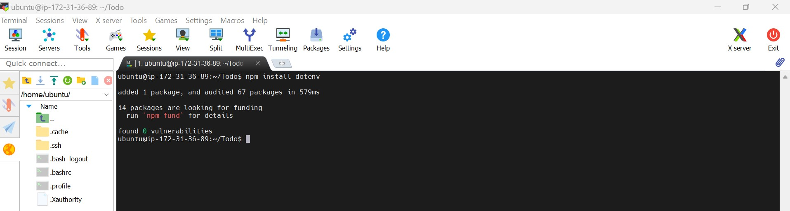

