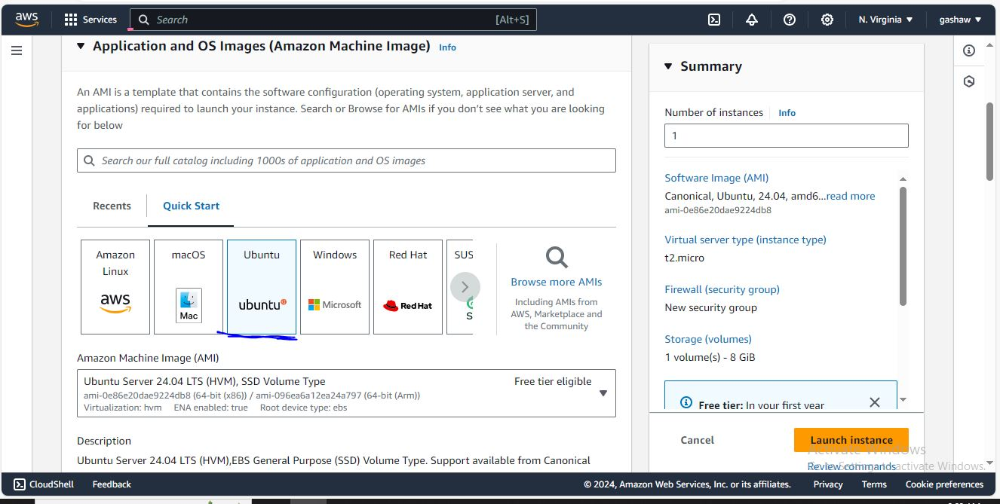
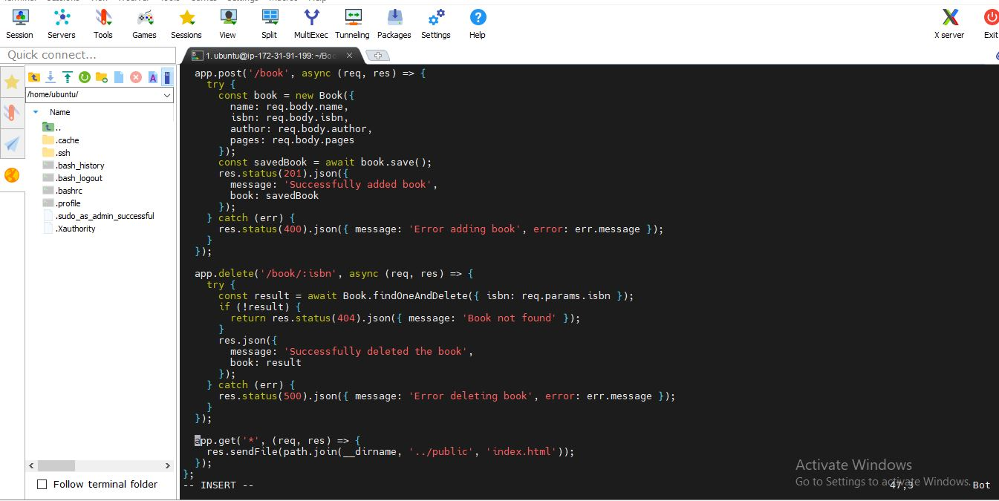

# MEAN Stack Development

The **MEAN** stack is a full-stack web development framework consisting of **MongoDB**, **Express.js**, **Angular**, and **Node.js**, all based on JavaScript. MongoDB serves as the NoSQL database, while Express.js and Node.js manage the server-side logic, with Angular providing the dynamic front-end interface.

This stack enables developers to build modern, scalable applications using a single language for both front-end and back-end, streamlining the development process. It is particularly suitable for developing single-page applications, leveraging Angular's two-way data binding for efficient UI updates and Node.js's asynchronous nature for improved performance.

## MEAN Web Stack Components: 

- **MongoDB:** A document-based, NoSQL database used to store application data in the form of documents.
- **Express.js:** A server-side web application framework for Node.js.
- **Angular:** A frontend framework developed by Google, based on TypeScript, used to build dynamic and responsive User Interface (UI) components.
- **Node.js:** A JavaScript runtime environment used to run JavaScript on a machine rather than in a browser.

## Key Benefits:
- Single language (JavaScript) across the stack.
- Highly scalable and suitable for modern web applications.
- Efficient, with Angular's two-way data binding for seamless UI updates and an asynchronous, event-driven backend using Node.js.

## Getting Started a MEAN STACK Project

**1. Launch instance in AWS Console**
The first step in implementing this project is to launch an instance in the AWS Console.

create an instance in the default region us-east-1 and enter instance name **MEAN STACK WEB SERVER**


- Next we select ubuntu operating system for an instance
  


- Create or use existing  private key pair to log into the instance created
  


- Choose the **volume size** and **type** for the instance created


- Configuring the security group in AWS EC2
  
A security group in AWS acts as a virtual firewall for your EC2 instances. It controls both inbound and outbound traffic to ensure only the permitted traffic reaches your instance. Each EC2 instance must be associated with at least one security group. The security group rules can be customized to define the type of traffic that is allowed to connect to the instance, including protocols, ports, and IP addresses.


- View the status of instance created

  

- View Instance Details

  

- Configuring Security Group with Specific Inbound Rules
  When setting up a security group for your EC2 instance, you can control which traffic reaches your instance through inbound rules.

For SSH (port 22), this rule allows secure shell access to your instance. By default, SSH is open to any IP address (0.0.0.0/0), which is useful for testing but insecure for production. It's recommended to restrict this access to trusted IPs to reduce exposure to unauthorized login attempts.

For HTTP (port 80), this rule allows web traffic from anywhere on the internet. This is essential if you're hosting a public-facing website or web service that users can access over HTTP.

For HTTPS (port 443), this rule enables secure web traffic. Like HTTP, HTTPS traffic is generally allowed from anywhere on the internet, ensuring encrypted access for your users. This is crucial for secure communication, especially for websites dealing with sensitive data.

By configuring these rules, your instance will allow SSH access for management and handle both HTTP and HTTPS traffic, making it accessible to the public while still maintaining necessary security measures.

  


**Give Permission for the Private SSH Key**
  
  This command ensures that this  private SSH key has the correct permissions before using it to connect to your instance.

  ```
  chmod 400 "gashaw_key.pem"
  ```
  
**Connecting to the Instance via SSH**

Once the private key file has the correct permissions, you can use SSH to connect to your EC2 instance using its public IP address or domain name.
```
ssh -i "gashaw_key.pem" ubuntu@ec2-54-226-142-99.compute-1.amazonaws.com
```


## Step 1 - Install NodeJs

- Update ubuntu

```
sudo apt update
```


- Upgrade Ubuntu

```
 sudo apt upgrade
```


- Add Certificates

```
sudo apt -y install curl dirmngr apt-transport-https lsb-release ca-certificates
```


Lets get the location of Node.js software from Ubuntu repositories.

```
curl -sL https://deb.nodesource.com/setup_18.x | sudo -E bash -
```


- **Install Node.js on the server**

```
sudo apt install -y nodejs
```


- Verify the node installation with the command below

```
node -v 
```

## Step 2: Install MongoDB

MongoDB stores data in flexible, JSON-like documents. Fields in a database can vary from document to document and data structure can be changed over time. For our example application, we are adding book records to MongoDB that contain book name, isbn number, author, and number of pages.

- **Install GnuPG and Curl**

This command installs essential tools for handling GPG keys and transferring data:

```
sudo apt-get install -y gnupg curl
```


- **Download and Store MongoDB GPG Key**

This command downloads MongoDB’s GPG key and stores it securely for use in package verification:

```
curl -fsSL https://www.mongodb.org/static/pgp/server-7.0.asc | sudo gpg -o /usr/share/keyrings/mongodb-server-7.0.gpg --dearmor
```


The command below adds the MongoDB repository to your system's package manager sources, enabling the installation and updates of MongoDB packages.

```
echo "deb [ arch=amd64,arm64 signed-by=/usr/share/keyrings/mongodb-server-7.0.gpg ] https://repo.mongodb.org/apt/ubuntu jammy/mongodb-org/7.0 multiverse" | sudo tee /etc/apt/sources.list.d/mongodb-org-7.0.list
```


- Install MongoDB

```
sudo apt-get install -y mongodb-org
```


- Start The server

```
sudo systemctl start mongod

```


- Verify that the service is up and running

```
sudo systemctl status mongod
```


- Install [npm](https://www.npmjs.com) - Node package manager.


```
sudo apt install -y npm
```


- Install 'body-parser package

We need 'body-parser' package to help us process JSON files passed in requests to the server.

```
sudo npm install body-parser
```


- Create a folder named 'Books'

```
mkdir Books && cd Books

```


- In the Books directory, Initialize npm project

```
npm init
```


- Add a file to it named server.js

```
vim server.js

```


- Copy and paste the web server code below into the server.js file.

```
const express = require('express');
const bodyParser = require('body-parser');
const mongoose = require('mongoose');
const path = require('path');

const app = express();
const PORT = process.env.PORT || 3300;

// MongoDB connection
mongoose.connect('mongodb://localhost:27017/test', {
  useNewUrlParser: true,
  useUnifiedTopology: true,
})
.then(() => console.log('MongoDB connected'))
.catch(err => console.error('MongoDB connection error:', err));

app.use(express.static(path.join(__dirname, 'public')));
app.use(bodyParser.json());

require('./apps/routes')(app);

app.listen(PORT, () => {
  console.log(`Server up: http://localhost:${PORT}`);
});

```


## Step 3: Install Express and set up routes to the server

Express is a minimal and flexible Node.js web application framework that provides features for web and mobile applications. We will use Express in to pass book information to and from our MongoDB database.

We also will use Mongoose package which provides a straight-forward, schema-based solution to model your application data. We will use Mongoose to establish a schema for the database to store data of our book register.

```
sudo npm install express mongoose

```


- In 'Books' folder, create a folder named apps

```
mkdir apps && cd apps
```


- Create a file named routes.js

```
vim  routes.js
```


- Copy and paste the code below into routes.js

```
const Book = require('./models/book');
const path = require('path');

module.exports = function(app) {
  app.get('/book', async (req, res) => {
    try {
      const books = await Book.find();
      res.json(books);
    } catch (err) {
      res.status(500).json({ message: 'Error fetching books', error: err.message });
    }
  });

  app.post('/book', async (req, res) => {
    try {
      const book = new Book({
        name: req.body.name,
        isbn: req.body.isbn,
        author: req.body.author,
        pages: req.body.pages
      });
      const savedBook = await book.save();
      res.status(201).json({
        message: 'Successfully added book',
        book: savedBook
      });
    } catch (err) {
      res.status(400).json({ message: 'Error adding book', error: err.message });
    }
  });

  app.delete('/book/:isbn', async (req, res) => {
    try {
      const result = await Book.findOneAndDelete({ isbn: req.params.isbn });
      if (!result) {
        return res.status(404).json({ message: 'Book not found' });
      }
      res.json({
        message: 'Successfully deleted the book',
        book: result
      });
    } catch (err) {
      res.status(500).json({ message: 'Error deleting book', error: err.message });
    }
  });

  app.get('*', (req, res) => {
    res.sendFile(path.join(__dirname, '../public', 'index.html'));
  });
};

```



- In the **apps** folder, create a folder named models

```
mkdir models && cd models
```


- Create a file named book.js

```
vim book.js
```


- Copy and paste the code below into **book.js**

```
const mongoose = require('mongoose');

const bookSchema = new mongoose.Schema({
  name: { type: String, required: true },
  isbn: { type: String, required: true, unique: true, index: true },
  author: { type: String, required: true },
  pages: { type: Number, required: true, min: 1 }
}, {
  timestamps: true
});

module.exports = mongoose.model('Book', bookSchema);
```


## Step 4 - Access the routes with AngularJS

AngularJS provides a web framework for creating dynamic views in your web applications. In this tutorial, we use AngularJS to connect our web page with Express and perform actions on our book register.

- Change the directory back to **Books**

```
cd ../..

```

- Create a folder named public

```
mkdir public && cd public
```


- Add a file named script.js

```
vim  script.js
```


- Copy and paste the Code below (controller configuration defined) into the script.js file.

```
angular.module('myApp', [])
  .controller('myCtrl', function($scope, $http) {
    function fetchBooks() {
      $http.get('/book')
        .then(response => {
          $scope.books = response.data;
        })
        .catch(error => {
          console.error('Error fetching books:', error);
        });
    }

    fetchBooks();

    $scope.del_book = function(book) {
      $http.delete(`/book/${book.isbn}`)
        .then(() => {
          fetchBooks();
        })
        .catch(error => {
          console.error('Error deleting book:', error);
        });
    };

    $scope.add_book = function() {
      const newBook = {
        name: $scope.Name,
        isbn: $scope.Isbn,
        author: $scope.Author,
        pages: $scope.Pages
      };

      $http.post('/book', newBook)
        .then(() => {
          fetchBooks();
          // Clear form fields
          $scope.Name = $scope.Isbn = $scope.Author = $scope.Pages = '';
        })
        .catch(error => {
          console.error('Error adding book:', error);
        });
    };
  });
```


- In **public** folder, create a file named **index.html**

```
vi index.html
```


- Cpoy and paste the code below into index.html file.

```
<!DOCTYPE html>
<html ng-app="myApp" ng-controller="myCtrl">
<head>
  <meta charset="UTF-8">
  <meta name="viewport" content="width=device-width, initial-scale=1.0">
  <title>Book Management</title>
  <script src="https://ajax.googleapis.com/ajax/libs/angularjs/1.8.2/angular.min.js"></script>
  <script src="script.js"></script>
  <style>
    body { font-family: Arial, sans-serif; margin: 20px; }
    table { border-collapse: collapse; width: 100%; }
    th, td { border: 1px solid #ddd; padding: 8px; text-align: left; }
    th { background-color: #f2f2f2; }
    input[type="text"], input[type="number"] { width: 100%; padding: 5px; }
    button { margin-top: 10px; padding: 5px 10px; }
  </style>
</head>
<body>
  <h1>Book Management</h1>
  
  <h2>Add New Book</h2>
  <form ng-submit="add_book()">
    <table>
      <tr>
        <td>Name:</td>
        <td><input type="text" ng-model="Name" required></td>
      </tr>
      <tr>
        <td>ISBN:</td>
        <td><input type="text" ng-model="Isbn" required></td>
      </tr>
      <tr>
        <td>Author:</td>
        <td><input type="text" ng-model="Author" required></td>
      </tr>
      <tr>
        <td>Pages:</td>
        <td><input type="number" ng-model="Pages" required></td>
      </tr>
    </table>
    <button type="submit">Add Book</button>
  </form>

  <h2>Book List</h2>
  <table>
    <thead>
      <tr>
        <th>Name</th>
        <th>ISBN</th>
        <th>Author</th>
        <th>Pages</th>
        <th>Action</th>
      </tr>
    </thead>
    <tbody>
      <tr ng-repeat="book in books">
        <td>{{book.name}}</td>
        <td>{{book.isbn}}</td>
        <td>{{book.author}}</td>
        <td>{{book.pages}}</td>
        <td><button ng-click="del_book(book)">Delete</button></td>
      </tr>
    </tbody>
  </table>
</body>
</html>
```


- Change the directory back up to 'Books'

```
cd ..
```


- Start the server by running this command:

```
node server.js
```


The server is now up and running, we can connect it via port 3300. You can launch a separate Putty or SSH console to test what curl command returns locally.

```
curl -s http://localhost:3300
```


For this - you need to open TCP port 3300 in your AWS Web Console for your EC2 Instance.


Now we can access our Book Register web application from the Internet with a browser using Public IP address or Public DNS name.

> - Quick reminder how to get your server's Public IP and public DNS name:

> -  You can find it in your AWS web console in EC2 details or Run
>   
**For Public IP address** 
```
curl -s http://169.254.169.254/latest/meta-data/public-ipv4
``` 
**For Public DNS name**
```
curl -s http://169.254.169.254/latest/meta-data/public-hostname
```
## This is how our Book Register Application will look like in browser:


- Insert and Retrieve Data in Angular App


## Conclusion for MEAN Stack Mini Project on AWS

In this project, we developed and deployed a simple Book Register Application using the MEAN stack:

- **Frontend:** Built with Angular.js for a dynamic user interface.
- **Backend:** Implemented using Express.js to handle server-side logic.
- **Database:** Utilized MongoDB for efficient data storage.

Deployed on an Ubuntu 24.04 (amd64) server on AWS, the application demonstrated scalability and reliability. This mini project highlighted the benefits of the MEAN stack and cloud deployment, providing a solid foundation in full-stack development and AWS practices.


