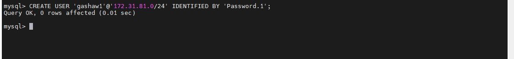

# Client-Server Architecture with MySQL
# Understanding Client-Server Architecture

**Client-server** architecture is a computing model where **clients** (user devices) request services, and **servers** (powerful machines or programs) provide them. 

**Clients** handle user interactions, while **servers** process data and manage resources. Communication follows a request-response model, with clients sending requests (e.g., web page, file), and servers responding with the needed information. This scalable model is widely used in web applications, email systems, and distributed computing.


In the **client-server** architecture with **MYSQL**, our Web Server has a role of a `Client` that connects and reads/writes to/from a Database (DB) Server (MySQL, MongoDB, Oracle, SQL Server or any other), and the communication between them happens over a Local Network (it can also be Internet connection, but it is a common practice to place Web Server and DB Server close to each other in local network).

# TASK - Implement a Client Server Architecture using MySQL Database Management System (DBMS).

To demonstrate a basic client-server using MySQL RDBMS, follow the below instructions

## 1. Create and configure two Linux-based virtual servers (EC2 instances in AWS)

- **Server A** name  `mysql server`

- **Server B** name - `mysql client`

**Let us see how to create mysql server and follow same steps too create mysql client server**
- **Log to aws account console and create EC2 instance of t2.micro type with Ubuntu 24.04 LTS (HVM) Server launch in the default region us-east-1. name instance mysql server**
   


- **Application and OS Images select Ubuntu free tire eligable version for Mysql Server**


- **Create new key pair or select existing key for Server**


- **Network setting create new security group or use existing security group For Server**


- **Configure Storage and launch the instance For Server**


- **View Instance of Mysql Server**

   

- **Instance Details for MYSQL server**


- **Configure security group with the following inbound rules: for Server**
   
- Allow traffic on port 22 (SSH) with source from any IP address.
- Allow traffic on port 3306  with source from mysql client IP address 172.31.16.13 . 

  

### For **Server B** name - `mysql client` follow same steps  to launch instance and our final instance detail looks like this 

- View Client Instance(Mysql_client)


- View Client Instance Details (Mysql_client)


**Now that both servers are running, we can proceed with our client-server architecture tasks.**


## 2. On mysql server Linux Server(Server A)** install MySQL Server software.
> Interesting fact: MySQL is an open-source relational database management system. Its name is a combination of `My`, the name of co-founder Michael Widenius's daughter, and `SQL`, the abbreviation for Structured Query Language.


  1.1.  Run sudo apt update -y for latest updates on server
  
  ``` 
  sudo apt update -y
  ```


    
  1.2.  Install MySQL Server software
    
  ```
  sudo apt install mysql-server
  ```


1.3 Start server

```
sudo systemctl enable mysql
```


1.4.  Check the status to ensure it is running

```
sudo systemctl status mysql
```   

 
## 3. On mysql client Linux Server install MySQL Client software.

1.1.  Run sudo apt update -y for latest updates on server
 
  ``` 
  sudo apt update -y
  ```


    
1.2.  Install MySQL Client software
    
  ```
  sudo apt install mysql-client
  ```


   
4. By default, both of our EC2 virtual servers are located in the same local virtual network. So they can communicate to each other using local IP addresses.

 Use mysql server's local IP address to connect from mysql client. MySQL server uses TCP port 3306 by default so  we will have to open it by creating a new `Inbound rules` in `mysql server` Security Groups.

> For extra security, do not allow all IP addresses to reach your `mysql server` - allow access only to the specific local IP address of your `mysql client`.


5. You might need to configure **MySQL server** to allow connections from remote hosts and replace the following line:bind-address = `127.0.0.1`  with the following line bind-address = `0.0.0.0`
   
```
sudo vim /etc/mysql/mysql.conf.d/mysqld.cnf
```


`
place '127.0.0.1' to '0.0.0.0' like this:
`


**Creating a Dedicated MySQL User and Granting Privileges**

- Create user from any host
```
CREATE USER 'gashity'@'%' IDENTIFIED BY 'Password.1';
```


- Create user from specific single host `172.31.81.205` or client IP address

```
CREATE USER 'gashaw'@'172.31.81.205' IDENTIFIED BY 'Password.1';
```


- Create user from specific subnet 
```
CREATE USER 'gashaw1'@'172.31.81.0/24' IDENTIFIED BY 'Password.1'; 
```



- grant privileges  for user `gashaw` from any host

```
GRANT ALL PRIVILEGES ON *.* TO 'gashaw'@'%';
FLUSH PRIVILEGES;
```


```
GRANT ALL PRIVILEGES ON *.* TO 'gashaw'@'172.31.81.205';
```


- Flush Previleges

```
FLUSH PRIVILEGES;
```


**Exit MySQL and restart the MySQL service using**
```
sudo systemctl restart mysql
```
> **Note**: '172.31.16.13' is the ip address of your mysql-client server

6. From aysql client Linux Server connect remotely to mysql server Database Engine without using ssh. You must use the mysql utility to perform this action.
```
mysql -h 172.31.92.86 -u gashaw -p
```


8. Check that you have successfully connected to a remote MySQL server and can perform SQL queries:
   
```
Show databases;
```


## The End of Client-Server Architecture using MySQL project
In this Project We have used  One of the most widely used server-side technologies for data storage is MySQL, an open-source relational database management system.
 we see  a step-by-step guide on how to implement client-server architecture with MySQL.
