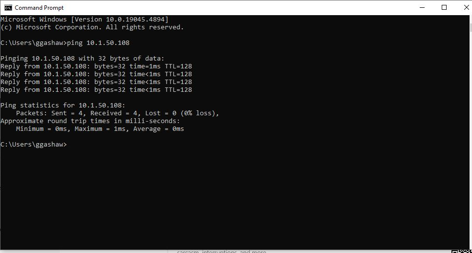
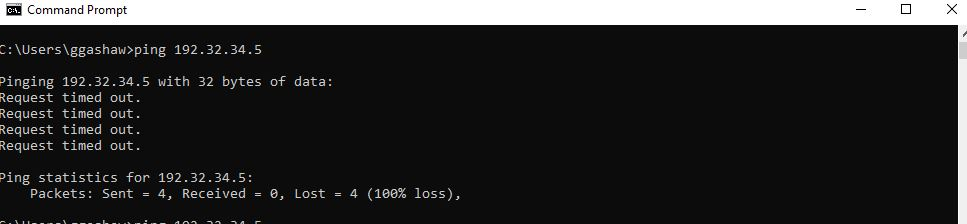
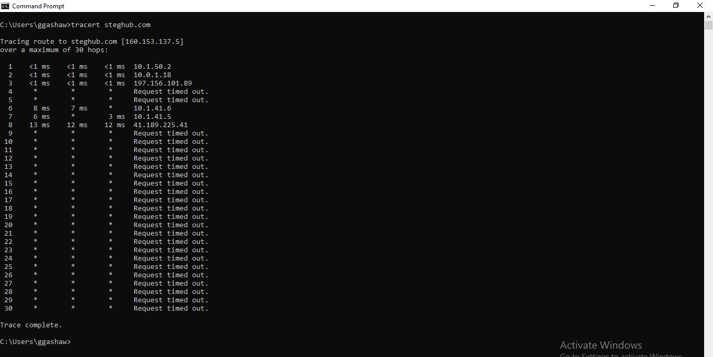
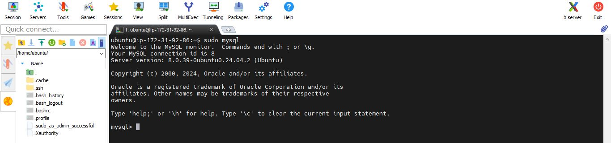
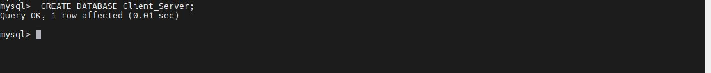
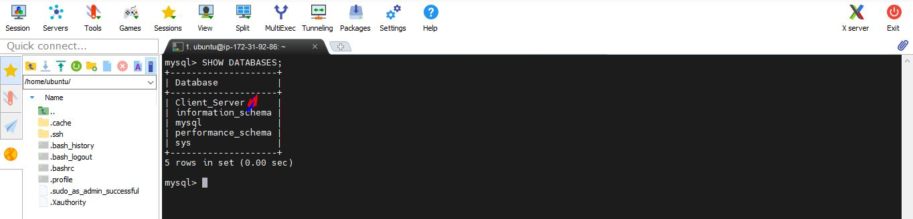
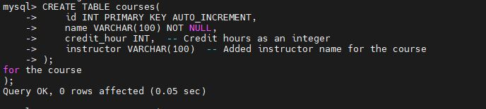
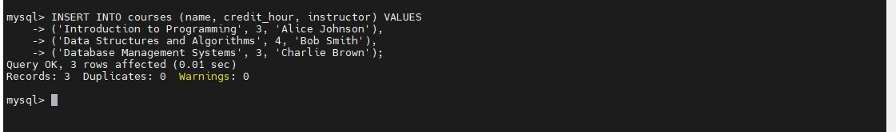

# Self Study
# 1. Read about ping and traceroute network diagnostic utilities. Be able to make sense out of the results of using these tools.

## Ping and Traceroute: Network Diagnostic Utilities

Ping and traceroute are two essential tools for network troubleshooting. They work together to diagnose different aspects of connectivity issues:
### Ping

**Ping** is a network utility used to test the reachability of a host on an IP network and measure the round-trip time for messages sent from the originating host to a destination computer. It uses Internet Control Message Protocol (ICMP) Echo Request messages to elicit an ICMP Echo Reply from the target host.


**How Ping Works:**

- Ping sends **ICMP (Internet Control Message Protocol)** Echo Request packets to the target device.

- The target replies with an Echo Reply packet.

- It measures the **round-trip time (RTT)** it takes for packets to go from the source to the destination and back.

When using Ping, always test a few different sites to see if it is just one site or all sites.



You can interrupt Ping at any time by holding down the CTRL key, and pressing C on your keyboard.

**Interpreting Ping Results:**
- **Reply from [IP Address]:** Indicates the host is reachable.
- **Request timed out:** No response was received, possibly due to network issues or the host being down.
- **Packets sent/received/lost:** Helps determine packet loss.
- **RTT (ms):** Shows minimum, maximum, and average round-trip times, indicating latency.


Ping operates by sending ICMP Echo Request packets to the target device and waiting for an ICMP Echo Reply. The program reports errors, packet loss, and a statistical summary of the results.
### Example: target device not responding
A ping result, where the target device is not responding, or there is a connection issue, will look like this




Although four packets were sent, none have been received, showing a 100% loss of packets, and indicating an issue with either the connection or the target device.


### Traceroute

**Traceroute** is a network diagnostic tool used to track the pathway that a packet takes from the source to the destination. It records the route (the specific gateway computers at each hop) through the Internet between your computer and a specified destination computer. It also calculates and displays the time taken for each hop.

**How Traceroute Works:**
- **ICMP/TCP/UDP Probes:** Traceroute sends a sequence of packets with incrementally increasing Time-To-Live (TTL) values.
- **TTL Exceeded:** Each router that forwards the packet decreases the TTL by one. When the TTL reaches zero, the router discards the packet and sends an ICMP "Time Exceeded" message back to the source.
- **Tracing the Path:** By recording the source of each "Time Exceeded" message, Traceroute determines the path taken by the packets to the destination.
```
tracert steghub.com
```



**Interpreting Traceroute Results:**

- **List of Hops:** Each line represents a hop from the source to the destination.
- **IP Address and Hostnames:** Shows the IP address and, if resolvable, the hostname of each hop.
- **RTT for Each Hop:** Provides round-trip times for each hop, often three times per hop.

**Key Points:**

- **Hop Count:** The number of hops (intermediate routers) to reach the destination.
- **Latency per Hop:** Helps identify where delays are occurring in the path.
- **Unreachable Nodes:** If a hop consistently fails to respond, it might indicate a network problem at that hop.

# 2. Refresh your knowledge of basic SQL commands, be able to perform simple SHOW, CREATE, DROP, SELECT and INSERT SQL queries.
SQL stands for Structured Query Language. SQL commands are the instructions used to communicate with a database to perform tasks, functions, and queries with data.

SQL commands can be used to search the database and to do other functions like creating tables, adding data to tables, modifying data, and dropping tables.

Here is a list of basic SQL commands (sometimes called clauses) you should know if you are going to work with SQL.

# Basic SQL Commands

## SHOW

The `SHOW` command is used to display database objects and their properties. It can show tables, databases, columns, and more.

**Examples:**
- **Show all databases:**
```
SHOW DATABASES;
```
- **Show all tables in the current database:**
```
SHOW TABLES;
```
- **Show columns of a specific table**:

```
SHOW COLUMNS FROM table_name;
```
### CREATE
The CREATE command is used to create databases, tables, views, and other database objects.

# Practical example how to use basic SQL commands

**Let's combine these commands in a practical scenario**:
- Log into your host and next to  MySQL
```
mysql -u root -p
```


- Create Database

```
CREATE DATABASE Client_Server;
```




- Show existing databases:

```
SHOW DATABASES;
```




- Switch to the new database:

```
USE Client_Server;
```


- Create a new table:

```
CREATE TABLE courses(
    id INT PRIMARY KEY AUTO_INCREMENT,
    name VARCHAR(100) NOT NULL,
    credit_hour INT,  -- Credit hours as an integer
    instructor VARCHAR(100)  -- Added instructor name for the course
);

```



- Insert data into the table:
```
INSERT INTO courses (name, credit_hour, instructor) VALUES
('Introduction to Programming', 3, 'Alice Johnson'),
('Data Structures and Algorithms', 4, 'Bob Smith'),
('Database Management Systems', 3, 'Charlie Brown');

```


- Query the table:

```
SELECT * FROM courses;
```

- Drop the table:
  ```
  DROP TABLE courses
  ```

## Challenges Faced and Solutions:

- I faced MYSQL User Permission challenges and I solved by granting all `user` permisions to user`gashaw`

- The port number **3306** was not working and I changed it toclients from specific client ip address

## Conclusion

This project enabled me to solidify my understanding of client-server architecture, gain practical experience with MySQL setup across AWS instances, and manage secure communication between database and client systems. Each component, from configuring MySQL to handling connectivity challenges, played a crucial role in ensuring the reliability and performance of the architecture.


### Continuous Learning

This experience emphasized the value of continuous learning and adapting to new challenges in cloud-based infrastructure. As AWS and database technologies evolve, keeping up with best practices and new services is essential for optimizing solutions. Lesson: Continuously expand your knowledge to stay current with advancements in cloud platforms and database management systems.
