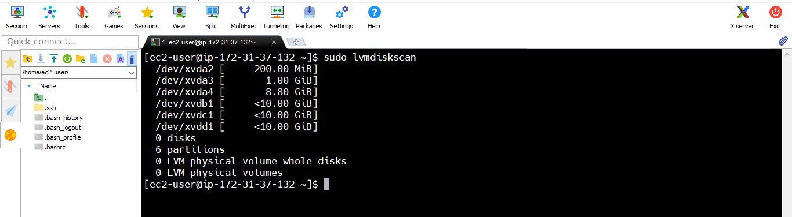
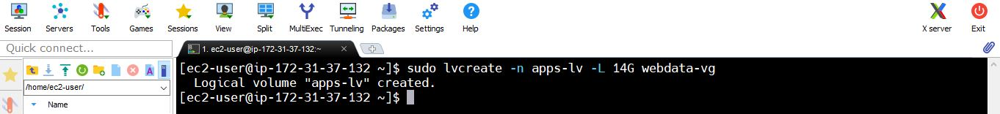
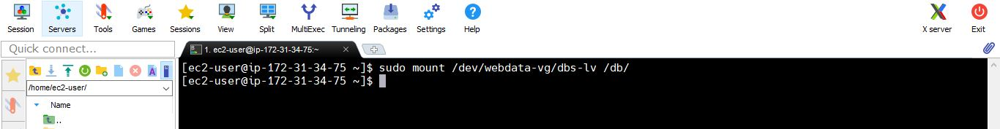

# Web Solution With WordPress

In this project we will be tasked to prepare storage infrastructure on `two` **Linux servers** and implement a basic web solution using `WordPress`. **WordPress** is a free and open-source content management system written in PHP and paired with MySQL or MariaDB as its backend Relational Database Management System (RDBMS).

## Project 6 consists of two parts:

1. Configure storage subsystem for Web and Database servers based on Linux OS. The focus of this part is to give us practical experience of working with disks, partitions and volumes in Linux.
2. Install WordPress and connect it to a remote MySQL database server. This part of the project will solidify our skills of deploying Web and DB tiers of Web solution.

### Three-tier Architecture
Generally, web, or mobile solutions are implemented based on what is called the Three-tier Architecture.

Three-tier Architecture is a client-server software architecture pattern that comprise of 3 separate layers.


1. **Presentation Layer (PL)**: This is the user interface such as the client server or browser on your laptop.
2. **Business Layer (BL)**: This is the backend program that implements business logic. Application or Webserver
3. **Data Access or Management Layer (DAL)**: This is the layer for computer data storage and data access. Database Server or File System Server such as File Transfer Protocol `FTP` server, orNetwork File System `NFS` Server


### Our 3-Tier Setup
1. A Laptop or PC to serve as a client
2. An EC2 Linux Server as a web server (This is where you will install WordPress)
3. An EC2 Linux server as a database (DB) server

> Use RedHat OS for this projects we will use very popular distribution called 'RedHat' (it also has a fully compatible derivative - CentOS)


**Let us get started by creating `Web Server` and `Database Server` using redhat Os**

1. Launch Two EC2 instances that will serve as **`Web Server`** and **`DB Server`**.


2. Application and OS Images select RedHat free tire eligable version


3. Create new key pair or select existing key


4. Network setting create new security group or use existing security group


5. Configure Storage and launch the instance


   
6. View Instance

   

7. Instance Details for `Web Server`


   
8. Configure security group with the following inbound rules:

- Allow traffic on port 22 (SSH) with source from any IP address. This is opened by default.
- Allow traffic on port 80 (HTTP) with source from anywhere on the internet.
- Allow traffic on port 443 (HTTPS) with source from anywhere on the internet.


### For DB Server follow same steps and our final instance detail looks like this

- `DB Server` instance after launched looks like


- `DB Server` instance Details Looks like:


### Now Two Servers `running` and let's configure our 3-Tire  server architecture


> **Note**: for Ubuntu server, when connecting to it via SSH/Putty or any other tool, we used ubuntu user, but for RedHat you will need to use ec2-user user. Connection string will look like ec2-user@<Public-IP>

**Let us see how to connect webserver**


# Step 1 — Prepare a Web Server

Launch an EC2 instance that will serve as `Web Server`. Create 3 volumes in the same AZ as your Web Server EC2, each of 10 GiB.

1. Add EBS Volume to an EC2 instance


**Created volumes in same availablity zone looks like this**


2. Attach all three volumes one by one to our Web Server EC2 instance


**After three voumes attached to the webserver instance**


3. Open up the Linux terminal to begin configuration


4. Use `lsblk` command to inspect what block devices are attached to the server.
```
lsblk
```


5. Use df -h command to see all mounts and free space 
```
df -h
```


6. Use `gdisk` utility to create a single partition on each of the 3 disks

```
sudo gdisk /dev/xvdb
```
**List Existing Partitions: To see the current partitions, use the p command:**


**Create a New Partition: To add a new partition, enter n: then Press Enter to accept default value**


**Write Changes: Once you've created the desired partitions, write the changes to the disk with w:**


**Yes to proceed and complete** 


**we follow the same steps for remaining two partitions**

7. Use lsblk utility to view the newly configured partition on each of the 3 disks.
```
lsblk
```


8. Install `lvm2` package 
```
sudo yum install lvm2
```


9.  Check for available partitions.
```
sudo lvmdiskscan 
```


> Note:  In Ubuntu we used apt command to install packages, in **RedHat/CentOS** a different package manager is used, so we shall use `yum` command instead.

10. Use `pvcreate` utility to mark each of 3 disks as physical volumes (PVs) to be used by LVM
```
sudo pvcreate /dev/xvdb1
```


```
sudo pvcreate /dev/xvdc1
```


```
sudo pvcreate /dev/xvdd1
```


11. Verify that your Physical volume has been created successfully 

```
sudo pvs
```


12. Use `vgcreate` utility to add all 3 PVs to a volume group (VG) Name the VG `webdata-vg`
```
sudo vgcreate webdata-vg /dev/xvdb1 /dev/xvdc1 /dev/xvdd1
```


13. Verify that your VG has been created successfully
```
 sudo vgs
``` 


14.  Use `lvcreate` utility to create 2 logical volumes. `apps-lv` (**Use half of the PV size**), and `logs-lv` Use the remaining space of the PV size.

>  NOTE: apps-lv will be used to store data for the Website while, logs-lv will be used to store data for logs.
```
sudo lvcreate -n apps-lv -L 14G webdata-vg
```



```
sudo lvcreate -n logs-lv -L 14G webdata-vg
```


15. Verify that our Logical Volume has been created successfully
```
sudo lvs
```


16.  Verify the entire setup
#view complete setup - VG , PV, and LV
```
sudo vgdisplay -v
```


```
sudo lsblk
```


**Use mkfs.ext4 to format the logical volumes with ext4 filesystem**
```
sudo mkfs -t ext4 /dev/webdata-vg/apps-lv
```


```
sudo mkfs -t ext4 /dev/webdata-vg/logs-lv
```


17. Create `/var/www/html` directory to store website files
```
sudo mkdir -p /var/www/html
```


18. Create `/home/recovery/logs` to store backup of log data 

```
sudo mkdir -p /home/recovery/logs
```


19.  Mount `/var/www/html` on apps-lv logical volume

```
sudo mount /dev/webdata-vg/apps-lv /var/www/html/
```


**Verify the Mount:**
```
df -h | grep /var/www/html
```


20. Use rsync utility to backup all the files in the log directory `/var/log` into `/home/recovery/logs`
 
 > This is required before mounting the file system

```
sudo rsync -av /var/log/ /home/recovery/logs/
```


21. Mount `/var/log` on `logs-lv` logical volume
    
> Note that all the existing data on `/var/log` will be deleted. That is why step 17 above is very important

```
sudo mount /dev/webdata-vg/logs-lv /var/log
```


22. Restore log files back into `/var/log` directory
```   
sudo rsync -av /home/recovery/logs/ /var/log
```


23. Update `/etc/fstab` file so that the mount configuration will persist after restart of the server.  The UUID of the device will be used to update the `/etc/`fstab file;

**Find the UUID of the Device**
```
sudo blkid
```


**Edit the `/etc/fstab` File**
```
sudo vim /etc/fstab
```


**Replace UUID with the actual UUID from the blkid**
```
# MOUNTS FOR WORDPRESS WEBSERVER
UUID=481d6b40-7d14-4897-bbce-5cb1db497ac1 /var/www/html    ext4 defaults 0 0
UUID=99c0c884-1094-4b8a-a122-08b0b000d01d  /var/log         ext4 defaults 0 0
```


24. Test the configuration 
```
sudo mount -a
```


**Reload the daemon**
```
sudo systemctl daemon-reload
```


25. Verify our setup
```
df -h
```


# Step 2 - Prepare the Database Server
1. Launch A second RedHat EC2 Instance that will have a role **`DB Server`**
Repeat the same steps as for the Web Server, but instead of _**`apps-lv`**_ create _**`db-lv`**_ and mount it to _**`/db`**_  directory instead of **`/var/www/html/`**

### Afterfollowing same step Like  `Web Server` we created an instance ` DB Server` and looks like  this 


**Now we are going to Add EBS Volume to an DB Server EC2 instance we repeat the above steps**
1. Create 3 volumes in the same AZ as your Web Server EC2, each of 10 GiB.


**Attach all volumes one by one to our DB Server EC2 instance**


2. Open up the Linux terminal to begin configuration


Connect with `DB Server` Instance


3. Use lsblk command to inspect what block devices are attached to the server.

```
lsblk
```


4. Use df -h command to see all mounts and free space on your server
   ```
   df -h
   ```


 **Use gdisk utility to create a single partition on each of the 3 disks**
``` 
sudo gdisk /dev/xvdb
```
**List Existing Partitions: To see the current partitions, use the p command:**


**Create a New Partition: To add a new partition, enter `n`: then Press Enter to accept default value**


**Write Changes: Once you've created the desired partitions, write the changes to the disk with `w`**:


**Yes to proceed and complete**


Finally the partition is created Like:


**we follow the same steps for remaining**

5. Use **lsblk** utility to view the newly configured partition on each.
```
lsblk
```


6. Install **lvm2** package
```
sudo yum install lvm2
```


**Check for available partitions**
```
sudo lvmdiskscan
```


7. Use pvcreate utility to mark each of disks as physical volumes (PVs) to be used by LVM
```
sudo pvcreate /dev/xvdb1
sudo pvcreate /dev/xvdc1
sudo pvcreate /dev/xvdd1
```


8. Verify that our Physical volume has been created successfully
```
sudo pvs
```


9. Use **vgcreate** utility to add all 3 PVs to a volume group (VG). Name the VG webdata-vg
```
sudo vgcreate webdata-vg /dev/xvdb1 /dev/xvdc1 /dev/xvdd1
```


10. Verify that our VG has been created successfully
```
sudo vgs
```


11. Use **lvcreate** utility to create 2 logical volumes. db-lv (Use half of the PV size), and logs-lv Use the remaining space of the PV size.
> NOTE: db-lv will be used to store data for the database while, logs-lv will be used to store data for logs.
```
sudo lvcreate -n dbs-lv -L 14G webdata-vg
```


```
sudo lvcreate -n logs-lv -L 14G webdata-vg
```


12. Verify that our Logical Volume has been created successfully
```
sudo lvs
```


13. Verify the entire setup view complete setup - VG, PV, and LV
```
sudo vgdisplay -v
```


```
sudo lsblk 
```


**Use mkfs.ext4 to format the logical volumes with ext4 filesystem**
```
sudo mkfs -t ext4 /dev/webdata-vg/dbs-lv
```


```
sudo mkfs -t ext4 /dev/webdata-vg/logs-lv
```


14. Create `/db` directory to store database files
```
sudo mkdir -p /db
```


16. Create `/home/recovery/logs` to store backup of log data
```
 sudo mkdir -p /home/recovery/logs
```


17. Mount `/db `on `dbs-lv` logical volume
```
sudo mount /dev/webdata-vg/dbs-lv /db/
```


**Verify the Mount**:
```
df -h | grep /db
```


18. Use **rsync** utility to backup all the files in the log directory /var/log into /home/recovery/logs (This is required before mounting the file system)
```
sudo rsync -av /var/log/ /home/recovery/logs/
```


19. Mount `/var/log` on `logs-lv` logical volume. (Note that all the existing data on /var/log will be deleted. That is why step 15 above is very important)
```
sudo mount /dev/webdata-vg/logs-lv /var/log
```


20. Restore log files back into /var/log directory
```
sudo rsync -av /home/recovery/logs/log/. /var/log
```


21. Update `/etc/fstab` file so that the mount configuration will persist after restart of the server. The UUID of the device will be used to update the `/etc/fstab` file;

**Find the UUID of the Device**
```
sudo blkid
```


**Edit the /etc/fstab File**
```
sudo vi /etc/fstab
```


**Update /etc/fstab in this format using our own UUID**
Replace UUID with the actual UUID from the blkid

```
UUID=d8247734-039f-48f4-a784-ff60fd905a88  /db             ext4 defaults 0 0
UUID=fe8c3fb4-b5cb-43d3-8821-625afdfe4cf7  /var/log         ext4 defaults 0 0
```


22. Test the configuration 
```
sudo mount -a
```


**Reload the daemon**
```
sudo systemctl daemon-reload
```


23. Verify our setup by running
```
df -h
```


# Step 3 - Install WordPress on your Web Server EC2
1. Update the repository

```
sudo yum -y update
```


2. Install **`wget`**, **`Apache`** and it's dependencies
```
sudo yum -y install wget httpd php php-mysqlnd php-fpm php-json
```


3. Start Apache
**Enable httpd**
```
sudo systemctl enable httpd 
```


**start httpd**
```
sudo systemctl start httpd
```


4. Install PHP and it's dependencies
 ```  
 sudo dnf install https://dl.fedoraproject.org/pub/epel/epel-release-latest-9.noarch.rpm
```


```
sudo dnf -y install http://rpms.remirepo.net/enterprise/remi-release-9.rpm -y
```


**Before installing PHP, we need to check the available PHP streams in the repository.**
```
 sudo yum module list php 
```


```
sudo yum module reset php 
```


```
sudo dnf module enable php:remi-8.0
```


```
sudo dnf install php php-opcache php-gd php-curl php-mysqlnd
```


```
sudo systemctl start php-fpm
```


```
sudo systemctl enable php-fpm
```


```
sudo setsebool -P httpd_execmem 1
```


5. Restart Apache and check it is running.
```
sudo systemctl restart httpd
```


```
sudo systemctl status httpd
```


6. Download wordpress and copy wordpress to `/var/www/html`

```
cd wordpress
```


```
sudo wget http://wordpress.org/latest.tar.gz
```


```
 sudo tar -xzvf latest.tar.gz
```


```
sudo rm -rf latest.tar.gz 
```


```
cp wordpress/wp-config-sample.php wordpress/wp-config.php
```


```
sudo cp -R wordpress /var/www/html/
```


7. Configure SELinux Policies
```
sudo chown -R apache:apache /var/www/html/wordpress
```


```
sudo chcon -t httpd_sys_rw_content_t /var/www/html/wordpress -R
```


```
sudo setsebool -P httpd_can_network_connect=1
```


# Step 4 — Install MySQL on our DB Server EC2
**Update the system**

```
sudo yum update
```


**Install Mysql Server**
```
sudo yum install mysql-server
```


**Verify that the service is up and running**
```
sudo systemctl status mysqld
```


**if it is not running, restart the service.** 
```
sudo systemctl restart mysqld
```


**Enable it to be running even after reboot**:
```
sudo systemctl enable mysqld
```

**Check status now**


# Step 5 - Configure DB to work with WordPress
**Log to mysql**
```
sudo mysql
```


```
CREATE DATABASE wordpress;
```


```
CREATE USER `gashaw`@`172.31.37.132` IDENTIFIED BY 'PassWord.1';
```


```
GRANT ALL ON wordpress.* TO 'gashaw'@'172.31.37.132';
```


```
FLUSH PRIVILEGES;
```


```
SHOW DATABASES;
```


Enter `exit` and logout

```
exit
```

# Step 6 - Configure WordPress to connect to remote database

> Hint: Do not forget to open MySQL port 3306 on DB Server EC2. For extra security, we shall allow access to the DB server ONLY from our Web Server's IP address so in the Inbound Rule configuration specify source as /32


1. Install MySQL client and test that you can connect from your Web Server to your DB server by using mysql-client
```
sudo yum install mysql
```


**sudo mysql -u admin -p -h <DB-Server-Private-IP-address>**
```
sudo mysql -u gashaw -p -h 172.31.34.75
```


2. Verify if you can successfully connect
 ```
SHOW DATABASES;
```


**if sucessful the command list of existing databases.**

3. Change permissions and configuration so Apache could use WordPress:

4. Enable TCP port 80 in Inbound Rules configuration for our Web Server EC2 (enable from everywhere 0.0.0.0/0 or from our workstation's IP)


5. Try to access from your browser the link to your WordPress
```
http://<Web-Server-Public-IP-Address>/wordpress/
```


### The End of Web Solution With WordPress project
In this project we prepared storage infrastructure on two Linux servers and implement a basic web solution using WordPress.
1. Configure storage subsystem for Web and Database servers based on Linux OS. The focus is working with disks, partitions and volumes in Linux
2. Install WordPress and connect it to a remote MySQL database server
3. Deploying Web and DB tiers of Web solution
