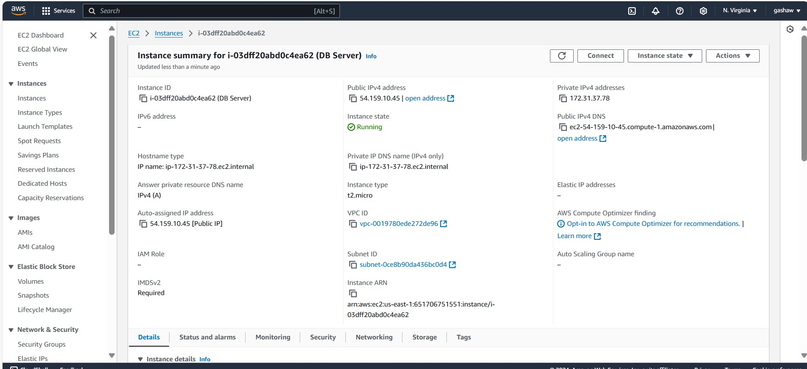
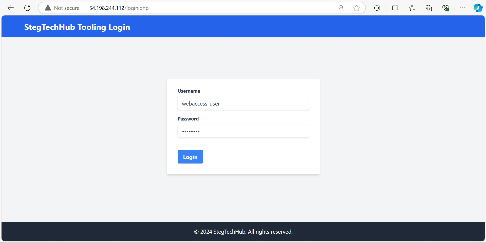

# DevOps Tooling Website Solution Project 7

> This project focuses on building a website solution for a team of developers that will help a in day to day activities in managing, developing, testing, deploying, and monitoring different projects


### In this project, we will implement a solution that consists of the following components:

1. Infrastructure: AWS
2. Webserver Linux: Red Hat Enterprise Linux 8
3. Database Server: Ubuntu 24.04 + MySQL
4. Storage Server: Red Hat Enterprise Linux 8 + NFS Server
5. Programming Language: PHP
6. GitHub Code Repository.

### Prerequisites

1. Knowledge of AWS core services and CLI
2. Basic knowledge of Linux commands and how to manage storage on a Linux server.
3. Basic knowledge of Network-attached storage (NAS), Storage Area Networks (SAN), and related protocols like NFS, FPT, SFTP, SMB, iSCSI.
4. Knowledge of Block-level storage and how it is used on the Cloud.
#### ARCHTECTURAL DESIGN


## Step 1 - Prepare NFS Server

1. Spin up a new EC2 instance with RHEL Linux Operating System.
   
**Log to aws account console and create EC2 instance of t2.micro type with RedHat Server launch in the default region us-east-1. name instance _Linux NFS server_**


**Application and OS Images select RedHat free tire eligable version**


**Create new key pair or select existing key**


**Network setting create new security group or use existing security group**


**Configure Storage and launch the instance**


**View Instance**


**Instance Details for web**


2. Based on your LVM experience from Project 6, Configure LVM on the Server. Create 3 volumes in the same AZ as your Web Server EC2, each of 10 GiB.

**Add EBS Volume to an EC2 instance**


**Attach all three volumes one by one to our NFS Web Server EC2 instance**


 **Open up the Linux terminal to begin configuration**

 


  **List Available Disks**
```
sudo lsblk
```


**Use df -h command to see all mounts and free space**
```
df -h
```


**Use gdisk utility to create a single partition on each of the 3 disks**
```
sudo gdisk /dev/xvdb
```
**List Existing Partitions: To see the current partitions, use the `p` command:**


**Create a New Partition: To add a new partition, enter `n`: then Press Enter to accept default value**


**Write Changes: Once you've created the desired partitions, write the changes to the disk with `w`:**


**Yes to proceed and complete**


> we follow the same steps for remaining `two` and create partition

**Use lsblk utility to view the newly configured partition on each of the 3 disks.**
```
lsblk
```


**Install lvm2 package**
```
sudo yum install lvm2
```


**Check for available partitions.**

```
sudo lvmdiskscan 
```


**Create Physical Volumes Use pvcreate utility to mark each of 3 disks as physical volumes (PVs) to be used by LVM**
```
sudo pvcreate /dev/xvdb1 /dev/xvdc1 /dev/xvdd1
```


**Verify that your Physical volume has been created successfully**
```
sudo pvs
```


**Use `vgcreate` utility to add all 3 PVs to a volume group (VG) Name the VG `webdata-vg`**
```
sudo vgcreate webdata-vg /dev/xvdb1 /dev/xvdc1 /dev/xvdd1
```


**Verify that your VG has been created successfully**
```
sudo vgs
```


**Create Logical Volumes Use `lvcreate utility` to create logical volumes

```
sudo lvcreate -L 14G -n lv-apps webdata-vg
sudo lvcreate -L 14G -n lv-logs webdata-vg
sudo lvcreate -L 14G -n lv-opt  webdata-vg
```


there is no enough space to create `lv-opt` and we have to make free some spaces


**Verify that our Logical Volume has been created successfully**
``` 
sudo lvs
```


**Verify the entire setup #view complete setup - VG , PV, and LV**
```
sudo vgdisplay -v
```


3. Instead of formatting the disks as `ext4` you will have to format them as `xfs`
- Ensure there are 3 Logical Volumes `lv-opt` `lv-apps`, and `lv-logs`
```
sudo lsblk
```


**Format the Logical Volumes as `XFS`:**
```
sudo mkfs.xfs /dev/webdata-vg/lv-apps
sudo mkfs.xfs /dev/webdata-vg/lv-logs
sudo mkfs.xfs /dev/webdata-vg/lv-opt
```


- Create mount points on `/mnt` directory for the logical volumes as follows: `Mount lv-apps` on `/mnt/apps` - To be used by webservers ,`Mount lv-logs` on `/mnt/logs` - To be used by webserver logs, `Mount lv-opt` on `/mnt/opt` - To be used by Jenkins server in Project 8

**Create Directories**:
```
sudo mkdir /mnt/apps
sudo mkdir /mnt/logs
sudo mkdir /mnt/opt
```


**Mount Logical Volumes**

```
sudo mount /dev/webdata-vg/lv-apps /mnt/apps
sudo mount /dev/webdata-vg/lv-logs /mnt/logs
sudo mount /dev/webdata-vg/lv-opt /mnt/opt
```


**Add Mount Points to /etc/fstab**

```
sudo vim /etc/fstab
```
**Add the following lines**:
```
/dev/webdata-vg/lv-apps /mnt/apps xfs defaults 0 0
/dev/webdata-vg/lv-logs /mnt/logs xfs defaults 0 0
/dev/webdata-vg/lv-opt /mnt/opt xfs defaults 0 0
```


**Verify Mounts**:

```
sudo mount -a
```
```
df -h
```


4. Install NFS server, configure it to start on reboot and make sure it is up and running

**Update the System and Install NFS Utilities**:
```
sudo yum -y update
```


```
sudo yum install nfs-utils -y
```


**Start and Enable NFS Server**:

```
sudo systemctl start nfs-server.service
```


```
sudo systemctl enable nfs-server.service
```


```
sudo systemctl status nfs-server.service
```


5. Export the NFS Mounts'

> Use `subnet cidr` to connect as clients. For simplicity, we will install our all three Web Servers inside the same subnet, but in _production_ set up  would probably want to separate each tier inside its own subnet for higher level of security. To check our subnet cidr - open our EC2 details in AWS web console and locate `Networking` tab and open a Subnet link:

**Set Permissions on Mount Points**
```
sudo chown -R nobody:nobody /mnt/apps
sudo chown -R nobody:nobody /mnt/logs
sudo chown -R nobody:nobody /mnt/opt
sudo chmod -R 777 /mnt/apps
sudo chmod -R 777 /mnt/logs
sudo chmod -R 777 /mnt/opt
```


**Restart NFS Server**

```
sudo systemctl restart nfs-server.service
```


6. Configure access to NFS for clients within the same subnet (example of Subnet CIDR - 172.31.32.0/20 ):


```
sudo vim /etc/exports
```
**Add the following lines**:

```
/mnt/apps 172.31.32.0/20(rw,sync,no_all_squash,no_root_squash)
/mnt/logs 172.31.32.0/20(rw,sync,no_all_squash,no_root_squash)
/mnt/opt 172.31.32.0/20(rw,sync,no_all_squash,no_root_squash)
```


**save and exit from the editor by** `Esc + :wq!`

**Export the NFS Shares**:

```
sudo exportfs -arv
```


7. Check which port is used by NFS and open necessary ports in Security Groups (add new Inbound Rule)

**Check NFS Ports**:

```
rpcinfo -p | grep nfs
```


> **Important note**: In order for NFS server to be accessible from our client,we open following ports:
- `TCP 111`
- `UDP 111`
- `UDP 2049`
- `UDP 2049`


## Step 2 - Configure the database server

Log to aws account console and create EC2 instance of t2.micro type with Ubuntu Server launch in the default region us-east-1. name instance MySQL server


 Follow the same step and finally the instance created like this 



1. Install MySQL Server

First, we need to connect to our  Mysql server server


1.1. Update the package index:
```
sudo yum update
```


1.2. Install MySQL server:
```
sudo yum install mysql-server
```


1.3 Check status :
```
sudo systemctl status mysqld
```


1.4. Enable MySQL to start on boot:

```
sudo systemctl enable mysqld
```


1.5. Secure the MySQL installation (set root password, remove test databases, etc.):
```
sudo mysql_secure_installation
```
Follow the prompts to complete the configuration.


2. Create a database and name it tooling

 2.1. Log in to the MySQL server as the root user:

```
sudo mysql -u root -p
```


2.2. Create the database:

```
CREATE DATABASE tooling;
```


```
show databases;
```


3. Create a database user and name it `webaccess`

```
CREATE USER 'webaccess'@'%' IDENTIFIED BY 'PassWord.1';
```


4. Grant permission to webaccess user on tooling database to do anything only from the webservers subnet `cidr`
> To grant permissions to a MySQL user based on a specific subnet (CIDR), you can use a series of wildcard characters to match the IP address range. MySQL does not support direct CIDR notation, so you need to translate the CIDR range into a pattern that MySQL understands.

```
GRANT ALL PRIVILEGES ON tooling. * TO 'webaccess'@'%' WITH GRANT OPTION;
```


**Apply the changes**:

```
FLUSH PRIVILEGES;
```


**Exit MySQL**

```
exit
```

## Step 3 - Prepare the Web Servers

 **In this step we will do the following**
 - Configure NFS client (this step must be done on all _three servers_)
 - Deploy a Tooling application to our Web Servers into a shared NFS folder
 - Configure the Web Servers to work with a single MySQL database
**For server One**

1. Launch a new EC2 instance with RHEL 8 Operating System


**Follow same steps above and  our instance detail look like this**


2. Install NFS client
```
sudo yum update -y
```


```
sudo yum install nfs-utils nfs4-acl-tools -y
```


3. Mount `/var/www/` and target the NFS server's export for apps

```
sudo mkdir /var/www
```


```
sudo mount -t nfs -o rw,nosuid 172.31.36.105:/mnt/apps /var/www
```


4. Verify that NFS was mounted successfully

```
 df -h
 ```


  
Make sure that the changes will persist on Web Server after reboot:

```
sudo vi /etc/fstab
```

add following line

```
172.31.36.105:/mnt/apps /var/www nfs defaults 0 0
```


5. Install Remi's repository, Apache and PHP

```
sudo yum install httpd -y
```


```
sudo dnf install https://dl.fedoraproject.org/pub/epel/epel-release-latest-9.noarch.rpm
```


**To confirm that EPEL has been added**
```
 rpm -qi epel-release
```


```
sudo dnf -y install http://rpms.remirepo.net/enterprise/remi-release-9.rpm -y
```


> If you encounter the "Killed" message while running , it likely means the process was terminated due to running out of memory. Here are steps to mitigate this:
Updating System with Limited Memory

Create a swap file to increase virtual memory:


```
sudo fallocate -l 1G /swapfile
sudo dd if=/dev/zero of=/swapfile bs=1M count=512
sudo chmod 600 /swapfile
sudo mkswap /swapfile
sudo swapon /swapfile
```


**Make the swap file permanent:**

```
echo '/swapfile swap swap defaults 0 0' | sudo tee -a /etc/fstab
```


**Update and Clean the System and re run**

```
sudo dnf upgrade --refresh -y
sudo dnf upgrade -y dnf
sudo dnf update -y
sudo dnf clean all
sudo reboot
```


**Tehn Re run again**

```
sudo dnf -y install http://rpms.remirepo.net/enterprise/remi-release-9.rpm -y
```


Before installing PHP, we need to check the available PHP streams in the repository.

```
 sudo dnf module list php -y
```


```
sudo dnf module reset php
```


```
sudo dnf module enable php:remi-8.2 -y
```


```
sudo dnf install php php-opcache php-gd php-curl php-mysqlnd
```


```
php -v
```


```
sudo systemctl start php-fpm
```


```
sudo systemctl enable php-fpm
```


```
sudo setsebool -P httpd_execmem 1
```


> Repeat steps 1-5 for another 2 Web Servers and finally 


6. Verify NFS Mount and Apache Setup 

Verify that Apache files and directories are available on the Web Server in `/var/www `and also on the NFS server in `/mnt/apps`. If you see the same files - it means NFS is mounted correctly.

```
cd /var/www
```


```
ls -l
```


 You can try to create a new file
```
sudo touch test.txt
```


**We can see the text.txt file created inside our nfs server `/mnt/apps` directory. So they are communicating perfectly.**


from one server and check if the same file is accessible from other Web Servers.


7. Locate the log folder for Apache on the Web Server and mount it to NFS server's export for logs. Repeat step №4 to make sure the mount point will persist after reboot.
```
sudo mkdir -p /var/log/httpd
```


```
sudo mount -t nfs -o rw,nosuid 172.31.36.105:/mnt/logs /var/log/httpd
```


Edit the /etc/fstab file so that it persists even after reboot
```
sudo vi /etc/fstab
```
add the following lines
```
172.31.36.105:/mnt/logs /var/log/httpd nfs defaults 0 0
```


8. Fork the tooling source code from Darey.io Github Account to your Github account.
**Download git**
```
sudo yum install git
```


**Clone the repository you forked the project into**
```
git clone https://github.com/gashawgedef/tooling.git
```


9. Deploy the tooling website's code to the Webserver. Ensure that the html folder from the repository is deployed to /var/www/html
```
sudo cp -R html/. /var/www/htm/
```


> Note 1: Do not forget to open TCP port 80 on the Web Server.

> Note 2: If you encounter 403 Error - check permissions to your /var/www/html folder and also disable SELinux sudo setenforce 0 To make this change permanent - open following config file

**Disable SELinux**
```
sudo setenforce 0
```


```
sudo vi /etc/sysconfig/selinux
```
and set SELINUX=disabled


 **Then restrt httpd**.
```
sudo systemctl restart httpd
```

```
sudo systemctl status httpd
```


10. Update the website's configuration to connect to the database (in /var/www/html/functions.php file). Apply `tooling-db.sql` script to your database using this command
 


 ```
  mysql -h 172.31.37.78 -u webaccess -p -D tooling < tooling-db.sql

```


11. Create in MySQL a new admin user with `username: myuser` and `password: password`:

```
mysql -h 172.31.37.78 -u webaccess -p
```


```
INSERT INTO `users` (`id`, `username`, `password`, `email`, `user_type`, `status`) 
VALUES (2, 'webaccess_user', '5f4dcc3b5aa765d61d8327deb882cf99', 'user@mail.com', 'admin', '1');

```


12. Open the website in your browser http://`Web-Server-Public-IP-Address`or `Public-DNS-Name`/index.php and make sure you can login into the website with  your user and password.




### End of the Project
We successfully implemented and deployed a DevOps tooling website in AWS, designed to provide seamless access to essential DevOps tools within the corporate infrastructure. The project involved setting up three web servers, all connected to a central database server. Additionally, a Network File System (NFS) was configured to enable the web servers to share common files, ensuring synchronized access to data across the infrastructure. This scalable solution enhances the efficiency of DevOps operations by integrating a reliable, high-availability system for managing DevOps tools.

