# Implementing a Load balancer Solution with Apache
Load balancers are a special type of server farm that helps in efficiently distributing incoming network traffic across a group of backend servers.

> In this project we will enhance our Tooling Website solution by adding a ***Load Balancer*** to distribute traffic between `Web Servers` and allow users to access our website using a single URL.

**Task**
Deploy and configure an Apache Load Balancer for Tooling Website solution on a separate Ubuntu EC2 intance. Make sure that users can be served by Web servers through the Load Balancer.

## Prerequisite for the projects.
1. AWS account log in with EC2 instances
2. Two Webserver Linux: Red Hat Enterprise Linux 9
3. Database Server: On Ubuntu 24.04 MySQL
4. Storage Server: Red Hat Enterprise Linux 9 (NFS Server)

# Configure Load Balancing Using Apache HTTP Server 

1. Create an Ubuntu Server 24.04 EC2 instance and name it **Project-8-apache-lb**
Log to aws account console and create EC2 instance of t2.micro type with Ubuntu Server 20.04 LTS (HVM) server launch in the default region us-east-1. 
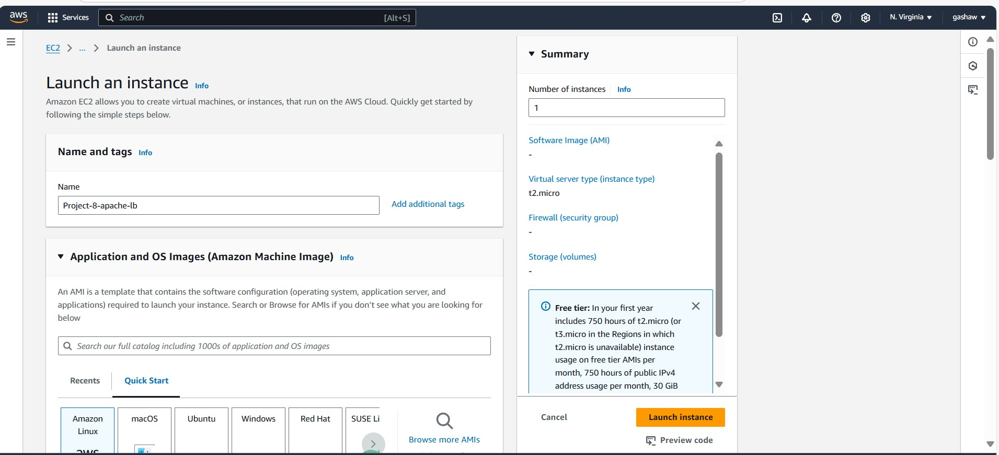

Application and OS Images select Ubuntu Server 20.04 LTS (HVM)  free tire eligable version

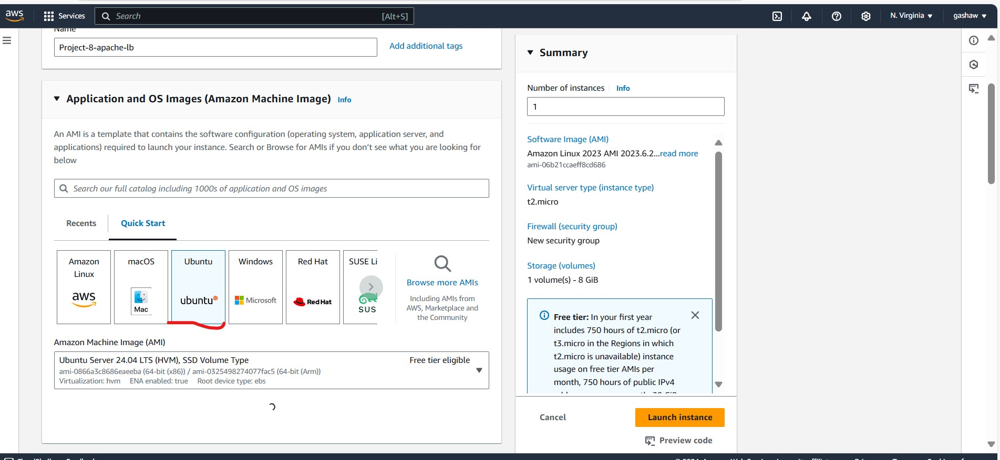

Create new key pair or select existing key 

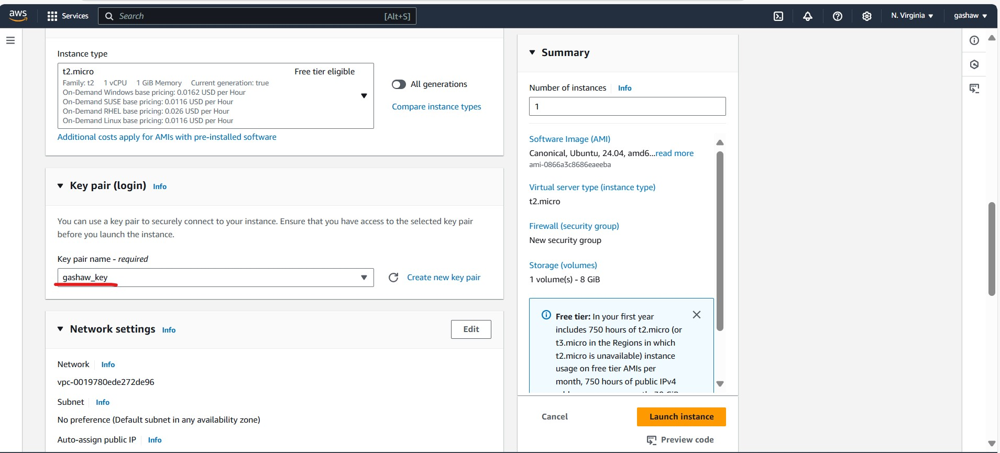

Network setting create new security group or use existing security group

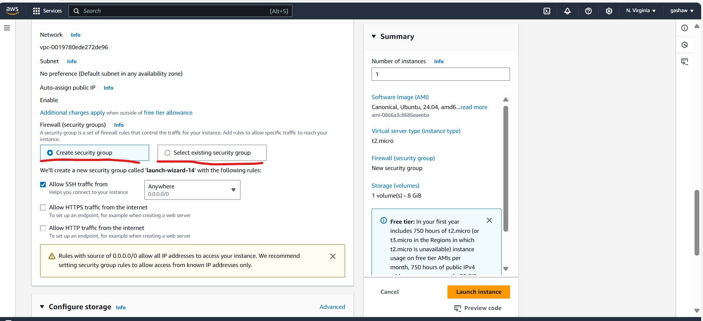

Configure Storage and launch the instance

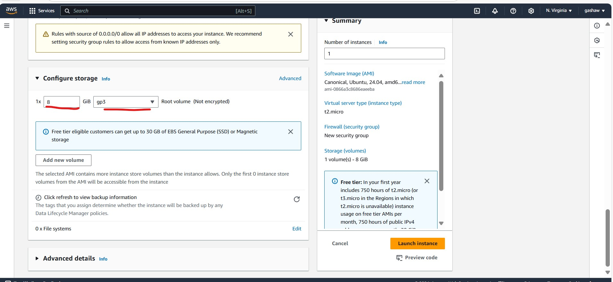

View Instance

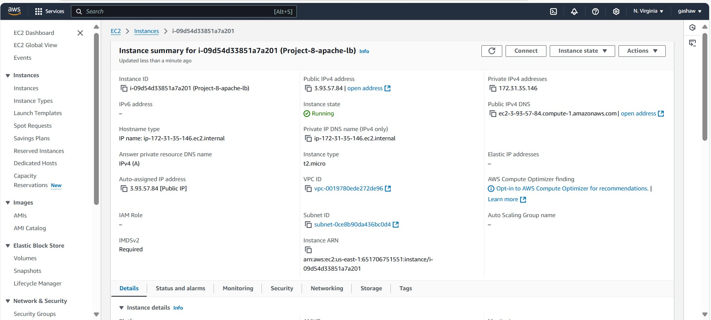

Instance Details for Project-8-apache-lb 

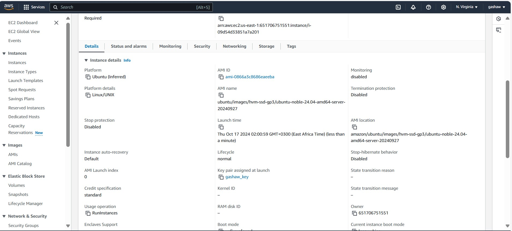

2. Open TCP port 80 on Apache-lb by creating an Inbound Rule in Security Group.

Configure security group with the following inbound rules:

Allow traffic on port 22 (SSH) with source from any IP address. This is opened by default.
Allow traffic on port 80 (HTTP) with source from anywhere on the internet.
Allow traffic on port 443 (HTTPS) with source from anywhere on the internet.

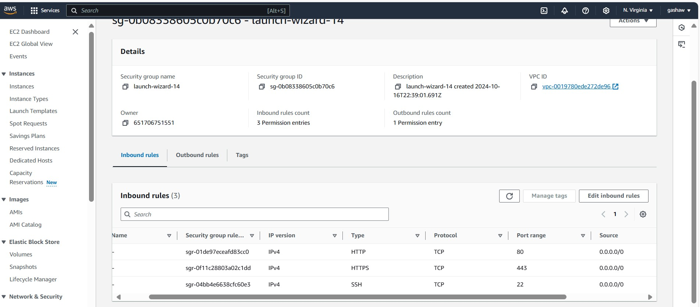

3. Install Apache Load Balancer on Apache-lb server and configure it to point traffic coming to LB to both Web Servers:

Give Permissions
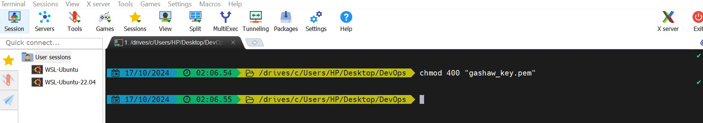

Connect to our lb server 

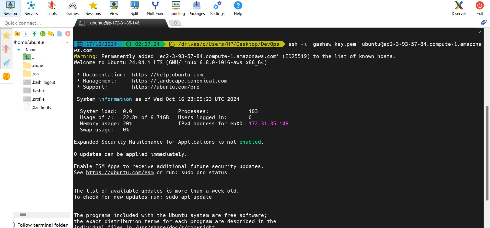


**Install apache2**
```
sudo apt update
sudo apt install apache2 -y
sudo apt-get install libxml2-dev
```


**Enable following modules**:
```
sudo a2enmod rewrite

sudo a2enmod proxy
sudo a2enmod proxy_balancer
sudo a2enmod proxy_http
sudo a2enmod headers
sudo a2enmod lbmethod_bytraffic
```
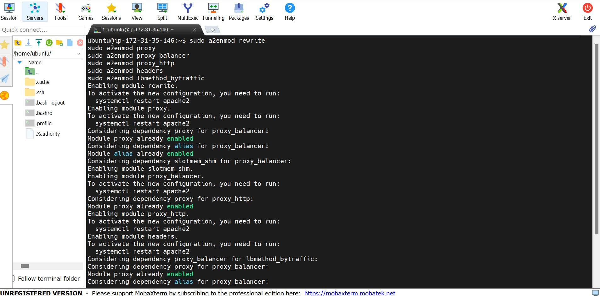

**Restart apache2 service**

```
sudo systemctl restart apache2
```
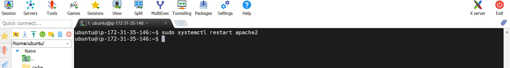

**Make sure apache2 is up and running**
```
sudo systemctl status apache2
```
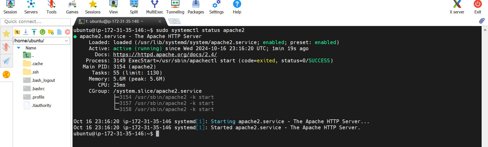

**Configure load balancing**
```
sudo vi /etc/apache2/sites-available/000-default.conf
```
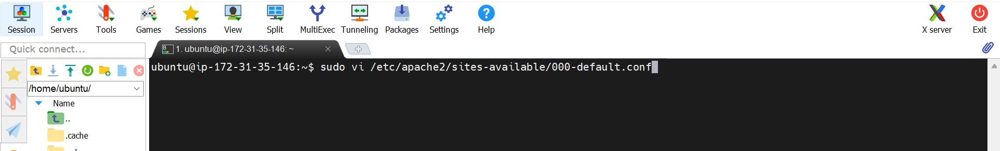

**Add this configuration into this section**
`
 <VirtualHost *:80>
 
 </VirtualHost>
`

```
<Proxy "balancer://mycluster">
               BalancerMember http://172.31.44.68:80 loadfactor=5 timeout=1
               BalancerMember http:172.31.20.250:80 loadfactor=5 timeout=1
               ProxySet lbmethod=bytraffic
               # ProxySet lbmethod=byrequests
        </Proxy>
        ProxyPreserveHost On
        ProxyPass / balancer://mycluster/
        ProxyPassReverse / balancer://mycluster/
```
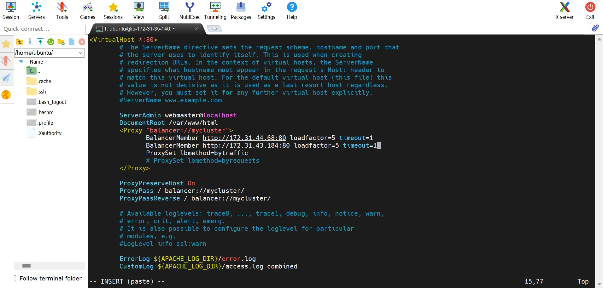

**Restart apache server**
```
sudo systemctl restart apache2
```


> `bytraffic` balancing method will distribute incoming load between our Web Servers according to current traffic load. We can control in which proportion the traffic must be distributed by loadfactor parameter.

we can also use other methods, like: `bybusyness`, `byrequests`, `heartbeat`

**Verify that our configuration works** 

```
http://54.224.143.231/index.php
```
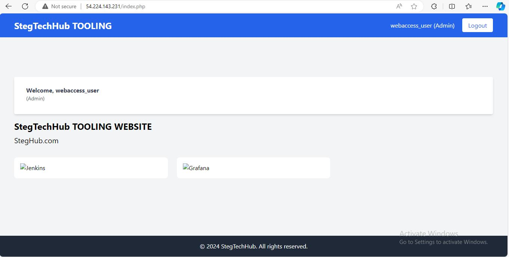

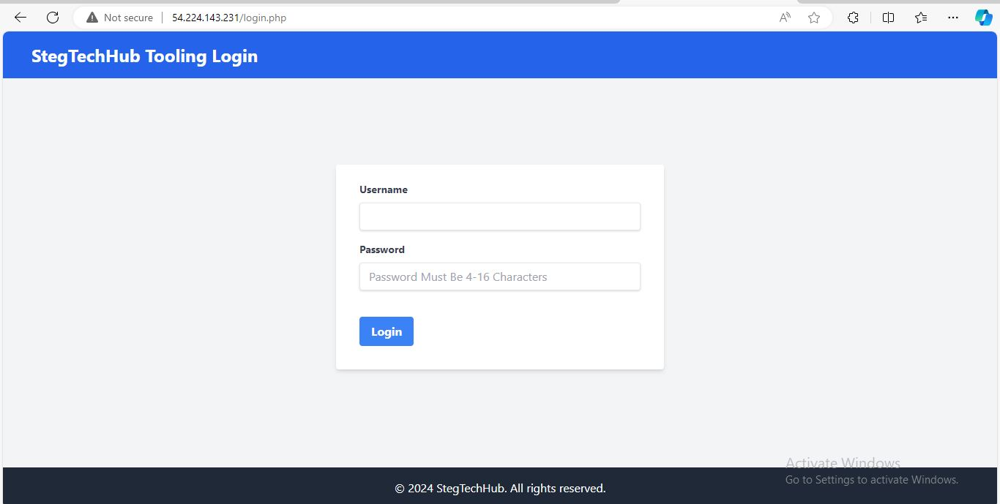

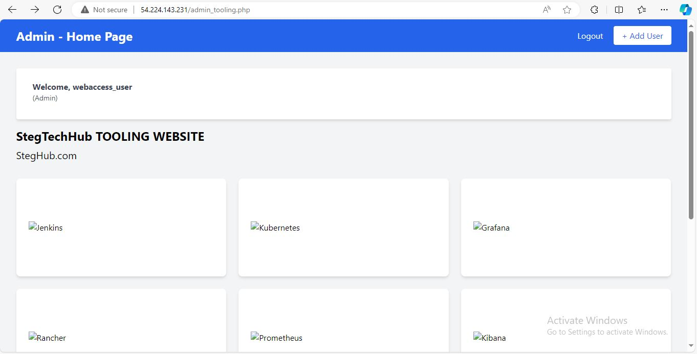


> **Note**: If in the previous project, we mounted /var/log/httpd/ from our Web Servers to the **NFS server** - unmount them and make sure that each Web Server has its own log directory.

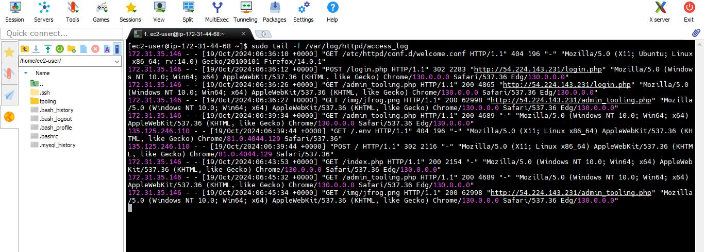

**Unmounting the NFS Directory**
1. Identify the NFS mount: Check the current NFS mounts:
```

df -h
```
2. Look for the line showing the `/var/log/httpd` mount point. Unmount the NFS directory:
```
sudo umount /var/log/httpd
```
But we unmount using the following  `lazy`command

```
sudo umount -l /var/log/httpd
```
> If the directory is busy, you might need to stop the services using it first:

```
sudo systemctl stop httpd
```
3. Verify the unmount:
Check that the directory is unmounted:
```
df -h
```
4. Restart Apache:
```
sudo systemctl restart httpd

```

we should do the above step for all

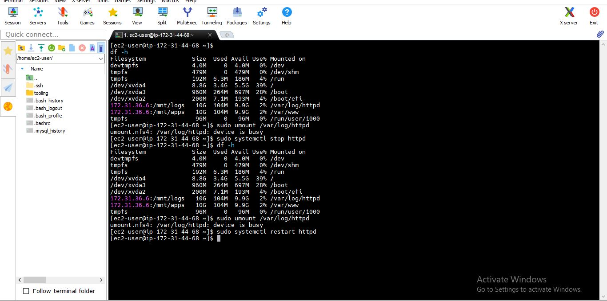


**Open two ssh/Putty consoles for both Web Servers and run following command:****
**server 1**
```
sudo tail -f /var/log/httpd/access_log
```


**sever 2**

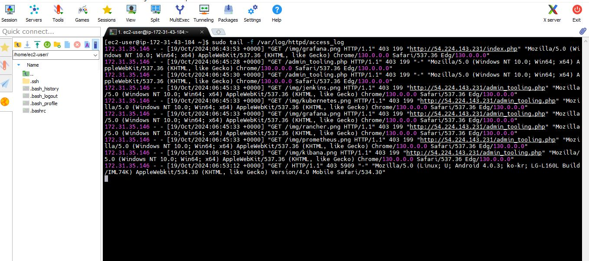

Try to refresh your browser page 

```
http://ec2-54-224-143-231.compute-1.amazonaws.com/login.php

```
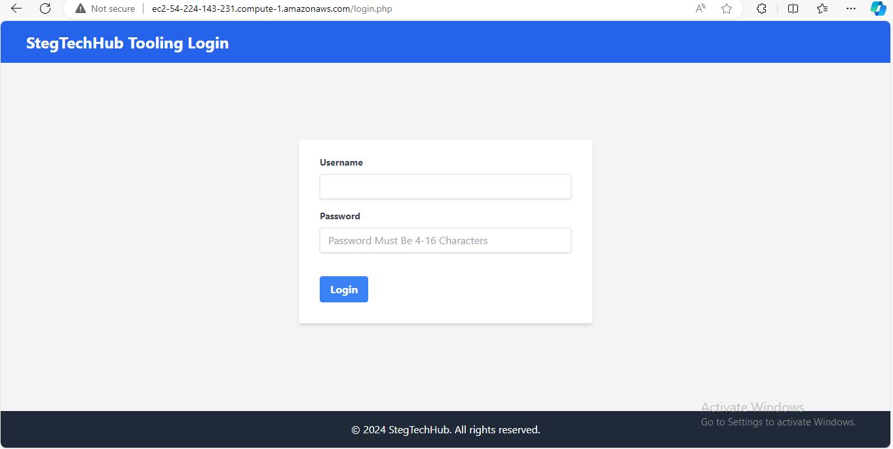

several times and make sure that both servers receive HTTP GET requests from our LB - new records must appear in each server's log file. The number of requests to each server will be approximately the same since we set loadfactor to the same value for both servers - it means that traffic will be distributed evenly between them.

# Optional Step - Configure Local DNS Names Resolution
Sometimes it is tedious to remember and switch between IP addresses, especially if we have a lot of servers. What we can do, is to configure `local domain name resolution`. The easiest way is use /etc/hosts file, although this approach is not very scalable, but it is very easy to configure and shows the concept well.

So let us configure IP address to domain name mapping for our Load Balancer.

1. Open this file on your LB server
```
sudo vi /etc/hosts
```
2. add this file with **Local IP address** and **arbitrary name** for our Web Servers
```
172.31.44.68 Web1
172.31.43.184 Web2
```
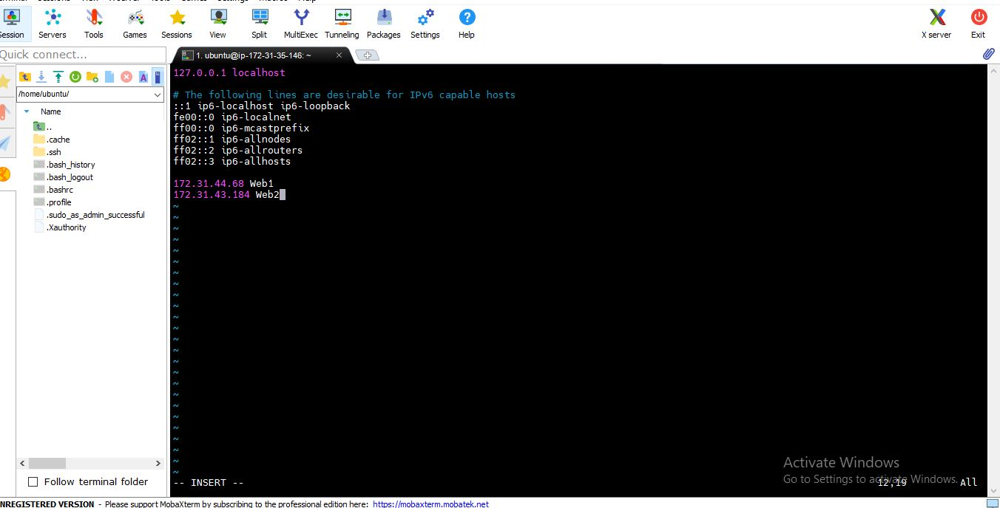

Now we can update our LB config file with those names instead of IP addresses
```
sudo vi /etc/apache2/sites-available/000-default.conf
```

```
BalancerMember http://Web1:80 loadfactor=5 timeout=1
BalancerMember http://Web2:80 loadfactor=5 timeout=1
```
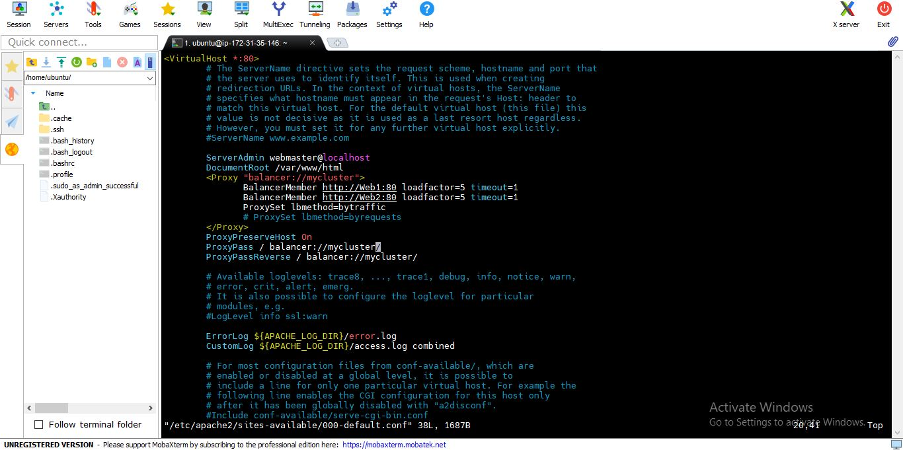

now we can try to curl our Web Servers from LB locally
```
curl http://Web1
```
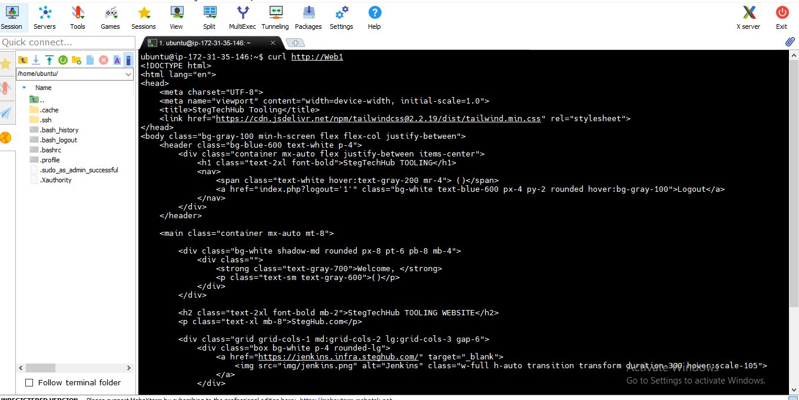

 **or**
 ```
 curl http://Web2
```
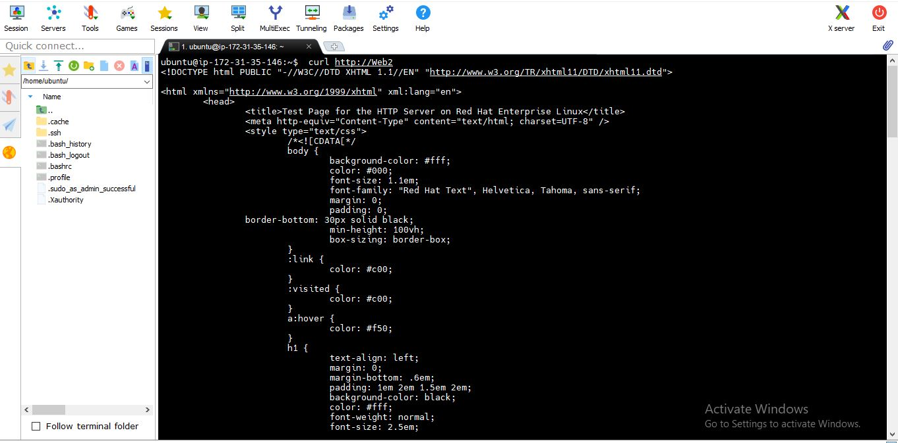

> **Remember**, This is only internal configuration and also local to our **LB server**, these names will neither be 'resolvable' from other servers internally nor from the Internet.


### End of Implementing a Load balancer Solution with Apache
In this project we Deploy and configure an Apache Load Balancer for Tooling Website solution on a separate Ubuntu EC2 intance and users can be served by Web servers through the Load Balancer.
 Load balancing is the process of distributing traffic across multiple servers for high-availability (HA) and elastic scalability. Many system administrators opt for dedicated software such as HAProxy to incorporate a proxy server. But with the mod_proxy_balancer module, we can easily use an unmanaged Linux cloud server as an Apache load balancer for domains or specified URIs. 

# Read more about 
1. **different configuration aspects of Apache mod_proxy_balancer module**. 

2. **Understand what sticky session means and when it is used.**

## Apache mod_proxy_balancer Configuration `mod_proxy_balancer`

The `mod_proxy_balancer` module in Apache HTTP Server is used to configure load balancing between backend servers, which helps distribute incoming client requests to multiple servers to ensure availability and reliability.

### Load Balancer Configuration

- **BalancerMember:** Defines the backend servers (also called balancer members) in the load balancer pool.
```
  <Proxy balancer://mycluster>
      BalancerMember http://backend1.example.com
      BalancerMember http://backend2.example.com
  </Proxy>
  ProxyPass / balancer://mycluster/

```

**BalancerManager** : Provides a web-based interface to manage and monitor the load balancer

```
<Location /balancer-manager>
    SetHandler balancer-manager
    Require all granted
</Location>
```

### Sticky Sessions (Session Persistence)
Sticky sessions, also known as session persistence, ensure that a user's session is consistently handled by the same backend server. This is crucial for applications where session data is stored on the server, and accessing different servers for subsequent requests would disrupt the session state.

Sticky sessions can be configured using the stickysession parameter:
```
<Proxy balancer://mycluster>
    BalancerMember http://backend1.example.com
    BalancerMember http://backend2.example.com
    ProxySet stickysession=JSESSIONID
</Proxy>
ProxyPass / balancer://mycluster/ stickysession=JSESSIONID
```
In the above example, the `JSESSIONID` cookie is used to track the session, ensuring that all requests with the same session ID are routed to the same backend server.

## Load Balancing Methods

**byrequests**: Distributes requests evenly based on the number of requests.
```
ProxySet lbmethod=byrequests
```
**bytraffic**: Distributes requests based on the amount of traffic (bytes).
```
ProxySet lbmethod=bytraffic
```

**bybusyness**: Distributes requests based on the number of active requests
```
ProxySet lbmethod=bybusyness
```

## Failover and Recovery

`status=+H`: Marks a backend server as hot standby.

```
BalancerMember http://backend3.example.com status=+H
```
**retry**: Sets the time to wait before retrying a failed backend server.
```
ProxySet retry=60
```

## When to Use Sticky Sessions

Sticky sessions are particularly useful when:

- **Session Data**: The application stores session data on the server rather than in a shared storage or database.
- **Stateful Applications**: Applications that maintain state across multiple requests, such as shopping carts or user authentication systems.
- **Performance Considerations**: Avoiding the overhead of synchronizing session data across multiple servers.

> However, sticky sessions can reduce the effectiveness of load balancing and lead to uneven distribution of load. In such cases, it's often better to use a centralized session store or a shared caching solution like Redis or Memcached.
