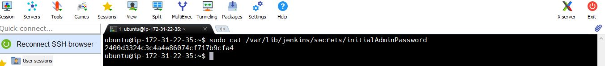
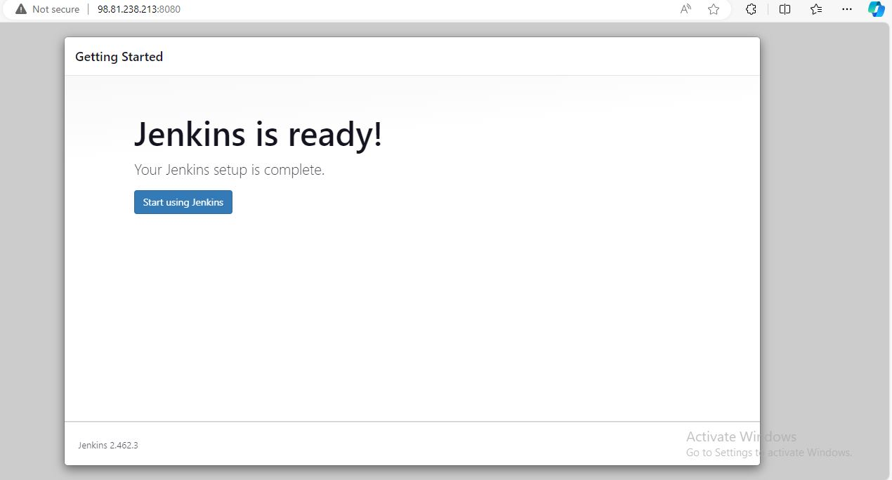
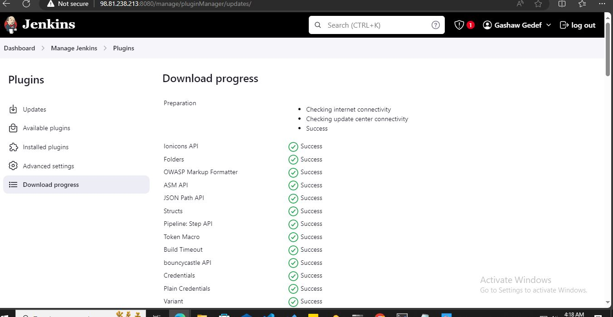

# Tooling Website deployment automation with Continuous Integration
In this project we are going to start automating part of our routine tasks with a free and open source automation server - **Jenkins**. It is one of the mostl popular CI/CD tools.

Acording to Circle CI, Continuous integration (CI) is a software development strategy that increases the speed of development while ensuring the quality of the code that teams deploy. Developers continually commit code in small increments which is then automatically built and tested before it is merged with the shared repository.

**Task**
Enhance the architecture prepared in `Project 8` by adding a Jenkins server, configure a job to automatically deploy source codes changes from Git to NFS server.

# Step 1 - Install Jenkins server
1. Create an aws EC2 instance server based on Ubuntu Server 24.04 LTS and name it `Jenkins Server`
 Log to aws account console and create EC2 instance of t2.micro type with Ubuntu Server 24.04 LTS Server launch in the default region us-east-1. name instance Linux `Jenkins server`


Application and OS Images select Ubuntu free tire eligable version


Create new key pair or select existing key


Network setting create new security group or use existing security group


Configure Storage and launch the instance


View Instance


Instance Details for Jenkins Server


Configure security group with the following inbound rules:

- Allow traffic on port 22 (SSH) with source from any IP address. This is opened by default.
- Allow traffic on port 8080  default Jenkins server uses TCP port
- Allow traffic on port 80 (HTTP) with source from anywhere on the internet.
- Allow traffic on port 443 (HTTPS) with source from anywhere on the internet.


2. Install JDK since Jenkins is a Java-based application
 
 Open up the Linux terminal to begin configuration


```
sudo apt update
```


```
sudo apt install default-jdk-headless
```


 **check if the installation worked**
```
java -version
```


3. Install Jenkins

Add the Jenkins repository:
```
sudo wget -q -O - https://pkg.jenkins.io/debian-stable/jenkins.io.key | sudo apt-key add -
```


**Put the Jenkins repository to the list of package sources**
```
sudo sh -c 'echo deb https://pkg.jenkins.io/debian-stable binary/ > \
    /etc/apt/sources.list.d/jenkins.list'
```


but i have got error using above commands

**Remove the Jenkins Repository and Key:** First, clean up the current Jenkins repository configuration:

```
sudo rm /etc/apt/sources.list.d/jenkins.list
sudo rm /usr/share/keyrings/jenkins-key.gpg
```
**Manually Import the Jenkins GPG Key Using apt-key:** Although apt-key is deprecated, it can still work for this particular case:

```
sudo apt-key adv --keyserver keyserver.ubuntu.com --recv-keys 5BA31D57EF5975CA
```
This directly imports the key identified by 5BA31D57EF5975CA from the keyserver.

**Re-add the Jenkins Repository:** Now add the Jenkins repository again:

```
sudo sh -c 'echo deb https://pkg.jenkins.io/debian-stable binary/ > /etc/apt/sources.list.d/jenkins.list'
```

**Update the Package List:** Run the update command to see if the key has been properly imported:
```
sudo apt update
```


**Installing and configuring Jenkins**
```
sudo apt-get install jenkins
```


**Enable jenkins**
```
sudo systemctl enable jenkins
```


**Check Jenkins is up and running**
```
sudo systemctl status jenkins
```


4. By default Jenkins server uses TCP port 8080 - open it by creating a new Inbound rule in our EC2 Security Group


5. Perform initial Jenkins setup
**Perform initial Jenkins setup. From your browser access**
```
http://<Jenkins-Server-Public-IP-Address>:8080
```


**Obtain Initial Admin Password**
After accessing Jenkins through our browser via `http: <Jenkins-Server-Public-IP-Address-or-Public-DNS-Name>:8080` we will be prompted to provide a default admin password. T

To get retrieve the default admin password, run the following command
```
sudo cat /var/lib/jenkins/secrets/initialAdminPassword
```


Copy the password and paste 


This step enables us to authenticate as the administrator and proceed with Jenkins setup and configuration.


6. Install Suggested Plugins Then we will be asked which plugins to install - choose suggested plugins.


7. Once plugin installation is done Create the First Admin User.
we will create the first admin user for our system, granting initial administrative privileges to manage and configure the platform.


8. Jenkins Setup Completion.



With the installation and configuration completed, Jenkins is now ready for use. Navigate to the Jenkins dashboard and click on `New Item` to create a new job.


# Step 2 - Configure Jenkins to retrieve source codes from GitHub using Webhooks
In this part, we will learn how to configure a simple **Jenkins job/project**. This job will will be triggered by `GitHub webhooks` and will execute a `build` task to retrieve codes from GitHub and store it locally on Jenkins server.

1. Enable webhooks in our GitHub repository settings. Go to your GitHub repository and select Settings > Webhooks > Add webhook


2. Go to Jenkins web console, click `New Item` and create a `Freestyle project`


To connect our GitHub repository, we will need to provide its URL, we can copy from the repository itself


```
https://github.com/gashawgedef/tooling.git
```
In configuration of our Jenkins freestyle project choose Git repository, provide there the link to our Tooling GitHub repository and credentials (user/password) so Jenkins could access files in the repository.


Save the configuration and let us try to run the build. For now we can only do it manually. Click ``Build Now` button, if we have configured everything correctly, the build will be successfull and you will see it under #1


You can open the build and check in **Console Output** if it has run successfully.


But this build does not produce anything and it runs only when we trigger it manually. Let us fix it.

3. Click `Configure` our job/project and add these two configurations

3.1 Configure triggering the job from GitHub webhook:
 
 

3.2 Configure `Post-build Actions` to archive all the files - files resulted from a build are called `artifacts`
- To archive all files generated by the build, you can enter

```
**/*
```


Now, go ahead and we make some change in any file in our GitHub repository (e.g. README.MD file) and push the changes to the master branch.


we will see that a new build has been launched automatically by webhook and its results - artifacts, saved on Jenkins server.


Now we configured an automated `Jenkins job ` that receives files from GitHub by webhook trigger this method is considered as `push` because the changes are being `pushed` and files transfer is initiated by GitHub. There are also other methods: trigger one job `downstreadm` from another `upstream`, pull GitHub periodically and others

**By default, the artifacts are stored on Jenkins server locally**
```
ls /var/lib/jenkins/jobs/tooling_github/builds/<build_number>/archive/
```


# Step 3 - Configure Jenkins to copy files to NFS server via SSH

Now we have our artifacts saved locally on Jenkins server, the next step is to copy them to our NFS server to `/mnt/apps` directory
Jenkins is a highly extendable application and there are `more than 1400 plugins` available. now we will need a plugin that is called `Publish Over SSH`
1. Install `Publish Over SSH` plugin. Go to the Jenkins web console and select **Manage Jenkins** > **Manage Plugins**> **Available** > **Publish over SSH** > `Install without restart`."




**Verify the installation**


2. Configure the **job/project** to copy artifacts over to **NFS server**
 
 On main dashboard select **Manage Jenkins** > **Configure System** menu item.

Scroll down to `Publish over SSH` plugin configuration section and configure it to be able to connect to your NFS server:

2.1 Provide a private key (content of .pem file that we use to connect to NFS server via SSH/Putty)

2.2 Arbitrary name

2.3 Hostname - can be `private IP address` of our NFS server

2.4 Username - `ec2-user` (since NFS server is based on EC2 with RHEL 9)

2.5 Remote directory - `/mnt/apps` since our Web Servers use it as a mointing point to retrieve files from the NFS server


> Test the configuration and make sure the connection returns _**Success**_. **N.B** that `TCP port 22 on NFS server` must be open to receive SSH connections


**Save the configuration, open your Jenkins job/project configuration page and add another one `Post-build Action`**


**Configure it to send all files produced by the build into our previouslys define remote directory** In our case we want to copy **all files** and **directories**, so we use `**` If you want to apply some particular pattern to define which files to send - [Read here in detail]
(https://ant.apache.org/manual/dirtasks.html#patterns).


**Save this configuration and go ahead, change something in README.MD file in our GitHub Tooling repository**
> Remeber to give directory permissions for user `ec2-user` on the **NFS server** :
Ensure the target directory on the NFS server has the correct permissions. You might need to change ownership or modify the permissions to allow the Jenkins user to write to it.
```
sudo chown -R ec2-user:ec2-user /mnt/apps
sudo chmod -R 755 /mnt/apps
```


`Webhook` will trigger a new job 


and in the `Console Output` of the job we will get something like this:

```
SSH: Transferred 25 file(s)
Finished: SUCCESS
```


**To make sure that the files in /mnt/apps have been updated - connect via SSH to our NFS server and check README.MD file**
```
sudo ls /mnt/apps
```


```
cat /mnt/apps/README.md
```


If you see the changes you had previously made in your GitHub - the job works as expected.

### End of Tooling Website deployment automation with Continuous Integration Project
In this project we implemented our first Continous Integration solution using Jenkins. We configure a job to automatically deploy source codes changes from Git to NFS server.

