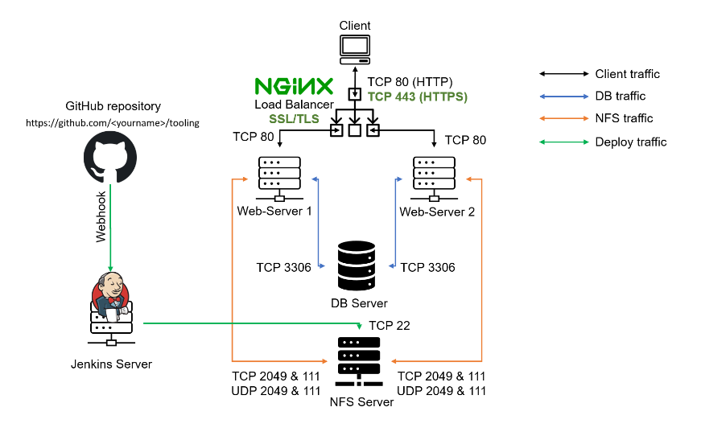
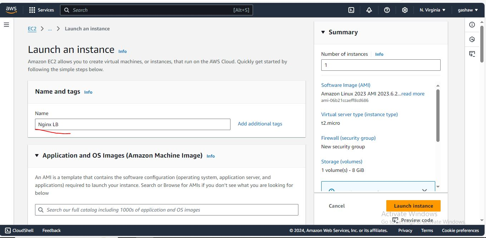
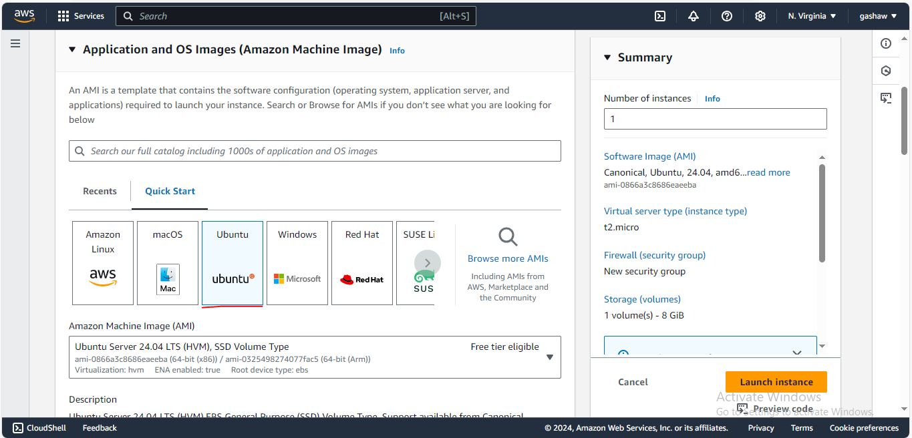
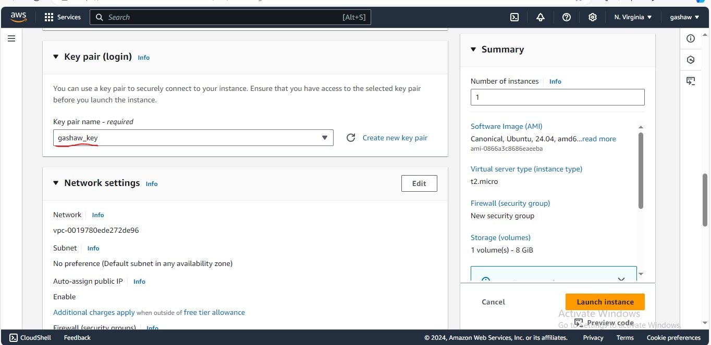
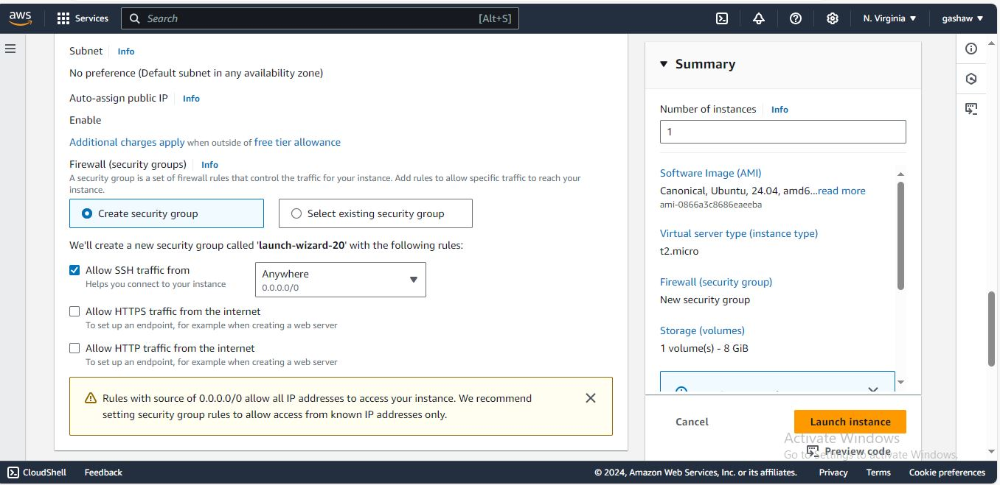
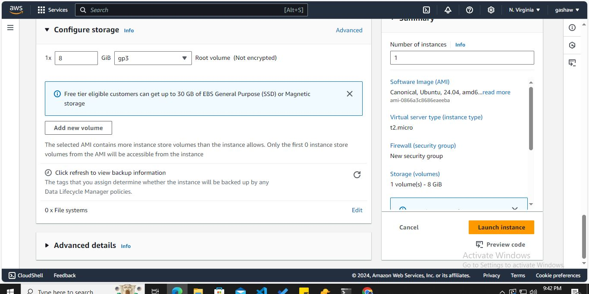
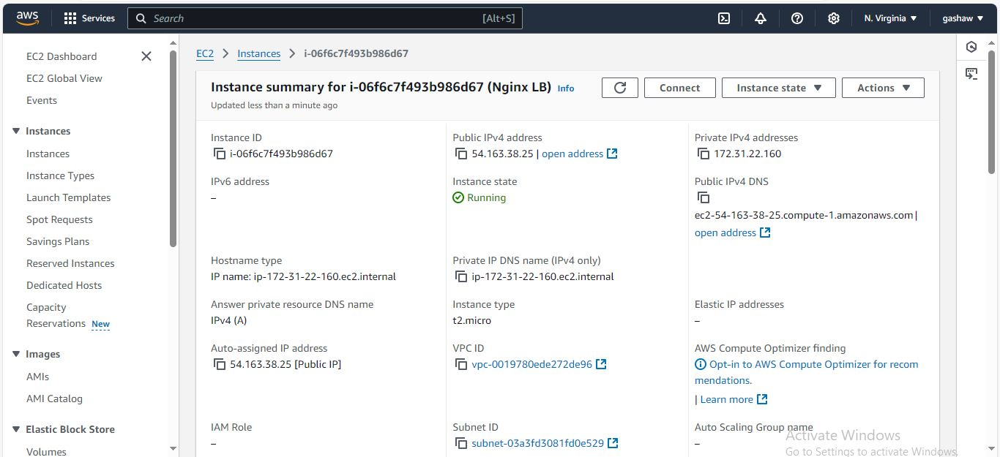
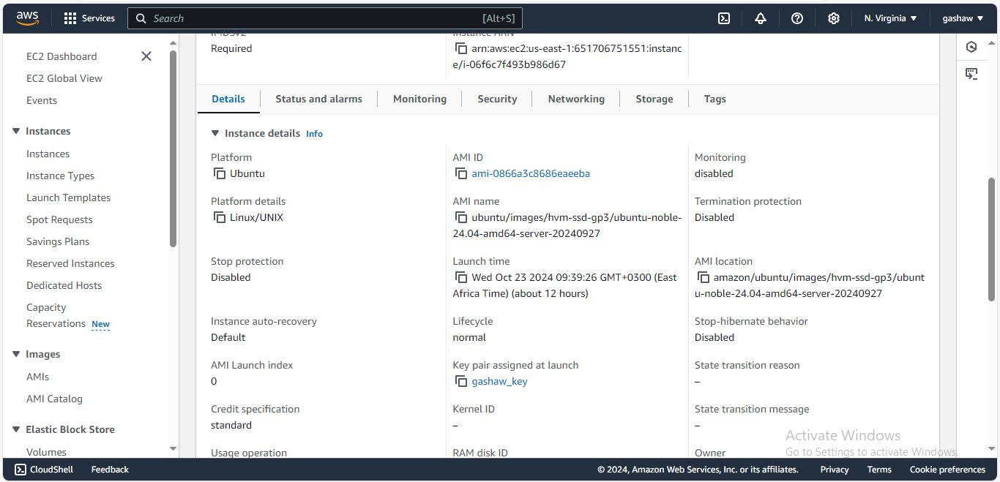
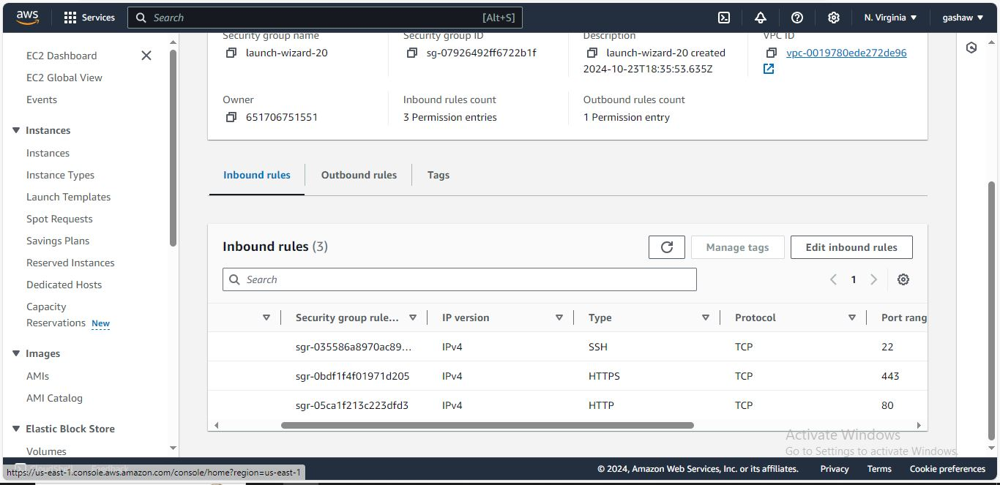
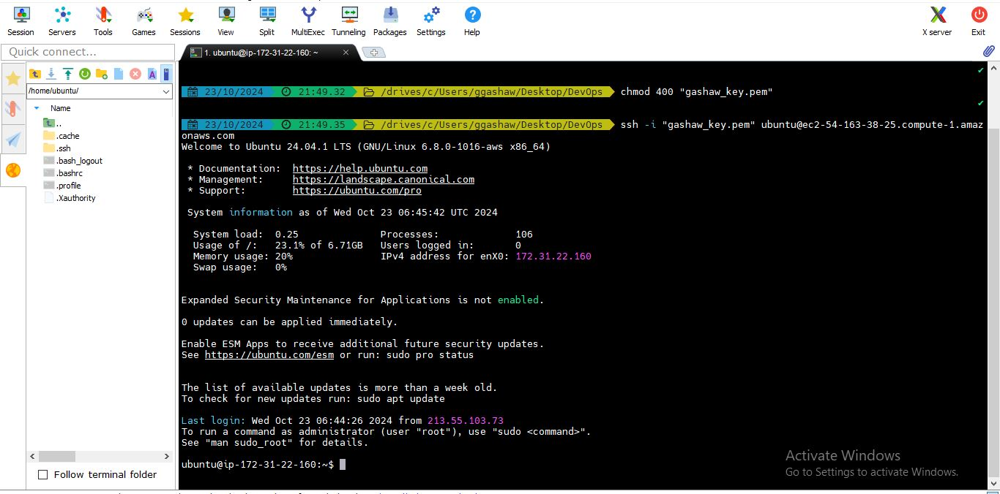

# Load Balancer Solution With Nginx and SSL/TLS

**Load balancing** : is an excellent way to scale out your application and increase its performance and redundancy. Nginx, a popular web server software, can be configured as a simple yet powerful load balancer to improve your server’s resource availability and efficiency.

**SSL/TLS Termination** : Generate an SSL certificate and private key for the domain name users will access. You can use a free Let's Encrypt certificate or obtain one from a certificate authority. Configure Nginx to use the SSL certificate and key within the server block listening on port 443.Nginx will handle the SSL/TLS encryption and decryption for incoming connections. Traffic between Nginx and the backend servers will be unencrypted HTTP.

**Task**

This project consists of two parts:

1. _Configure Nginx as a Load Balancer_
   
2. _Register a new domain name and configure secured connection using SSL/TLS certificates_
 
Our target architecture will look like this:



# Part 1 Configure Nginx as a load balancer

1. Create an EC2 VM based on Ubuntu Server 24.04 LTS and name it nginx Ls 

  


Application and OS Images select Ubuntu free tire eligable version



Create new key pair or select existing key



Network setting create new security group or use existing security group



Configure Storage and launch the instance



View Instance



Instance Details for web



Configure security group with the following inbound rules:

- Allow traffic on port 22 (SSH) with source from any IP address. This is opened by default.
- Allow traffic on port 80 (HTTP) with source from anywhere on the internet.
- Allow traffic on port 443 (HTTPS) with source from anywhere on the internet.



Now connect to ssh terminal and work on



2. Update `/etc/hosts` file for local DNS with Web Servers' names (e.g web1 and web2) and their local IP addresses
```
sudo vi /etc/hosts
```


Verify change 
```
sudo cat /etc/hosts
```


3. Install and configure Nginx as a load balancer to point traffic to the resolvable DNS names of the webservers

Update the instance
```
sudo apt update
```


Install Nginx 

```
sudo apt install nginx
```


4. Edit the Nginx configuration file to set up load balancing
```
  sudo vi /etc/nginx/nginx.conf
```


5. insert the following configuration in `http` section

```
    upstream myproject {
       server Web1 weight=5;
       server Web2 weight=5;
    }

    server {
        listen 80;
        server_name ww.domain.com;

        location / {
            proxy_pass http://myproject;
        }
    }
    # comment out this line
    # include /ete/nginx/sites-enabled/

```


6. Test the Configuration

Before reloading Nginx, test the configuration to ensure there are no syntax errors
```
sudo nginx -t
```


7. Reload Nginx
If the configuration test is successful, reload Nginx to apply the changes

```
sudo systemctl reload nginx
```


8. Verify  the service is up and running
```
sudo systemctl status nginx
```


# Part 2 - Register a new domain name and configure secured connection using SSL/TLS certificates
In order to get a valid SSL certificate we need to register a **new domain name**, we can do it using any Domain name registrar - a company that manages reservation of domain names. The most popular ones are: `Godaddy.com`, `Domain.com`, `Bluehost.com`

1. Register a new domain
   
- Select a domain registrar like GoDaddy, Domain.com, Bluehost or other for this time I need free domain for that 
  got to [https://www.cloudns.net/main/](https://www.cloudns.net/main/) and signup and register new domain
 


- Register your desired domain name  (e.g. .com, .net, .org, .edu, .info, .xyz or any other)


Now let us check using DNS Checker  [https://dnschecker.org/#A/www.tooling.dns-dynamic.net](https://dnschecker.org/#A/www.tooling.dns-dynamic.net) 


   
2. Assign an Elastic IP to our Nginx LB server and associate our domain name with this Elastic IP
learn how to allocate an Elastic IP and associate it with an EC2 server [Elastic IP addresses](https://docs.aws.amazon.com/AWSEC2/latest/UserGuide/elastic-ip-addresses-eip.html)

**Allocate an Elastic IP Address:**

2.1 In the AWS Management Console, navigate to the EC2 Dashboard

2.2 Select `Elastic IPs` from the left-hand menu

2.3 Click `Allocate Elastic IP address` and follow the prompts


**Associate Elastic IP with Your EC2 Instance:**

2.1. Select the allocated Elastic Ip

2.2 Click `Actions` and choose `Associate Elastic IP address`

2.3 Select your Nginx EC2 instance from the list and associate the Elastic IP


3. **Update DNS Settings**
   
3.1. Update A record in your registrar to point to Nginx LB using Elastic IP address
   
3.2 Log in to your domain registrar's control panel

3.3 Find the DNS settings for your domain

3.4 Add or update an A record to point to your Elastic IP address


4. Configure Nginx to recognize your new domain name
Open the Nginx configuration file, typically located at `/etc/nginx/nginx.conf` or a specific site configuration file in `/etc/nginx/sites-available/` update your nginx.conf with server_name www.<your-domain-name.com instead of server_name www.domain.com

**our server name :** `www.tooling.dns-dynamic.net`

```
sudo vi /etc/nginx/nginx.conf
```


**Restart Nginx**
```
sudo systemctl restart nginx
```


5. Install `certbot` and request for an SSL/TLS certificate

**verify snapd service is active and running**
```
sudo systemctl status snapd
```


**Install certbot**
```
sudo snap install --classic certbot
```


Obtain SSL/TLS Certificates:just follow the certbot instructions you will need to choose which domain you want your certificate to be issued for, domain name will be looked up from `nginx.conf` file so make sure you have updated it on step 4).

**Create a Symlink for Certbot:** Create a symbolic link to make Certbot easily executable
```
sudo ln -s /snap/bin/certbot /usr/bin/certbot
```


**Run Certbot to obtain and install the certificate**
```
sudo certbot --nginx
```
Follow the prompts to select your domain and complete the installation


6. Test secured access to your Web Solution by trying to reach
- Visit `https://<your-domain-name.com>` in your web browser
  
- Ensure you see a padlock icon indicating a secure connection
  
- Click the padlock icon to view the details of the SSL certificate

> You shall be able to access your website by using HTTPS protocol (that uses TCP port 443) and see a padlock pictogram in your browser's search string. Click on the padlock icon and you can see the details of the certificate issued for your website.


7. Set up periodical renewal of your SSL/TLS certificate
By default, LetsEncrypt certificate is valid for 90 days, so it is recommended to renew it at least every 60 days or more frequently.

**Test Renewal in Dry-Run Mode**
```
sudo certbot renew --dry-run
```


> Best pracice is to have a scheduled job that to run renew command periodically. Let us configure a `cronjob` to run the command twice a day

**Open the crontab editor**
```
crontab -e
```
**Add the following line to schedule the renewal command to run twice a day**:
```
* */12 * * *   root /usr/bin/certbot renew > /dev/null 2>&1
```


**Additional Resources**
- For more information on cron jobs, watch the video [Job Scheduling (cronjob/crontab) on Linux CentOS 8](https://www.youtube.com/watch?v=4g1i0ylvx3A)
-Use an online cron expression editor to help create and understand cron expressions [online cron expression editor](https://crontab.guru/)
