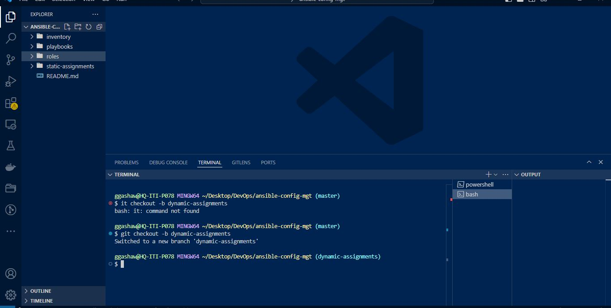

# ANSIBLE DYNAMIC ASSIGNMENTS (INCLUDE) AND COMMUNITY ROLES

> IMPORTANT NOTICE: Ansible is an actively developing software project, so you are encouraged to visit Ansible Documentation for the latest updates on modules and their usage.[https://docs.ansible.com/](https://docs.ansible.com/)

Last 2 projects have already equipped you with some knowledge and skills on Ansible, so you can perform configurations using playbooks, roles and imports. Now you will continue configuring your UAT servers learning and practicing new Ansible concepts and modules.

In this project we will introduce [dynamic assignments](https://docs.ansible.com/ansible/latest/playbook_guide/playbooks_reuse.html#includes-dynamic-re-use ) by using _include_ module.

Now you may be wondering, what is the difference between **static** and **dynamic** assignments?

Well, from **Project 12**, you can already tell that static assignments use `import` Ansible module. The module that enables dynamic assignments is include.

Hence,
```
import = Static
include = Dynamic
```
When the **import** module is used, all statements are pre-processed at the time playbooks are [parsed](https://en.wikipedia.org/wiki/Parsing). Meaning, when you execute `site.yml` playbook, Ansible will process all the playbooks referenced during the time it is parsing the statements. This also means that, during actual execution, if any statement changes, such statements will not be considered. Hence, it is static.

On the other hand, when **include module** is used, all statements are processed only during execution of the playbook. Meaning, after the statements are parsed, any changes to the statements encountered during execution will be used.

> **Take note that** in most cases it is recommended to use **static assignments** for playbooks, because it is more reliable. With dynamic ones, it is hard to debug playbook problems due to its dynamic nature. However, you can use dynamic assignments for environment specific variables as we will be introducing in this project.

# Introducing Dynamic Assignment Into Our Stracture

In your https://github.com//ansible-config-mgt GitHub repository start a new branch and call it dynamic-assignments.
```
git checkout -b dynamic-assignments

```


1. Create a new folder, name it `dynamic-assignments`.
2.  Then inside this folder, create a new file and name it `env-vars.yml`.
3. We will instruct `site.yml` to include this playbook later. For now, let us keep building up the structure.

Your GitHub shall have following structure by now.

> Note: Depending on what method you used in the previous project you may have or not have roles folder in your GitHub repository – if you used ansible-galaxy, then roles directory was only created on your Jenkins-Ansible server locally. It is recommended to have all the codes managed and tracked in GitHub, so you might want to recreate this structure manually in this case – it is up to you.
```
├── dynamic-assignments
│   └── env-vars.yml
├── inventory
│   └── dev
    └── stage
    └── uat
    └── prod
└── playbooks
    └── site.yml
└── roles (optional folder)
    └──...(optional subfolders & files)
└── static-assignments
    └── common.yml
```


Since we will be using the same Ansible to configure multiple environments, and each of these environments will have certain unique attributes, such as **servername**, **ip-address** etc., we will need a way to set values to variables per specific environment.

For this reason, we will now create a folder to keep each environment’s variables file. Therefore, **create a new folder** `env-vars`, then for each environment, create new YAML files which we will use to set variables.

Your layout should now look like this
```
├── dynamic-assignments
│   └── env-vars.yml
├── env-vars
    └── dev.yml
    └── stage.yml
    └── uat.yml
    └── prod.yml
├── inventory
    └── dev
    └── stage
    └── uat
    └── prod
├── playbooks
    └── site.yml
└── static-assignments
    └── common.yml
    └── webservers.yml
```


Now paste the instruction below into the env-vars.yml file.
```
---
- name: collate variables from env specific file, if it exists
  hosts: all
  tasks:
    - name: looping through list of available files
      include_vars: "{{ item }}"
      with_first_found:
        - files:
            - dev.yml
            - stage.yml
            - prod.yml
            - uat.yml
          paths:
            - "{{ playbook_dir }}/../env-vars"
      tags:
        - always
```


**Notice 3 things to notice here:**

1. We used `include_vars` syntax instead of `include`, this is because Ansible developers decided to separate different features of the module. From Ansible version **2.8**, the include module is deprecated and variants of include_* must be used. These are:

- [include_role](https://docs.ansible.com/ansible/latest/collections/ansible/builtin/include_role_module.html#include-role-module )
- [include_tasks](https://docs.ansible.com/ansible/latest/collections/ansible/builtin/include_tasks_module.html#include-tasks-module )
- [include_vars](https://docs.ansible.com/ansible/latest/collections/ansible/builtin/include_vars_module.html#include-vars-module )

In the same version, variants of import were also introduces, such as:

- [import_role](https://docs.ansible.com/ansible/latest/collections/ansible/builtin/import_role_module.html#import-role-module )
- [import_tasks](https://docs.ansible.com/ansible/latest/collections/ansible/builtin/import_tasks_module.html#import-tasks-module )

2. We made use of a [special variables](https://docs.ansible.com/ansible/latest/reference_appendices/special_variables.html) { playbook_dir } and { inventory_file }. { playbook_dir } will help Ansible to determine the location of the running playbook, and from there navigate to other path on the filesystem. { inventory_file } on the other hand will dynamically resolve to the name of the inventory file being used, then append .yml so that it picks up the required file within the `env-vars` folder.

3. We are including the variables using a loop._ with_first_found _ implies that, looping through the list of files, the first one found is used. This is good so that we can always set default values in case an environment specific env file does not exist.

# UPDATE SITE.YML WITH DYNAMIC ASSIGNMENTS

Update `site.yml` file to make use of the dynamic assignment. (At this point, we cannot test it yet. We are just setting the stage for what is yet to come. So hang on to your hats)

`site.yml` should now look like this.
```
---
- hosts: all
- name: Include dynamic variables 
  tasks:
  import_playbook: ../static-assignments/common.yml 
  include: ../dynamic-assignments/env-vars.yml
  tags:
    - always

-  hosts: webservers
- name: Webserver assignment
  import_playbook: ../static-assignments/webservers.yml
```


# Community Roles

Now it is time to create a role for **MySQL database** – it should install the `MySQL package`, create a database and configure users. But why should we re-invent the wheel? There are tons of roles that have already been developed by other open source engineers out there. These roles are actually production ready, and dynamic to accomodate most of Linux flavours. With Ansible Galaxy again, we can simply download a ready to use ansible role, and keep going.

# Download Mysql Ansible Role 
 you can browse available community roles [here](https://galaxy.ansible.com/ui/)

We will be using a [MySQL role developed by geerlingguy](https://galaxy.ansible.com/geerlingguy/mysql )


> Hint: To preserve your your GitHub in actual state after you install a new role – make a commit and push to master your `ansible-config-mgt` directory. Of course you must have git installed and configured on Jenkins-Ansible server and, for more convenient work with codes, you can configure Visual Studio Code to work with this directory. In this case, you will no longer need webhook and Jenkins jobs to update your codes on Jenkins-Ansible server, so you can disable it – we will be using Jenkins later for a better purpose.

On `Jenkins-Ansible` server make sure that git is installed with git --version, then go to ‘ansible-config-mgt’ directory and run
```
git init
git pull https://github.com/<your-name>/ansible-config-mgt.git
git remote add origin https://github.com/<your-name>/ansible-config-mgt.git
git branch roles-feature
git switch roles-feature
```
Inside roles directory create your new MySQL role with ansible-galaxy install geerlingguy.mysql and rename the folder to mysql

```
ansible-galaxy role install geerlingguy.mysql
```


```
mv geerlingguy.mysql/ mysql
```


Read `README.md` file, and edit roles configuration to use correct credentials for MySQL required for the `tooling` website.

Now it is time to upload the changes into your GitHub:
```
git add .
git commit -m "Commit new role files into GitHub"
git push --set-upstream origin roles-feature
```

Now, if you are satisfied with your codes, you can create a **Pull Request** and merge it to main branch on GitHub.

# LOAD BALANCER ROLES
We want to be able to choose which Load Balancer to use, Nginx or Apache, so we need to have two roles respectively:

1. Nginx
2. Apache

With your experience on Ansible so far you can:

- Decide if you want to **develop your own** roles, or find **available ones from the community**

**Install Nginx Role:**

```
ansible-galaxy role install geerlingguy.nginx
```
**Install Apache Role:**

```
ansible-galaxy role install geerlingguy.apache
```


- Update both static-assignment and site.yml files to refer the roles

> Important Hints:

- Since you cannot use both **Nginx** and **Apache** load balancer, you need to add a condition to enable either one – this is where you can make use of variables.

- Declare a variable in defaults/main.yml file inside the Nginx and Apache roles. Name each variables _enable_nginx_lb _ and _enable_apache_lb_ respectively.

- Set both values to false like this `enable_nginx_lb: false` and `enable_apache_lb: false` 

- Declare another variable in both roles `load_balancer_is_required` and set its value to _false_ as well

Update defaults/main.yml for Nginx Role 
```
enable_nginx_lb: false
load_balancer_is_required: false
```


Update defaults/main.yml for Apache Role:
```
enable_apache_lb: false
load_balancer_is_required: false
```


- Update both assignment and `site.yml` files respectively

Create  `loadbalancers.yml` file  in static-assignments and add 

```
- hosts: lb
  roles:
    - { role: nginx, when: enable_nginx_lb and load_balancer_is_required }
    - { role: apache, when: enable_apache_lb and load_balancer_is_required }
```


Update `site.yml` file

```
- name: Loadbalancers assignment
  hosts: lb
- import_playbook: ../static-assignments/loadbalancers.yml
  when: load_balancer_is_required 
```


Now you can make use of `env-vars\uat.yml` file to define which loadbalancer to use in UAT environment by setting respective environmental variable to _true_

You will activate **load balancer**, and enable `nginx` by setting these in the respective environment’s env-vars file.
```
enable_nginx_lb: true
load_balancer_is_required: true
```


The same must work with `apache` **LB**, so you can switch it by setting respective environmental variable to _true_ and other to _false_
```
enable_nginx_lb: false
enable_apache_lb: true
load_balancer_is_required: true

```


To test this, you can update inventory for each environment and run Ansible against each environment.
update your inventory file for UAT ` inventory/uat`:
```
[lb]
lb_host ansible_host=your_lb_host_ip
```
Run the playbook against the UAT environment:
```
ansible-playbook -i inventory/uat site.yml --extra-vars "@env-vars/uat.yml"
```

## End of Project 13 ANSIBLE DYNAMIC ASSIGNMENTS (INCLUDE) AND COMMUNITY ROLES

In this project you have learned and practiced how to use Ansible configuration management tool to prepare UAT environment for Tooling web solution

## Next project 
Next project is a **capstone project** for this part of your Project Based Learning journey – it will require all previously gained knowledge and skills, and introduce more new and exciting concepts and DevOps tools!
