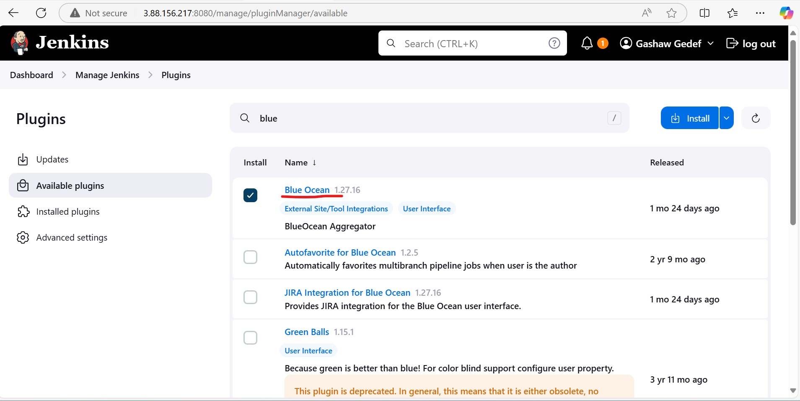
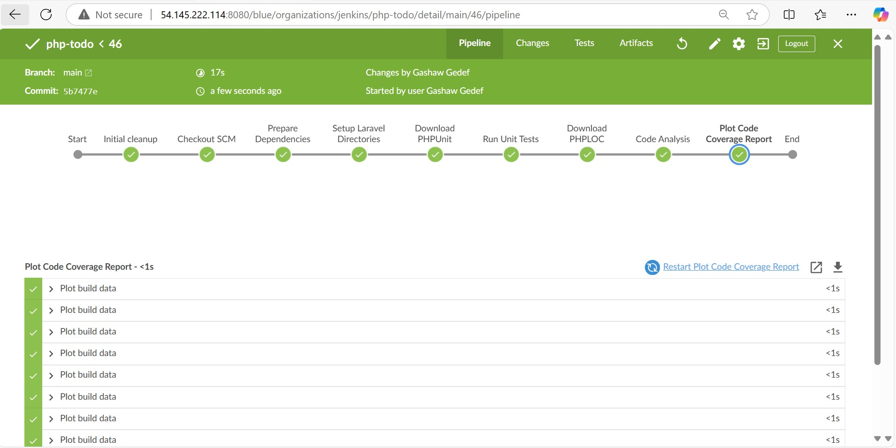
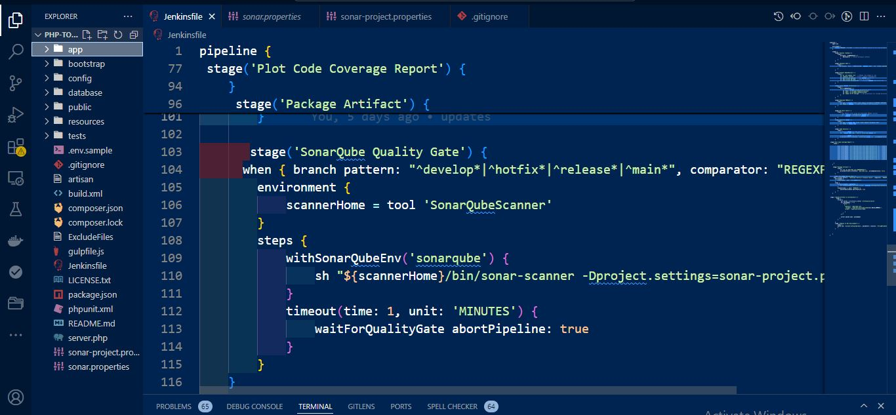

# EXPERIENCE CONTINUOUS INTEGRATION WITH JENKINS | ANSIBLE | ARTIFACTORY | SONARQUBE | PHP

**IMPORTANT NOTICE** – This project has some initial theoretical concepts that must be well understood before moving on to the practical
part. Please read it carefully as many times as needed to completely digest the most important and fundamental DevOps concepts. 
To successfully implement this project, it is crucial to grasp the importance of the entire CI/CD process, roles of each tool and
success metrics – so we encourage you to thoroughly study the following theory until you feel comfortable explaining all the concepts
(e.g., to your new junior colleague or during a job interview).

In previous projects, you have been deploying a tooling website directly into the
var/www/html directory on dev servers. Well, even though that worked fine, and we were 
able to access the website, it is not the best way to do it. Real world web application code written on
[Java](https://en.wikipedia.org/wiki/Java(programming_language)), .NET or other compiled programming languages require a build 
stage to create an executable file. The executable file (e.g., jar file in case of Java) contains all the codes embedded, and the
necessary library dependencies, which the application needs to run and work successfully.

Some other programs written languages such as PHP, JavaScript or Python work directly without being built into an executable file – 
these languages are called interpreted. That is why we could easily deploy the entire code from git into var/www/html and immediately
the webserver was able to render the pages in a browser. However, it is not optimal to download code directly from Git onto our servers.
There is a smarter way to package the entire application code, and track release versions. We can package the entire code and all its
dependencies into an archive such as .tar.gz or .zip, so that it can be easily unpacked on a respective environment’s servers.

For a better understanding of the difference between compiled vs interpreted programming languages – read this short article.
( https://www.freecodecamp.org/news/compiled-versus-interpreted-languages/ )

In this project, you will understand and get hands on experience around the entire concept around CI/CD from applications perspective.
To fully gain real expertise around this idea, it is best to see it in action across different programming languages and from the platform perspective too. From the application perspective, we will be focusing on PHP here; there are more projects ahead that are based on Java, Node.js, .Net and Python. By the time you start working on Terraform, Docker and Kubernetes projects, you will get to see the platform perspective of CI/CD in action.

### What is Continuous Integration?

In software engineering, Continuous Integration (CI) is a practice of merging all developers’ working copies to a shared mainline
(e.g., Git Repository or some other version control system) several times per day. Frequent merges reduce chances of any conflicts in code and allow to run tests more often to avoid massive rework if something goes wrong. This principle can be formulated as Commit early, push often.

The general idea behind multiple commits is to avoid what is generally considered as Merge Hell or Integration hell. When a new developer joins a new project, he or she must create a copy of the main codebase by starting a new feature branch from the mainline to develop his own features (in some organization or team, this could be called a develop, main or master branch). If there are tens of developers working on the same project, they will all have their own branches created from mainline at different points in
time. Once they make a copy of the repository it starts drifting away from the mainline with every new merge of other developers’ codes. If this lingers on for a very long time without reconciling the code, then this will cause a lot of code conflict or Merge Hell, as rightly said. Imagine such a hell from tens of developers or worse, hundreds. So, the best thing to do, is to continuously commit & push your code to the mainline. As many times as tens times per day. With this practice, you can avoid Merge Hell or Integration hell.

**CI concept is not only about committing your code** There is a general workflow, let us start it …


- **Run tests locally**: Before developers commit their code to a central repository, it is recommended to test the code locally. So, Test-Driven Development (TDD) approach is commonly used in combination with CI. Developers write tests for their code called _unit-tests_, and before they commit their work, they run their tests locally. This practice helps a team to avoid having one developer’s work-in-progress code from breaking other developers’ copy of the codebase.

- **Compile code in CI** : After testing codes locally, developers commit and push their work to a central repository. Rather than building the code into an executable locally, a dedicated CI server picks up the code and runs the build there. In this project we will use, already familiar to you, Jenkins as our CI server. Build happens either periodically – by polling the repository at some configured schedule, or after every commit. Having a CI server where builds run is a good practice for a team, as everyone has visibility into each commit and its corresponding builds.

- **Run further tests in CI**: Even though tests have been run locally by developers, it is important to run the unit-tests on the CI server as well. But, rather than focusing solely on unit-tests, there are other kinds of tests and code analysis that can be run using CI server. These are extremely critical to determining the overall quality of code being developed, how it interacts with other developers’ work, and how vulnerable it is to attacks. A CI server can use different tools for Static Code Analysis, Code 
Coverage Analysis, Code smells Analysis, and Compliance Analysis. In addition, it can run other types of tests such as _Integration_ and _Penetration tests_. Other tasks performed by a CI server include production of code documentation from the source code and facilitate manual _quality assurance (QA) testing_ processes.

- **Deploy an artifact from CI**: At this stage, the difference between CI and CD is spelt out. As you now know, CI is Continuous Integration, which is everything we have been discussing so far. CD on the other hand is Continuous Delivery which ensures that software checked into the mainline is always ready to be deployed to users. The deployment here is manually triggered after certain QA tasks are passed successfully. There is another CD known as Continuous Deployment which is also about deploying the software to the users, but rather than manual, it makes the entire process fully automated. Thus, Continuous Deployment is just one step ahead in automation than Continuous Delivery.


### Continuous Integration in The Real World
To emphasize a typical CI Pipeline further, let us explore the diagram below a little deeper.


- **Version Control**: This is the stage where developers' code gets committed and pushed after they have tested their work locally.

- **Build**: Depending on the type of language or technology used, we may need to build the codes into binary executable files (in case of compiled languages) or just package the codes together with all necessary dependencies into a deployable package (in case of interpreted languages).

- **Unit Test**: Unit tests that have been developed by the developers are tested. Depending on how the CI job is configured, the entire 
pipeline may fail if part of the tests fails, and developers will have to fix this failure before starting the pipeline again. A Job by the way, is a phase in the pipeline. Unit Test is a phase, therefore it can be considered a job on its own.

- **Deploy**: Once the tests are passed, the next phase is to deploy the compiled or packaged code into an artifact repository. This is where all the various versions of code including the latest will be stored. The CI tool will have to pick up the code from this location to proceed with the remaining parts of the pipeline.

- **Auto Test**: Apart from Unit testing, there are many other kinds of tests that are required to analyse the quality of code and determine how vulnerable the software will be to external or internal attacks. These tests must be automated, and there can be multiple environments created to fulfil different test requirements. For example, a server dedicated for Integration Testing will have the code deployed there to conduct integration tests. Once that passes, there can be other sub-layers in the testing phase in which the code will be deployed to, so as to conduct further tests. Such as **User Acceptance Testing** (UAT), and another can be **Penetration Testing**. These servers will be named according to what they have been designed to do in those environments. A **UAT server**
is generally be used for UAT, **SIT server** is for Systems Integration Testing, **PEN Server** is for Penetration Testing and they can be named whatever the naming style or convention in which the team is used. An environment does not necessarily have to reside on one single server. In most cases it might be a stack as you have defined in your Ansible Inventory. All the servers in the inventory/dev are considered as Dev Environment. The same goes for inventory/stage (Staging Environment) inventory/preprod (Pre-production environment), inventory/prod (Production environment), etc. So, it is all down to naming convention as agreed and used company or team wide.

- **Deploy to production**: Once all the tests have been conducted and either the release manager or whoever has the authority to authorize the release to the production server is happy, he gives green light to hit the deploy button to ship the release to production environment. This is an Ideal Continuous Delivery Pipeline. If the entire pipeline was automated and no human is required to manually give the Go decision, then this would be considered as Continuous Deployment. Because the cycle will be repeated, and every time there is a code commit and push, it causes the pipeline to trigger, and the loop continues over and over again.


- **Measure and Validate**: This is where live users are interacting with the application and feedback is being collected for further improvements and bug fixes. There are many metrics that must be determined and observed here. We will quickly go through 13 metrics that MUST be considered.

### Common Best Practices of CI/CD

Before we move on to observability metrics – let us list down the principles that define a reliable and robust CI/CD pipeline:


- Maintain a code repository
- Automate build process
- Make builds self-tested
- Everyone commits to the baseline every day
- Every commit to baseline should be built
- Every bug-fix commit should come with a test case
- Keep the build fast
- Test in a clone of production environment
- Make it easy to get the latest deliverables
- Everyone can see the results of the latest build
- Automate deployment (if you are confident enough in your CI/CD pipeline and willing to go for a fully automated Continuous Deployment)

# Why are we doing everything we are doing? – 13 DEVOPS SUCCESS METRICS

After all, DevOps is all about continuous delivery or deployment, and being able to ship out quality code as fast as possible. This is a very ambitious thing to desire; therefore, we must be careful not to break things as we are moving very fast. By tracking these metrics, we can determine our delivery speed and bottlenecks before breaking things. Ultimately, the goals of DevOps are enhanced Velocity, Quality, and Performance. But how do we track these parameters? Let us have a look at the 13 metrics to watch out for.

1. **Deployment frequency**: Tracking how often you do deployments is a good DevOps metric. Ultimately, the goal is to do more smaller deployments as often as possible. Reducing the size of deployments makes it easier to test and release. I would suggest counting both production and non-production deployments separately. How often you deploy to QA or pre-production environments is also important.
 You need to deploy early and often in QA to ensure enough time for testing.

2. **Lead time**: If the goal is to ship code quickly, this is a key DevOps metric. I would define lead time as the amount of time that occurs between starting on a work item until it is deployed. This helps you know that if you started on a new work item today, how long would it take on average until it gets to production.

3. **Customer tickets**: The best and worst indicator of application problems is customer support tickets and feedback. The last thing you want is your users reporting bugs or having problems with your software. Because of this, customer tickets also serve as a good indicator of application quality and performance problems.

4. **Percentage of passed automated tests**: To increase velocity, it is highly recommended that the development team makes extensive usage of unit and functional testing. Since DevOps relies heavily on automation, tracking how well automated tests work is a good DevOps metrics. It is good to know how often code changes break tests.

5. **Defect escape rate**: Do you know how many software defects are being found in production versus QA? If you want to ship code fast, you need to have confidence that you can find software defects before they get to production. Defect escape rate is a great DevOps metric to track how often those defects make it to production.

6. **Availability**: The last thing we ever want is for our application to be down. Depending on the type of application and how we deploy it, we may have a little downtime as part of scheduled maintenance. It is highly recommended to track this metric and all unplanned outages. Most software companies build status pages to track this. Such as this Google Products Status Page

7. **Service level agreements**: Most companies have some service level agreement (SLA) that they promise to the customers. It is also important to track compliance with SLAs. Even if there are no formally stated SLAs, there probably are application non-functional requirements or expectations to be met.

8. **Failed deployments**: We all hope this never happens, but how often do our deployments cause an outage or major issues for the users? Reversing a failed deployment is something we never want to do, but it is something you should always plan for. If you have issues with failed deployments, be sure to track this metric over time. This could also be seen as tracking Mean Time To Failure (MTTF).

9. **Error rates**: Tracking error rates within the application is super important. Not only they serve as an indicator of quality problems, but also ongoing performance and uptime related issues. In software development, errors are also known as **exceptions**, and proper exception handling is critical. If they are not handled nicely, we can figure it out while monitoring the rate of errors.
 
- Bugs – Identify new exceptions being thrown in the code after a deployment
- Production issues – Capture issues with database connections, query timeouts, and other related issues

Presenting error rate metrics like this simply gives greater insights into where to focus attention.

10. **Application usage & traffic**: After a deployment, we want to see if the number of transactions or users accessing our system looks normal. If we suddenly have no traffic or a giant spike in traffic, something could be wrong. An attacker may be routing traffic elsewhere, or initiating a DDOS attack

11. **Application performance**: Before we even perform a deployment, we should configure monitoring tools like Retrace, DataDog,New Relic, or AppDynamics to look for performance problems, hidden errors, and other issues. During and after the deployment, we should also look for any changes in overall application performance and establish some benchmarks to know when things deviate from the norm.

It might be common after a deployment to see major changes in the usage of specific SQL queries, web service or HTTP calls, and other application dependencies. These monitoring tools can provide valuable visualizations like this one below that helps make it easy to spot problems.


12. **Mean time to detection (MTTD)**: When problems happen, it is important that we identify them quickly. The last thing we want is to have a major partial or complete system outage and not know about it. Having robust application monitoring and good observability tools in place will help us detect issues quickly. Once they are detected, we also must fix them quickly!

13. **Mean time to recovery (MTTR)**: This metric helps us track how long it takes to recover from failures. A key metric for the business is keeping failures to a minimum and being able to recover from them quickly. It is typically measured in hours and may refer to business hours, not calendar hours.

These are the major metrics that any DevOps team should track and monitor to understand how well CI/CD process is established and how it helps to deliver quality application to the users.


# SIMULATING A TYPICAL CI/CD PIPELINE FOR A PHP BASED APPLICATION

As part of the ongoing infrastructure development with Ansible started from **Project 11**, you will be tasked to create a pipeline that simulates continuous integration and delivery. Target end to end CI/CD pipeline is represented by the diagram below. It is important to know that both **Tooling** and **TODO Web Applications** are based on an interpreted (scripting) language (PHP). It means, it can be deployed directly onto a server and will work without compiling the code to a machine language.

The problem with that approach is, it would be difficult to package and version the software for different releases. And so, in this project, we will be using a different approach for releases, rather than downloading directly from git, we will be using 
Ansible uri module.


## Set Up
This project is partly a continuation of your Ansible work, so simply add and subtract based on the new setup in this project. It will require a lot of servers to simulate all the different environments from dev/ci all the way to production. This will be quite a lot of servers altogether (But you don’t have to create them all at once. Only create servers required for an environment you are 
working with at the moment. For example, when doing deployments for development, do not create servers for integration, pentest, or production yet).

Try to utilize your AWS free tier as much as you can, you can also register a new account if you have exhausted the current one. Alternatively, you can use Google Cloud (GCP) to rent virtual machines from this cloud service provider – you can get $300 credit here or here (NOTE: Please read instructions carefully to get your credits)

> NOTE: This is still NOT a cloud-focus project yet. AWS cloud end to end project begins from project-15. Therefore, do not worry about advanced AWS or GCP configuration. All we need here is virtual machines that can be accessed over SSH.

To minimize the cost of cloud servers, you don not have to create all the servers at once, simply spin up a minimal server set up as you progress through the project implementation and have reached a need for more.

To get started, we will focus on these environments initially.
- Ci
- Dev
- Pentest


Both SIT – For System Integration Testing and UAT – User Acceptance Testing do not require a lot of extra installation or configuration. They are basically the webservers holding our applications. But Pentest – For Penetration testing is where we will conduct security related tests, so some other tools and specific configurations will be needed. 
In some cases, it will also be used for Performance and Load testing. Otherwise, that can also be a separate environment on its own. It all depends on decisions made by the company and the team running the show.

What we want to achieve, is having Nginx to serve as a reverse proxy for our sites and tools. Each environment setup is represented in the below table and diagrams.


## CI-Environment


## Other Environments from Lower To Higher


DNS requirements
Make DNS entries to create a subdomain for each environment. Assuming your main domain is total.com

You should have a subdomains list like this:


| Server | Domain |
| :--- | :---: |
| Jenkins	 | https://ci.infradev.totaldevops. |
Sonarqube	| https://sonar.infradev.totaldevops.com |
Artifactory	| https://artifacts.infradev.totaldevops.com |
Production Tooling	| https://tooling.totaldevops.com |
Pre-Prod Tooling	| https://tooling.preprod.totaldevops.com |
Pentest Tooling	| https://tooling.pentest.totaldevops.com |
UAT Tooling	| https://tooling.uat.totaldevops.com |
SIT Tooling	| https://tooling.sit.totaldevops.com |
Dev Tooling	| https://tooling.dev.totaldevops.com |
Production TODO-WebApp	| https://todo.totaldevops.com |
Pre-Prod TODO-WebApp	| https://todo.preprod.darey.io |
Pentest TODO-WebApp	| https://todo.pentest.totaldevops.com |
UAT TODO-WebApp	| https://todo.uat.totaldevops.com |
SIT TODO-WebApp	| https://todo.sit.totaldevops.com |
Dev TODO-WebApp	| https://todo.dev.totaldevops.com |


## Ansible Inventory should look like this

```
├── ci
├── dev
├── pentest
├── pre-prod
├── prod
├── sit
└── uat
```

ci inventory file

```
[jenkins]
<Jenkins-Private-IP-Address>

[nginx]
<Nginx-Private-IP-Address>

[sonarqube]
<SonarQube-Private-IP-Address>

[artifact_repository]
<Artifact_repository-Private-IP-Address>
```


dev Inventory file

```
[tooling]
<Tooling-Web-Server-Private-IP-Address>

[todo]
<Todo-Web-Server-Private-IP-Address>

[nginx]
<Nginx-Private-IP-Address>

[db:vars]
ansible_user=ec2-user
ansible_python_interpreter=/usr/bin/python

[db]
<DB-Server-Private-IP-Address>
```

pentest inventory file

```
[pentest:children]
pentest-todo
pentest-tooling

[pentest-todo]
<Pentest-for-Todo-Private-IP-Address>

[pentest-tooling]
<Pentest-for-Tooling-Private-IP-Address>
```


## Observations:

1. You will notice that in the pentest inventory file, we have introduced a new concept pentest:children This is because, we want to have
a group called pentest which covers Ansible execution against both pentest-todo and pentest-tooling simultaneously. But at the same 
time, we want the flexibility to run specific Ansible tasks against an individual group.

2. The db group has a slightly different configuration. It uses a RedHat/Centos Linux distro. Others are based on Ubuntu (in this case 
user is ubuntu). Therefore, the user required for connectivity and path to python interpreter are different. If all your environment 
is based on Ubuntu, you may not need this kind of set up. Totally up to you how you want to do this. Whatever works for you is
absolutely fine in this scenario.

This makes us to introduce another Ansible concept called group_vars. With group vars, we can declare and set variables for each 
group of servers created in the inventory file.

For example, If there are variables we need to be common between both pentest-todo and pentest-tooling, rather than setting these
variables in many places, we can simply use the group_vars for pentest. Since in the inventory file it has been created as
pentest:children Ansible recognizes this and simply applies that variable to both children.

### ANSIBLE ROLES FOR CI ENVIRONMENT

Now go ahead and Add two more roles to ansible:

1. [SonarQube](https://www.sonarsource.com/products/sonarqube/) (Scroll down to the Sonarqube section to see instructions on how to 
set up and configure SonarQube manually)

2. [Artifactory](https://jfrog.com/artifactory/)

### Why do we need SonarQube?
**SonarQube** is an open-source platform developed by SonarSource for continuous inspection of code quality, it is used to perform 
automatic reviews with static analysis of code to detect bugs, code smells, and security vulnerabilities. 
[Watch a short description here](https://youtu.be/vE39Fg8pvZg). There is a lot more hands on work ahead with SonarQube and Jenkins.
So, the purpose of SonarQube will be clearer to you very soon.


### Why do we need Artifactory?
**Artifactory** is a product by [JFrog](https://jfrog.com/) that serves as a binary repository manager. The binary repository is a natural extension to the
source code repository, in that the outcome of your build process is stored. It can be used for certain other automation, 
but we will it strictly to manage our build artifacts.

[Watch a short description here](https://youtu.be/upJS4R6SbgM) Focus more on the first 10.08 mins


### Configuring Ansible For Jenkins Deployment

In previous projects, you have been launching Ansible commands manually from a CLI. Now, with Jenkins, we will start running Ansible
from Jenkins UI.

**To do this**
0. Set up SSH-agent
```
eval `ssh-agent -s`
ssh-add <path-to-private-key>
```

```
eval `ssh-agent -s`
ssh-add melkamu_key.pem
ssh-add -l 
ssh -A ubuntu@34.233.123.4
```

1. Navigate to Jenkins URL
```
<Jenkins-server-public-IP>:8080
```
2. Install & Open Blue Ocean Jenkins Plugin
In the Jenkins dashboard, click on **Manage Jenkins** -> **Manage plugins** and search for `Blue Ocean plugin`. Install and open Blue Ocean plugin



4. Create a new pipeline

5. Select GitHub


6. Connect Jenkins with GitHub

7. Login to GitHub & Generate an Access Token


8. Copy Access Token

9. Paste the token and connect


10. Create a new Pipeline

At this point you may not have a [Jenkinsfile](https://www.jenkins.io/doc/book/pipeline/jenkinsfile/) in the Ansible repository, so 
Blue Ocean will attempt to give you some guidance to create one. But we do not need that. We will rather create one ourselves.
So, click on Administration to exit the Blue Ocean console.

**Here is our newly created pipeline. It takes the name of your GitHub repository**


### Let us create our Jenkinsfile

In Vscode, inside the Ansible project, create a new directory and name it `deploy`, create a new file `Jenkinsfile` inside the directory


Add the code snippet below to start building the Jenkinsfile gradually. This pipeline currently has just one stage called Build and 
the only thing we are doing is using the shell script module to echo Building Stage


```
pipeline {
    agent any

  stages {
    stage('Build') {
      steps {
        script {
          sh 'echo "Building Stage"'
        }
      }
    }
    }
}
```


**Now go back into the Ansible pipeline in Jenkins, and select configure**


**Scroll down to Build Configuration section and specify the location of the Jenkinsfile at `deploy/Jenkinsfile`**


**Back to the pipeline again, this time click `Build now`**


This will trigger a build and you will be able to see the effect of our basic `Jenkinsfile` configuration by going through the console
output of the build.


To really appreciate and feel the difference of Cloud Blue UI, it is recommended to try triggering the build again from Blue Ocean
interface.

1. Click on Blue Ocean
2. Select your project
3. Click on the play button against the branch


> Notice that this pipeline is a multibranch one. This means, if there were more than one branch in GitHub, Jenkins would have scanned
the repository to discover them all and we would have been able to trigger a build for each branch.

**Let us see this in action**

1. Create a new git branch and name it `feature/jenkinspipeline-stages`
```
git checkout -b feature/jenkinspipeline-stages

```
2. Currently we only have the _Build stage_. Let us add another stage called _Test_. Paste the code snippet below and push the new changes 
to GitHub.

```
pipeline {
    agent any

  stages {
    stage('Build') {
      steps {
        script {
          sh 'echo "Building Stage"'
        }
      }
    }

    stage('Test') {
      steps {
        script {
          sh 'echo "Testing Stage"'
        }
      }
    }
    }
}
```


4. To make your new branch show up in Jenkins, we need to tell Jenkins to scan the repository.

1. Click on the "Administration" button

2. Navigate to the Ansible project and click on `Scan repository now`

3. Refresh the page and both branches will start building automatically. You can go into Blue Ocean and see both branches there too.


4. In Blue Ocean, you can now see how the Jenkinsfile has caused a new step in the pipeline launch build for the new branch.


### A QUICK TASK FOR YOU!

```
1. Create a pull request to merge the latest code into the main branch
2. After merging the PR, go back into your terminal and switch into the main branch.
3. Pull the latest change.
4. Create a new branch, add more stages into the Jenkins file to simulate below phases. (Just add an echo command like we have in build
and test stages)
   1. Package 
   2. Deploy 
   3. Clean up
```


```
5. Verify in Blue Ocean that all the stages are working, then merge your feature branch to the main branch
6. Eventually, your main branch should have a successful pipeline like this in blue ocean
```


### Running Ansible Playbook from Jenkins

Now that you have a broad overview of a typical **Jenkins pipeline**. Let us get the actual Ansible deployment to work by:

1. Installing Ansible on Jenkins
```
sudo apt update
sudo apt upgrade -y
```
Install Required Dependencies
```
sudo apt install software-properties-common -y
```
Add the Ansible PPA (Personal Package Archive)
```
sudo add-apt-repository --yes --update ppa:ansible/ansible
```

```
sudo apt update
sudo apt install ansible -y
```

Verify the Installation

```
ansible --version
```


2. Installing Ansible plugin in Jenkins UI On the dashboard page, click on Manage Jenkins > Manage plugins > Available type in ansible and install without restart


Click on Dashboard > Manage Jenkins > Global Tool Configuration > Add Ansible. Add a name and the path ansible is installed on the jenkins server

Get the path to `ansible` installed
```
 which ansible
```


Then enter the above path to `Jenkins` GUI as follows


3. Creating Jenkinsfile from scratch. (Delete all you currently have in there and start all over to get Ansible to run successfully)

You can [watch a 10 minutes video here](https://youtu.be/PRpEbFZi7nI) to guide you through the entire setup

Let's delete the content of current Jenkinsfile nad create a new Jenkinsfile from scratch to run the ansible playbook against the dev environment.

To do this let's ensure git module is checking out SCM from main branch.
```
    pipeline {
    agent any

  stages {
     stage("Initial cleanup") {
      steps {
        dir("${WORKSPACE}") {
          deleteDir()
        }
      }
    }

    stage('Checkout SCM') {
      steps {
        git branch: 'main', credentialsId: 'gashity_token', url: 'https://github.com/gashawgedef/ansible-config-mgt.git'
      }
    }
      stage('Test SSH Connection') {
            steps {
                sshagent(['private_key']) {  // 'ansible' is the ID of the credentials
                    sh 'ssh -o StrictHostKeyChecking=no ubuntu@172.31.22.35 exit'
                }
            }
        }
   


    stage('Run Ansible playbook') {
      steps {
       ansiblePlaybook credentialsId: 'private_key', disableHostKeyChecking: true, installation: 'ansible-config-mgt', inventory: 'inventory/dev.yml', playbook: 'playbooks/site.yml', vaultTmpPath: ''
      }
    }
      stage('Clean Workspace after build') {
      steps {
        cleanWs(cleanWhenAborted: true, cleanWhenFailure: true, cleanWhenNotBuilt: true, cleanWhenUnstable: true, deleteDirs: true)
      }
    }


    }
}


```

>**Note**: Ensure that Ansible runs against the Dev environment successfully.


**Possible errors to watch out for:**

1. Ensure that the git module in `Jenkinsfile` is checking out SCM to main branch instead of master (GitHub has discontinued the use of
Master due to Black Lives Matter. You can read more here)

2. Jenkins needs to export the `ANSIBLE_CONFIG` environment variable. You can put the .`ansible.cfg` file alongside Jenkinsfile in the
deploy directory. This way, anyone can easily identify that everything in there relates to deployment. Then, using the Pipeline
Syntax tool in Ansible, generate the syntax to create environment variables to set.

https://wiki.jenkins.io/display/JENKINS/Building+a+software+project

**Possible issues to watch out for when you implement this**

1. Remember that `ansible.cfg` must be exported to environment variable so that Ansible knows where to find Roles. But because you will
possibly run `Jenkins` from different git branches, the location of Ansible roles will change. Therefore, you must handle this 
dynamically. You can use Linux [Stream Editor sed](https://www.gnu.org/software/sed/manual/sed.html) to update the section 
roles_path each time there is an execution. You may not have this issue if you run only from the main branch.

2. If you push new changes to Git so that Jenkins failure can be fixed. You might observe that your change may sometimes have no effect.
Even though your change is the actual fix required. This can be because Jenkins did not download the latest code from GitHub. Ensure
that you start the **Jenkinsfile** with a clean up step to always delete the previous workspace before running a new one. Sometimes 
you might need to login to the **Jenkins Linux server** to verify the files in the workspace to confirm that what you are actually 
expecting is there. Otherwise, you can spend hours trying to figure out why Jenkins is still failing, when you have pushed up 
possible changes to fix the error.

3. Another possible reason for Jenkins failure sometimes, is because you have indicated in the Jenkinsfile to check out the main git
branch, and you are running a pipeline from another branch. So, always verify by logging onto the Jenkins box to check the workspace,
and run git branch command to confirm that the branch you are expecting is there.

**After fixing all errors  final result looks** 


If everything goes well for you, it means, the Dev environment has an up-to-date configuration. But what if we need to deploy to
other environments?

- Are we going to manually update the Jenkinsfile to point inventory to those environments? such as sit, uat, pentest, etc.
- Or do we need a dedicated git branch for each environment, and have the inventory part hard coded there.

Think about those for a minute and try to work out which one sounds more like a better solution.

**Manually updating the Jenkinsfile** is definitely not an option. And that should be obvious to you at this point. Because we try to
automate things as much as possible.

Well, unfortunately, we will not be doing any of the highlighted options. What we will be doing is to **parameterise the deployment**.  So that at the point of execution, the appropriate values are applied.


### Parameterizing `Jenkinsfile` For Ansible Deployment

To deploy to other environments, we will need to use parameters

1. Update `sit inventory` with new servers

```
[tooling]
<SIT-Tooling-Web-Server-Private-IP-Address>

[todo]
<SIT-Todo-Web-Server-Private-IP-Address>

[nginx]
<SIT-Nginx-Private-IP-Address>

[db:vars]
ansible_user=ec2-user
ansible_python_interpreter=/usr/bin/python

[db]
<SIT-DB-Server-Private-IP-Address>
```


2. Update `Jenkinsfile` to introduce parameterization. Below is just one parameter. It has a default value in case if no value is 
specified at execution. It also has a description so that everyone is aware of its purpose.

```
pipeline {
    agent any

    parameters {
      string(name: 'inventory', defaultValue: 'dev',  description: 'This is the inventory file for the environment to deploy configuration')
    }
...
```


3. In the Ansible execution section, remove the hardcoded inventory/dev and replace with `${inventory}
From now on, each time you hit on execute, it will expect an input.


> Notice that the default value loads up, but we can now specify which environment we want to deploy the configuration to. Simply type
`sit` and `hit` Run


4. Add another parameter. This time, introduce tagging in Ansible. You can limit the Ansible execution to a specific role or playbook
desired. Therefore, add an Ansible tag to run against webserver only. Test this locally first to get the experience. Once you 
understand this, update Jenkinsfile and run it from Jenkins


after Adding Ansible Tag bove only `webserver` tag will excute as follows


# CI/CD Pipline for TODO Application 
We already have **tooling** website as a part of deployment through Ansible. Here we will introduce another PHP application to add to the
list of software products we are managing in our infrastructure. The good thing with this particular application is that it has 
unit tests, and it is an ideal application to show an end-to-end CI/CD pipeline for a particular application.

Our goal here is to deploy the application onto servers directly from Artifactory rather than from `git` If you have not updated 
Ansible with an Artifactory role, simply use this guide to create an Ansible role for Artifactory (ignore the Nginx part). 
[Configure Artifactory on Ubuntu 20.04](https://www.howtoforge.com/tutorial/ubuntu-jfrog/)

**Prerequests**  Make sure port 8082 is opened in artifactory server

```
ansible-galaxy collection install jfrog.platform
```


In the browser, login into artifactory with the  authentication `admin` and  custom `password`


Create a local repository `todo-dev-local`


In Jenkins UI configure Artifactory, enter the public ip for the artifactory, the login details and test the connection  manage Jenkins> configure> Jfrog Platform url


### Phase 1 – Prepare Jenkins

1. Fork the repository below into your GitHub account
```
https://github.com/gashawgedef/php-todo.git
```


2. On you Jenkins server, install PHP, its dependencies and Composer tool (Feel free to do this manually at first, then update 
your Ansible accordingly later)

**Step 1: Manually Install PHP and Dependencies**
- Update the Package Index:

```
sudo apt update
```
- Install PHP and Required Extensions: Run the following command to install PHP and the specified extensions:

```
sudo apt install -y zip libapache2-mod-php phploc php-{xml,bcmath,bz2,intl,gd,mbstring,mysql,zip}
```

- Verify PHP Installation: Check the installed PHP version to confirm the installation:

```
php -v
```

- Install Composer: Composer is a dependency management tool for PHP. Follow these steps:

```
curl -sS https://getcomposer.org/installer | php
sudo mv composer.phar /usr/local/bin/composer
```

- Verify Composer Installation: Confirm Composer is installed:

```
composer --version
```


3. Install Jenkins plugins

    1 .  [Plot plugin](https://plugins.jenkins.io/plot/)


    2 .  [Artifactory plugin](https://www.jfrog.com/confluence/display/JFROG/Jenkins+Artifactory+Plug-in)


- We will use _plot_ plugin to display tests reports, and code coverage information.
- The _Artifactory_ plugin will be used to easily upload code artifacts into an Artifactory server.

4. In Jenkins UI configure Artifactory

Configure the server ID, URL and Credentials, run Test Connection.


### Phase 2 – Integrate Artifactory repository with Jenkins

1.  Create a dummy Jenkinsfile in the todo app repository > In VScode create a new Jenkinsfile in the Todo repository

2. Using Blue Ocean, create a multibranch Jenkins pipeline

3. In jenkins server Install  my sql client:
```
sudo apt install mysql-client -y
```
 On the database server, create database and user
```
Create database homestead;
CREATE USER 'homestead'@'%' IDENTIFIED BY 'sePret^i';
GRANT ALL PRIVILEGES ON * . * TO 'homestead'@'%';
```


Login into the DB-server(mysql server) and set the the bind address to 0.0.0.0: 
```
sudo vi /etc/mysql/mysql.conf.d/mysqld.cnf
```
Restart the my sql- server: 
```
sudo systemctl restart mysql
```

4. Update the database connectivity requirements in the file .env.sample
```
DB_HOST=172.31.39.234
DB_DATABASE=homestead
DB_USERNAME=homestead
DB_PASSWORD=sePret^i12
DB_CONNECTION=mysql 
DB_PORT=3306
APP_KEY=
```


5. Update _Jenkinsfile_ with proper pipeline configuration


```
pipeline {
  agent any
  stages {
    stage('Initial cleanup') {
      steps {
        dir(path: "${WORKSPACE}") {
          deleteDir()
        }

      }
    }

    stage('Checkout SCM') {
      steps {
        git(branch: 'main', url: 'https://github.com/gashawgedef/php-todo.git')
      }
    }

    stage('Prepare Dependencies') {
      steps {
        sh 'mv .env.sample .env'
        sh 'composer install'
        sh 'php artisan migrate'
        sh 'php artisan db:seed'
        sh 'php artisan key:generate'
      }
    }

  }
}
```


> **Notice the Prepare Dependencies section**

- The required file by PHP is _.env_ so we are renaming `.env.sample` to `.env`
- Composer is used by PHP to install all the dependent libraries used by the application
- php artisan uses the .env file to setup the required database objects


– After successful run of this step,
login to the database,password:`root`

```
mysql -u root -p
```
run show tables and you will see the tables being created for you


1. Update the Jenkinsfile to include Unit tests step
first install 
```
composer require --dev phpunit/phpunit
```
then update Jenkinsfile

```
stage('Execute Unit Tests') {
      steps {
             sh './vendor/bin/phpunit'
      } 
}
```


### Phase 3 – Code Quality Analysis

This is one of the areas where developers, architects and many stakeholders are mostly interested in as far as product development
is concerned. As a DevOps engineer, you also have a role to play. Especially when it comes to setting up the tools.

For PHP the most commonly tool used for code quality analysis is [phploc](https://phpqa.io/projects/phploc.html). 
[Read the article here for more](https://matthiasnoback.nl/2019/09/using-phploc-for-quick-code-quality-estimation-part-1/)


The data produced by **phploc** can be ploted onto graphs in Jenkins.


1. Add the code analysis step in Jenkinsfile. The output of the data will be saved in build/logs/phploc.csv file.

```
stage('Code Analysis') {
  steps {
        sh 'phploc app/ --log-csv build/logs/phploc.csv'

  }
}
```


2. Plot the data using _plot Jenkins_ plugin.

This plugin provides generic plotting (or graphing) capabilities in Jenkins. It will plot one or more single values variations
across builds in one or more plots. Plots for a particular job (or project) are configured in the job configuration screen,
where each field has additional help information. Each plot can have one or more lines (called data series). After each build
completes the plots’ data series latest values are pulled from the CSV file generated by **phploc**



You should now see a Plot menu item on the left menu. Click on it to see the charts. (The analytics may not mean much to you as 
it is meant to be read by developers. So, you need not worry much about it – this is just to give you an idea of the real-world 
implementation).


3. Bundle the application code for into an artifact (archived package) upload to Artifactory

```
stage ('Package Artifact') {
    steps {
            sh 'zip -qr php-todo.zip ${WORKSPACE}/*'
     }
    }

```


4. Publish the resulted artifact into Artifactory

```
stage ('Upload Artifact to Artifactory') {
          steps {
            script { 
                 def server = Artifactory.server 'artifactory-server'                 
                 def uploadSpec = """{
                    "files": [
                      {
                       "pattern": "php-todo.zip",
                       "target": "<name-of-artifact-repository>/php-todo",
                       "props": "type=zip;status=ready"

                       }
                    ]
                 }""" 

                 server.upload spec: uploadSpec
               }
            }

        }
```


5. Deploy the application to the dev environment by launching Ansible pipeline

```
stage ('Deploy to Dev Environment') {
    steps {
    build job: 'ansible-project/main', parameters: [[$class: 'StringParameterValue', name: 'env', value: 'dev']], propagate: false, wait: true
    }
  }
```

The build job used in this step tells **Jenkins to start another job**. In this case it is the ansible-project job, and we are 
targeting the main branch. Hence, we have ansible-project/main. Since the Ansible project requires parameters to be passed in,
we have included this by specifying the parameters section. The name of the parameter is env and its value is dev. Meaning, 
deploy to the Development environment.
**Make sure to update artifactory login details in the todo deployment configuration file in ansible-config-mgt project**

Make sure zip is install

```
 sudo apt install zip -y
```


But how are we certain that the code being deployed has the quality that meets corporate and customer requirements? Even though we 
have implemented **Unit Tests** and **Code Coverage Analysis** with **phpunit** and **phploc**, we still need to implement **Quality Gate** to ensure 
that ONLY code with the required code coverage, and other quality standards make it through to the environments.

To achieve this, we need to configure **SonarQube** – An open-source platform developed by **SonarSource for continuous inspection** of 
code quality to perform automatic reviews with static analysis of code to detect bugs, code smells, and security vulnerabilities.

# SONARQUBE INSTALLATION
Before we start getting hands on with **SonarQube** configuration, it is incredibly important to understand a few concepts:

- [Software Quality](https://en.wikipedia.org/wiki/Software_quality) – The degree to which a software component, system or process 
meets specified requirements based on user needs and expectations.
- [Software Quality Gates](https://docs.sonarqube.org/latest/user-guide/quality-gates/) – Quality gates are basically acceptance 
criteria which are usually presented as a set of predefined quality criteria that a software development project must meet in order 
to proceed from one stage of its lifecycle to the next one.

SonarQube is a tool that can be used to create quality gates for software projects, and the ultimate goal is to be able to ship
only quality software code.

Despite that DevOps CI/CD pipeline helps with fast software delivery, it is of the same importance to ensure the quality of such 
delivery. Hence, we will need **SonarQube** to set up Quality gates. In this project we will use predefined Quality Gates (also known as
[The Sonar Way](https://docs.sonarsource.com/sonarqube/latest/instance-administration/quality-profiles/) ). Software testers and developers would normally work with project leads and architects to create custom quality gates.

### Install SonarQube on Ubuntu 24.04 With PostgreSQL as Backend Database

Here is a manual approach to installation. Ensure that you can to automate the same with Ansible.

Below is a step by step guide how to install **SonarQube 7.9.3 version**. It has a strong prerequisite to have Java installed since the
tool is Java-based. MySQL support for SonarQube is deprecated, therefore we will be using PostgreSQL.

We will make some Linux Kernel configuration changes to ensure optimal performance of the tool – we will increase vm.max_map_count,
file discriptor and ulimit.

**Tune Linux Kernel**

This can be achieved by making session changes which does not persist beyond the current session terminal.

```
sudo sysctl -w vm.max_map_count=262144
sudo sysctl -w fs.file-max=65536
ulimit -n 65536
ulimit -u 4096
```

To make a permanent change, edit the file /etc/security/limits.conf and append the below

```
vi /etc/security/limits.conf
```

```
sonarqube   -   nofile   65536
sonarqube   -   nproc    4096
```

Before installing, let us update and upgrade system packages:

```
sudo apt-get update
sudo apt-get upgrade
```

Install [wget](https://www.gnu.org/software/wget/) and [unzip](https://linux.die.net/man/1/unzip) packages

```
sudo apt-get install wget unzip -y
```

Install [OpenJDK](https://openjdk.org/) and [Java Runtime Environment](https://docs.oracle.com/goldengate/1212/gg-winux/GDRAD/java.htm#BGBFJHAB) (JRE) 11

```
sudo apt-get install openjdk-11-jdk -y
sudo apt-get install openjdk-11-jre -y
```

Set default JDK – To set default JDK or switch to OpenJDK enter below command:

```
sudo update-alternatives --config java
```

If you have multiple versions of Java installed, you should see a list like below:

```
Selection    Path                                            Priority   Status

------------------------------------------------------------

  0            /usr/lib/jvm/java-11-openjdk-amd64/bin/java      1111      auto mode

  1            /usr/lib/jvm/java-11-openjdk-amd64/bin/java      1111      manual mode

  2            /usr/lib/jvm/java-8-openjdk-amd64/jre/bin/java   1081      manual mode

* 3            /usr/lib/jvm/java-8-oracle/jre/bin/java          1081      manual mode
```


Type "1" to switch OpenJDK 11

Verify the set JAVA Version:

```
java -version
```


 **Output**


### Install and Setup PostgreSQL 10 Database for SonarQube

The command below will add PostgreSQL repo to the repo list:

```
sudo sh -c 'echo "deb http://apt.postgresql.org/pub/repos/apt/ `lsb_release -cs`-pgdg main" >> /etc/apt/sources.list.d/pgdg.list'
```

**Download PostgreSQL software**

```
wget -q https://www.postgresql.org/media/keys/ACCC4CF8.asc -O - | sudo apt-key add -
```

 I**nstall PostgreSQL Database Server**

```
sudo apt-get -y install postgresql postgresql-contrib
```

 **Start PostgreSQL Database Server**

```
sudo systemctl start postgresql
```

**Enable it to start automatically at boot time**

```
sudo systemctl enable postgresql
```

**Change the password for default postgres user (Pass in the password you intend to use, and remember to save it somewhere)**

```
sudo passwd postgres
```

**Switch to the postgres user**

```
su - postgre
```

**Create a new user by typing**
```
createuser sonar
```
**Switch to the PostgreSQL shell**

```
psql
```

**Set a password for the newly created user for SonarQube database**

```
ALTER USER sonar WITH ENCRYPTED password 'sonar';
```

**Create a new database for PostgreSQL database by running:**

```
CREATE DATABASE sonarqube OWNER sonar;
```

**Grant all privileges to sonar user on sonarqube Database.**

```
grant all privileges on DATABASE sonarqube to sonar;
```

**Exit from the psql shell:**
```
\q
```
**Switch back to the sudo user by running the exit command**
```
exit
```

### Install SonarQube on Ubuntu 24.04 LTS

**Navigate to the tmp directory to temporarily download the installation files**
```
cd /tmp && sudo wget https://binaries.sonarsource.com/Distribution/sonarqube/sonarqube-7.9.3.zip
```

**Unzip the archive setup to /opt directory**

```
sudo unzip sonarqube-7.9.3.zip -d /opt
```
**Move extracted setup to /opt/sonarqube directory**

```
sudo mv /opt/sonarqube-7.9.3 /opt/sonarqube
```

# CONFIGURE SONARQUBE

We cannot run SonarQube as a root user, if you run using root user it will stop automatically. The ideal approach will be to create 
a separate group and a user to run SonarQube

Create a group sonar

```
sudo groupadd sonar
```

Now add a user with control over the /opt/sonarqube directory

```
sudo useradd -c "user to run SonarQube" -d /opt/sonarqube -g sonar sonar 
sudo chown sonar:sonar /opt/sonarqube -R
```

Open SonarQube configuration file using your favourite text editor (e.g., nano or vim)

```
sudo vim /opt/sonarqube/conf/sonar.properties
```

Find the following lines:

```
#sonar.jdbc.username=
#sonar.jdbc.password=
```

Uncomment them and provide the values of PostgreSQL Database username and password:

```
#--------------------------------------------------------------------------------------------------

# DATABASE

#

# IMPORTANT:

# - The embedded H2 database is used by default. It is recommended for tests but not for

#   production use. Supported databases are Oracle, PostgreSQL and Microsoft SQLServer.

# - Changes to database connection URL (sonar.jdbc.url) can affect SonarSource licensed products.

# User credentials.

# Permissions to create tables, indices and triggers must be granted to JDBC user.

# The schema must be created first.

sonar.jdbc.username=sonar
sonar.jdbc.password=sonar
sonar.jdbc.url=jdbc:postgresql://localhost:5432/sonarqube

```


Edit the sonar script file and set RUN_AS_USER

```
sudo nano /opt/sonarqube/bin/linux-x86-64/sonar.sh
```


```
# If specified, the Wrapper will be run as the specified user.

# IMPORTANT - Make sure that the user has the required privileges to write

#  the PID file and wrapper.log files.  Failure to be able to write the log

#  file will cause the Wrapper to exit without any way to write out an error

#  message.

# NOTE - This will set the user which is used to run the Wrapper as well as

#  the JVM and is not useful in situations where a privileged resource or

#  port needs to be allocated prior to the user being changed.

RUN_AS_USER=sonar

```

Now, to start SonarQube we need to do following: Switch to sonar user

```
sudo su sonar
```


Move to the script directory

```
cd /opt/sonarqube/bin/linux-x86-64/
```


Run the script to start SonarQube

```
./sonar.sh start
```


Expected output shall be as:

```
Starting SonarQube...

Started SonarQube
```

Check SonarQube running status:

```
./sonar.sh status
```

Sample Output below:

```
./sonar.sh status

SonarQube is running (176483).
```


To check SonarQube logs, navigate to /opt/sonarqube/logs/sonar.log directory

```
tail /opt/sonarqube/logs/sonar.log
```


## Output


You can see that SonarQube is up and running

**Configure SonarQube to run as a systemd service**

Stop the currently running SonarQube service

```
cd /opt/sonarqube/bin/linux-x86-64/
```

Run the script to start SonarQube

```
./sonar.sh stop
```

Create a systemd service file for SonarQube to run as System Startup.

```
 sudo nano /etc/systemd/system/sonar.service
```


Add the configuration below for systemd to determine how to start, stop, check status, or restart the SonarQube service.

```
[Unit]
Description=SonarQube service
After=syslog.target network.target

[Service]
Type=forking

ExecStart=/opt/sonarqube/bin/linux-x86-64/sonar.sh start
ExecStop=/opt/sonarqube/bin/linux-x86-64/sonar.sh stop

User=sonar
Group=sonar
Restart=always

LimitNOFILE=65536
LimitNPROC=4096

[Install]
WantedBy=multi-user.target

```

Save the file and control the service with systemctl

```
sudo systemctl start sonar
sudo systemctl enable sonar
sudo systemctl status sonar
```
### We understand how mannually  install SonarQube on Ubuntu 20.04 with PostgreSQL as the backend database here let us Launch a instance for sonarqube and configure the environemnt using ansible., 
 sonarqube installation let us update our ansible config project 

 1. Set Up Inventory File:
Define our target host(s) in an inventory file.


2. Update Ansible Playbook:
update  a playbook that includes tasks for installing PostgreSQL, creating the SonarQube database and user, installing SonarQube, and configuring it to use PostgreSQL.


3. Update Role by adding role fo PostgreSQL and SonarQube :


4. Execute the Playbook
   


**Access SonarQube**  To access SonarQube using browser, type server’s IP address followed by port 9000

```
http://server_IP:9000 OR http://localhost:9000
```

Login to SonarQube with default administrator username and password – admin


Now, when SonarQube is up and running, it is time to setup our Quality gate in Jenkins.

# Configure SonarQube and Jenkins For Quality Gate


- In Jenkins, install [SonarScanner plugin](https://docs.sonarsource.com/sonarqube/latest/analyzing-source-code/scanners/jenkins-extension-sonarqube/)
- In Jenkins, install SonarScanner plugin


- Navigate to configure system in Jenkins. Add SonarQube server as shown below: Manage **Jenkins** > **Configure System**


- Generate authentication token in SonarQube
  
 **User** > **My Account** > **Security** > **Generate Tokens**
 


- Configure Quality Gate Jenkins Webhook in SonarQube – The URL should point to your Jenkins server
 http://{JENKINS_HOST}/sonarqube-webhook/

**Administration** > **Configuration** > **Webhook**s > **Create**


- Setup SonarQube scanner from Jenkins – Global Tool Configuration

Manage Jenkins > Global Tool Configuration


### Update Jenkins Pipeline to include SonarQube scanning and Quality Gate
Below is the snippet for a Quality Gate stage in Jenkinsfile
```
  stage('SonarQube Quality Gate') {
        environment {
            scannerHome = tool 'SonarQubeScanner'
        }
        steps {
            withSonarQubeEnv('sonarqube') {
                sh "${scannerHome}/bin/sonar-scanner"
            }

        }
    }
```


> NOTE: The above step will fail because we have not updated `sonar-scanner.properties`

- Configure sonar-scanner.properties – From the step above, Jenkins will install the scanner tool on the Linux server. You will need
to go into the tools directory on the server to configure the properties file in which SonarQube will require to function during 
pipeline execution.


```
cd /var/lib/jenkins/tools/hudson.plugins.sonar.SonarRunnerInstallation/SonarQubeScanner/conf/
```


Open sonar-scanner.properties file

```
sudo vi sonar-scanner.properties
```


Add configuration related to `php-todo` project

```
sonar.host.url=http://<SonarQube-Server-IP-address>:9000
sonar.projectKey=php-todo
#----- Default source code encoding
sonar.sourceEncoding=UTF-8
sonar.php.exclusions=**/vendor/**
sonar.php.coverage.reportPaths=build/logs/clover.xml
sonar.php.tests.reportPath=build/logs/junit.xml

```


> HINT: To know what exactly to put inside the `sonar-scanner.properties` file, SonarQube has a configurations page where you can get
some directions.


A brief explanation of what is going on the the stage – set the environment variable for the scannerHome use the same name used 
when you configured SonarQube Scanner from Jenkins **Global Tool Configuration**. If you remember, the name was SonarQubeScanner. 
Then, within the steps use shell to run the scanner from `bin` directory.

To further examine the configuration of the scanner tool on the Jenkins server – navigate into the tools directory

```
cd /var/lib/jenkins/tools/hudson.plugins.sonar.SonarRunnerInstallation/SonarQubeScanner/bin
```


List the content to see the scanner tool `sonar-scanner`. That is what we are calling in the pipeline script.

Output of (ls -latr)


So far you have been given code snippets on each of the stages within the Jenkinsfile. But, you should also be able to generate 
Jenkins configuration code yourself.

- To generate Jenkins code, navigate to the dashboard for the php-todo pipeline and click on the Pipeline Syntax menu item

```
**Dashboard** > **php-todo** > Pipeline Syntax 
```


- Click on Steps and select withSonarQubeEnv – This appears in the list because of the previous SonarQube configurations you
 have done in Jenkins. Otherwise, it would not be there.
 


Within the generated block, you will use the sh command to run shell on the server. For more advanced usage in other projects, 
you can add to bookmarks this 
[SonarQube documentation page](https://docs.sonarqube.org/latest/analyzing-source-code/scanners/jenkins-extension-sonarqube/) 
in your browser.

### End-to-End Pipeline Overview
Indeed, this has been one of the longest projects from Project 1, and if everything has worked out for you so far, you should have
a view like below:


**But we are not completely done yet!**

The quality gate we just included has no effect. Why? Well, because if you go to the SonarQube UI, you will realise that we just
pushed a poor-quality code onto the development environment.

- Navigate to php-todo project in SonarQube


There are bugs, and there is 0.0% code coverage. (code coverage is a percentage of unit tests added by developers to test functions
and objects in the code)

- If you click on php-todo project for further analysis, you will see that there is 6 hours’ worth of technical debt, code smells
and security issues in the code.


In the development environment, this is acceptable as developers will need to keep iterating over their code towards perfection. 
But as a DevOps engineer working on the pipeline, we must ensure that the quality gate step causes the pipeline to fail if the 
conditions for quality are not met.

### Conditionally deploy to higher environments
In the real world, developers will work on feature branch in a repository (e.g., GitHub or GitLab). There are other branches that 
will be used differently to  control how software releases are done. You will see such branches as:

1. Develop
2. Master or Main
(The * is a place holder for a version number, Jira Ticket name or some description. It can be something like Release-1.0.0)
3. Feature/*
4. Release/*
5. Hotfix/*
etc.

There is a very wide discussion around release strategy, and git branching strategies which in recent years are considered under 
what is known as GitFlow (Have a read and keep as a bookmark – it is a possible candidate for an interview discussion, so take it 
seriously!)

Assuming a basic `gitflow` implementation restricts only the develop branch to deploy code to Integration environment like sit.

Let us update our Jenkinsfile to implement this:

- First, we will include a When condition to run Quality Gate whenever the running branch is either develop, hotfix, release, main, 
or master

```
when { branch pattern: "^develop*|^hotfix*|^release*|^main*", comparator: "REGEXP"}
```


Then we add a timeout step to wait for SonarQube to complete analysis and successfully finish the pipeline only when code quality
is acceptable.


```
 timeout(time: 1, unit: 'MINUTES') {
        waitForQualityGate abortPipeline: true
    }
```


The complete stage will now look like this:


```
 stage('SonarQube Quality Gate') {
      when { branch pattern: "^develop*|^hotfix*|^release*|^main*", comparator: "REGEXP"}
        environment {
            scannerHome = tool 'SonarQubeScanner'
        }
        steps {
            withSonarQubeEnv('sonarqube') {
                sh "${scannerHome}/bin/sonar-scanner -Dproject.settings=sonar-project.properties"
            }
            timeout(time: 1, unit: 'MINUTES') {
                waitForQualityGate abortPipeline: true
            }
        }
    }
    
```

To test, create different branches and push to GitHub. You will realise that only branches other than develop, hotfix, release,
main, or master will be able to deploy the code.

**Create multiple branches  and commit, push the new code.**


For Branch `main`


For main branch 

> Notice that with the current state of the code, it cannot be deployed to Integration environments due to its quality. 
In the real world, DevOps engineers will push this back to developers to work on the code further, based on SonarQube quality report. 
Once everything is good with code quality, the pipeline will pass and proceed with sipping the codes further to a higher environment.


### Complete the following tasks to finish Project 14

1. Introduce Jenkins agents/slaves – Add 2 more servers to be used as Jenkins slave. Configure Jenkins to run its pipeline jobs 
randomly on any available slave nodes.
Let's add 2 more servers to be used as Jenkins slave and install java in them.  


```
sudo apt update
sudo apt install default-jdk
```


2. Configure webhook between Jenkins and GitHub to automatically run the pipeline when there is a code push. Let's Configure the new nodes on Jenkins Server.
 Navigate to **Dashboard** > **Manage Jenkins** > **Nodes**, click on New node and enter a Name and click on create.


**To connect to slave_one completed this fields and save.**

Name: slave_one
Remote root directory: /opt/build (This can be any directory for the builds)
Labels: slave_one 
save 


To connect to slave_one, click on the slave_one and if you finsih configuration  save it you see


Use either options. In this case, I use the first option
> befor running please check yor public ip addres of your jenkin is same as the if not go to Dashboard> manage Jenkin > systme and update current IP
```
sudo mkdir -p /opt/build
sudo chown -R ubuntu:ubuntu /opt/build
sudo chmod -R 755 /opt/build
ls -ld /opt/build
```


**To make it run in background and `&`**
```
java -jar agent.jar -webSocket -url http://50.17.45.184:8080/ -secret @secret-file -name "slave_one" -workDir "/opt/build" &

```

**Repate same thing for the second**
slave_one


slave_two


3. Deploy the application to all the environments in order to deploy to all environment we Add these stages to our existing Jenkins pipeline script 

**Development**

```
stage ('Deploy to Dev Environment') {
            agent { label 'slave_one' } // Specify the Jenkins slave to use for deployment
            steps {
                build job: 'ansible-config-mgt/main', parameters: [[$class: 'StringParameterValue', name: 'env', value: 'dev']], propagate: false, wait: true
            }
        }
```
**Test Environment**

```
        stage ('Deploy to Test Environment') {
            agent { label 'slave_two' } // Specify another Jenkins slave for deployment
            steps {
                build job: 'ansible-config-mgt/main', parameters: [[$class: 'StringParameterValue', name: 'env', value: 'pentest']], propagate: false, wait: true
            }
        }
```
**Production Environment**
```
        stage ('Deploy to Production Environment') {
            agent any
            steps {
                build job: 'ansible-config-mgt/main', parameters: [[$class: 'StringParameterValue', name: 'env', value: 'ci']], propagate: false, wait: true
            }
        }
```


   


4. **Optional** – Experience pentesting in pentest environment by configuring [Wireshark](https://www.wireshark.org/) there and just explore for information sake only.[Watch Wireshark Tutorial here](https://youtu.be/lb1Dw0elw0Q)
- Ansible Role for Wireshark:
- https://github.com/ymajik/ansible-role-wireshark (Ubuntu)
- https://github.com/wtanaka/ansible-role-wireshark (RedHat)
   
   ### The End of Project 14 
We have just experienced one of the most interesting and complex projects in our Project Based Learning journey 
so far. 

