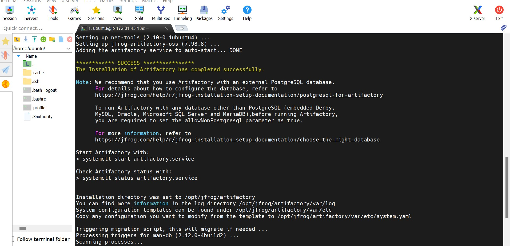

Install JFrog

```
sudo apt-get install gnupg2 -y
```


**Step 1: Add the GPG Key**

Use the gpg tool to add the GPG key directly to the trusted keyring:

```
curl -fsSL https://releases.jfrog.io/artifactory/api/gpg/key/public | sudo gpg --dearmor -o /usr/share/keyrings/jfrog-artifactory.gpg
```

**Step 2: Add the JFrog Repository**

Use the following command to add the repository to your sources list:

```
echo "deb [signed-by=/usr/share/keyrings/jfrog-artifactory.gpg] https://releases.jfrog.io/artifactory/artifactory-debs $(lsb_release -cs) main" | sudo tee /etc/apt/sources.list.d/jfrog-artifactory.list

```
**Step 3: Update the Package List and Install JFrog CLI**

Update the package list

```
sudo apt update
```

**Step 4: Update Repository Information**
```
sudo apt-get update -y
```
**Step 5: Install Artifactory OSS**

Install the OSS version of JFrog Artifactory:

```
sudo apt-get install jfrog-artifactory-oss -y

```
