## AWS CLOUD SOLUTION FOR 2 COMPANY WEBSITES USING A REVERSE PROXY TECHNOLOGY

**WARNING**: This infrastructure set up is NOT covered by `AWS free tier`. Therefore, ensure to DELETE ALL the resources created immediately after finishing the project. Monthly cost may be shockingly high if resources are not deleted. Also, it is strongly recommended to set up a budget and configure notifications when your spendings reach a predefined limit.
[Watch this video](https://www.youtube.com/watch?v=fvz0cphjHjg) to learn how to configure AWS budget.


**Let us Get Started**

You have been doing great work so far – implementing different Web Solutions and getting hands on experience with many great DevOps tools. In previous projects you used basic [Infrastructure as a Service (IaaS)](https://en.wikipedia.org/wiki/Infrastructure_as_a_service) offerings from AWS such as 
- [EC2 (Elastic Compute Cloud)](https://en.wikipedia.org/wiki/Amazon_Elastic_Compute_Cloud) as rented  Virtual Machines and
-  [EBS (Elastic Block Store)](https://en.wikipedia.org/wiki/Amazon_Elastic_Block_Store), you have also learned how to configure Key pairs and basic Security Groups.

But the power of Clouds is not only in being able to rent Virtual Machines – it is much more than that. From now on, you will start 
gradually study different Cloud concepts and tools on example of AWS, but do not be worried, your knowledge will not be limited to only AWS specific concepts – overall principles are common across most of the major Cloud Providers (e.g., Microsoft Azure and Google Cloud Platform).

> NOTE: The next few projects will be implemented manually. Before you begin to automate infrastructure in the cloud, it is very important that you can build the solution manually. Otherwise, programming your automation may become frustrating very quickly.

You will build a secure infrastructure inside AWS VPC (Virtual Private Cloud) network for a fictitious company (Choose an interesting 
name for it) named `tooling` that uses [WordPress CMS](https://wordpress.com/) for its main business website, and a Tooling Website
(https://github.com/melkamu372/tooling) for their DevOps team. As part of the company’s desire for improved security and performance, a decision has been made to use a reverse proxy technology from NGINX to achieve this.

Cost, Security, and Scalability are the major requirements for this project. Hence, implementing the architecture designed below,
ensure that infrastructure for both websites, WordPress and Tooling, is resilient to Web Server’s failures, can accomodate to increased traffic and, at the same time, has reasonable cost.
  
  


  
## Starting Off Your AWS Cloud Project
  
There are few requirements that must be met before you begin:

1. Properly configure your AWS account and Organization Unit [Watch How To Do This Here](https://youtu.be/9PQYCc_20-Q)

- Create an AWS Master account. (Also known as Root Account) 
- Within the Root account, create a sub-account and name it DevOps. (You will need another email address to complete this)
1.1.  In the AWS Management Console, navigate to AWS Organizations.
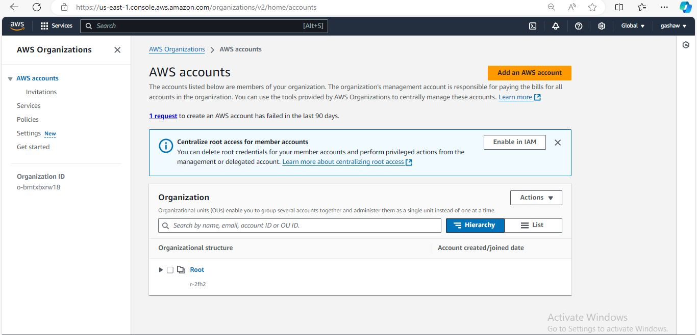

1.2. If you haven't already created an organization, click "Create an organization" and select "Enable All Features".
1.3. Click "Add account".
1.4. Select "Create account".
1.5. Fill in the required details:
 - Account name: DevOps
 - Email address: Provide a new email address (different from the root account).
1.6. Click "Create". AWS will send a verification email to the provided email address.
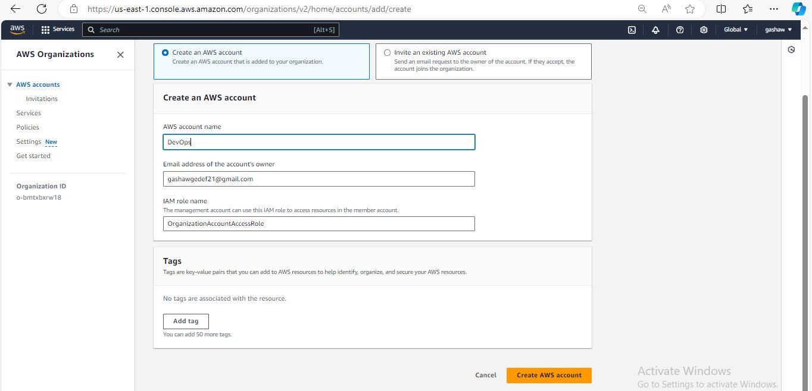

1.7. Verify the email address by following the instructions in the email sent by AWS.
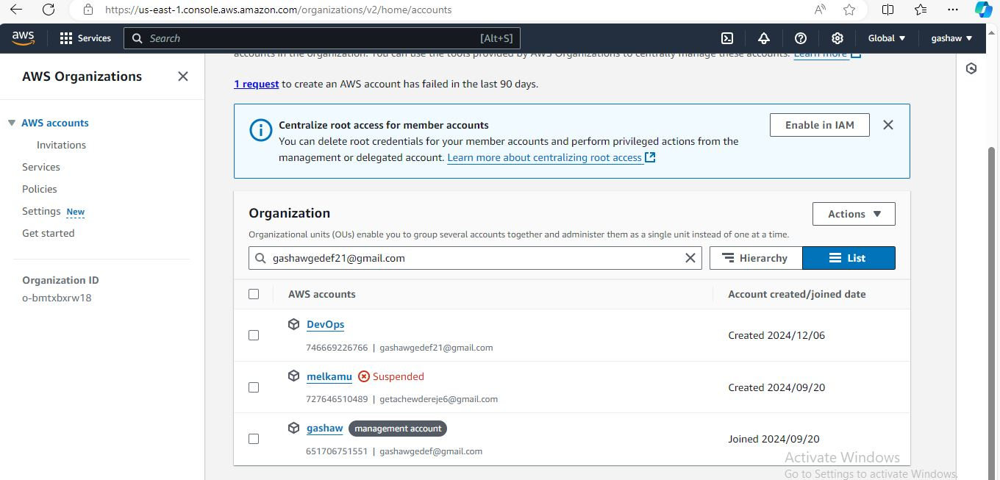

- Within the Root account, create an AWS Organization Unit (OU). Name it Dev. (We will launch Dev resources in there)
  
  **Create an Organizational Unit (OU) Named Dev**  > **In the AWS Organizations dashboard, click on "Organize accounts"** > **Click on "Create organizational unit"** > **Enter Dev as the name for the new OU** > **Click "Create organizational unit"**
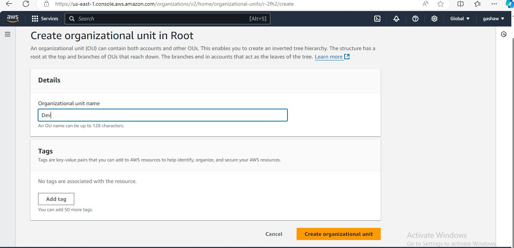

- Move the DevOps account into the Dev OU.
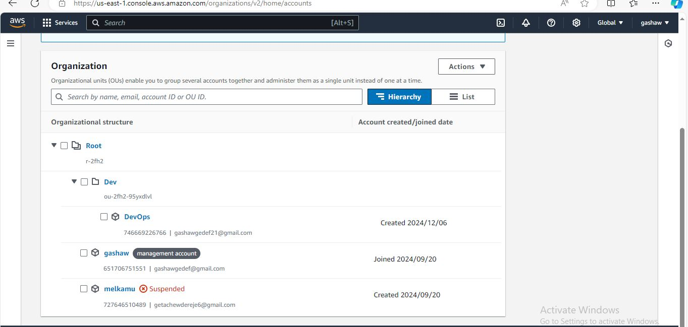

- Login to the newly created AWS account using the new email address.
   - Go to the AWS Management Console login page.
   - Enter the email address used for the DevOps account and click Next.
   - Click on "Forgot your password?" if you don't have the initial password.
   - Follow the instructions to reset the password and Log in with the new password


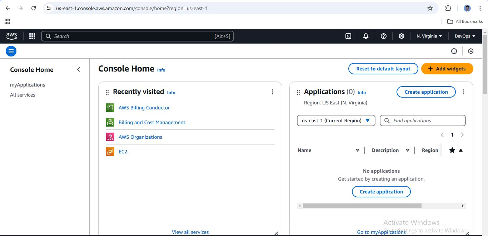


2. Create a free domain name for your fictitious company. I used [cloudns](https://www.cloudns.net/)

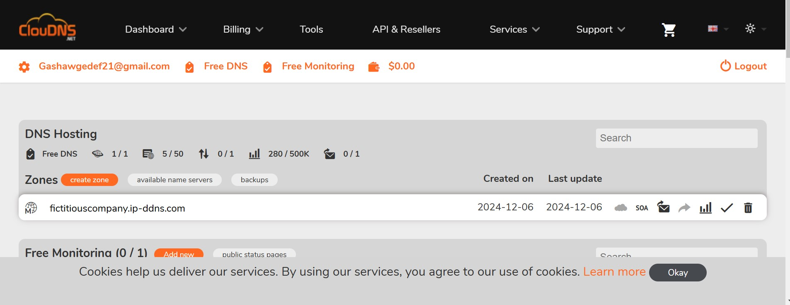


3. Create a hosted zone in AWS, and map it to your free domain. [Watch how to do that here](https://youtu.be/IjcHp94Hq8A)

 In the search bar, type `Route 53` and select `Route 53` from the results. >  In the Route 53 dashboard, click on `Hosted zones` in the left-hand navigation pane >
 Click `Create hosted zone`
Fill in the following details:
   -  Domain name: Enter your Freenom domain name (e.g., example.tk).
   -  Comment: Optional.
   -  Type: Select Public hosted zone.
   -  VPC: Leave this blank for a public hosted zone.
   -  Click Create hosted zone

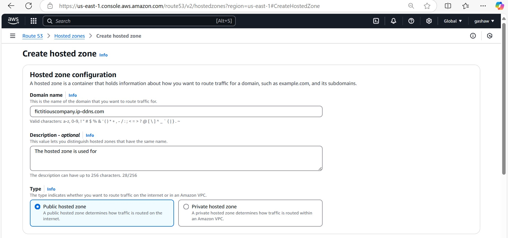

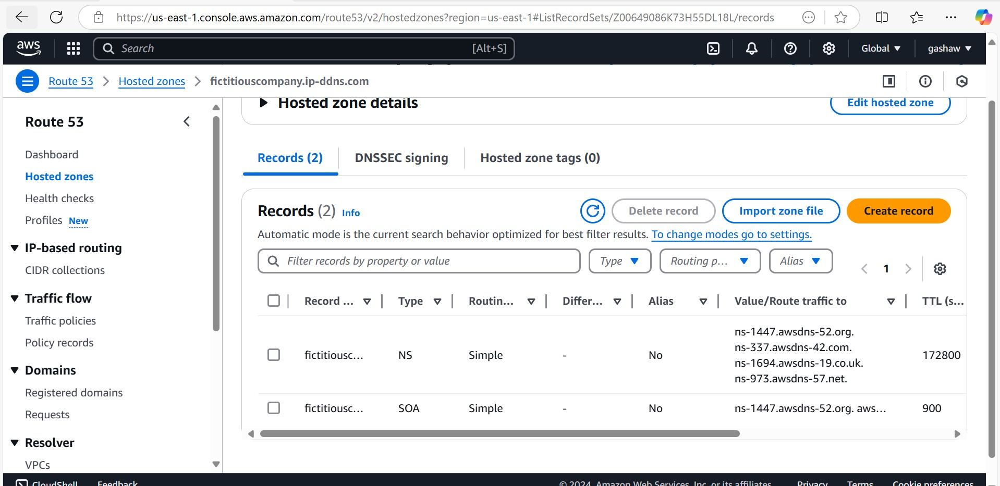

 Go to the domain name provider and edit the nameservers

Transfer the (4 server address) in the hostname zone in the (NS column) to the domain provider (nameservers).

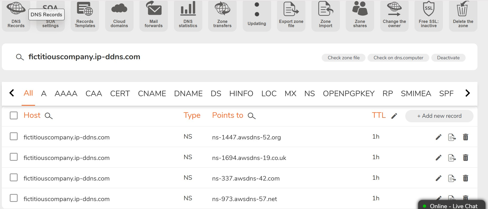

The next step is to get a certificate from AWS Certificate Manager. The reason we are creating a certificate first is because when creating `ALB` we need to select a certificate.

- Click on request a Cert > Request public cert > Next

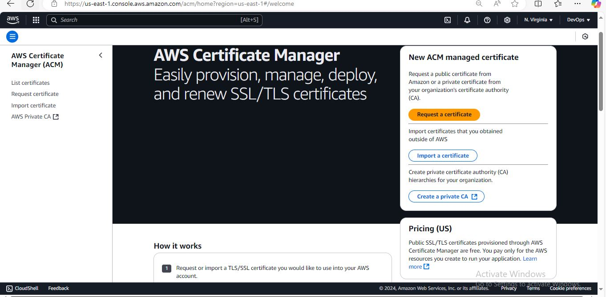

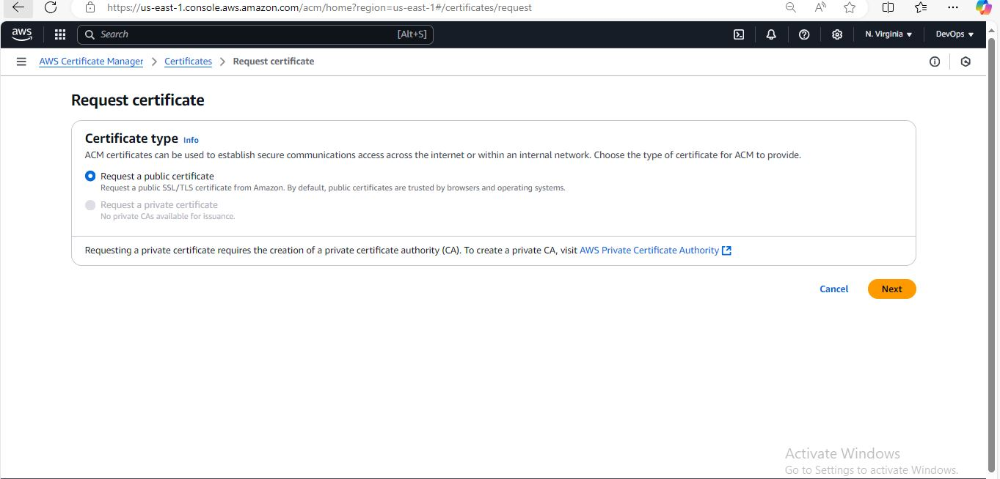


In the domain name, we are going to use a wild card i.e(*.). should in case we want to have another `name` or `subdomain`, the `WILDCARD` will make sure that any name before the domain name is attached to the `certificate`. 
e.g gashaw.fictitiouscompany.ip-ddns.com

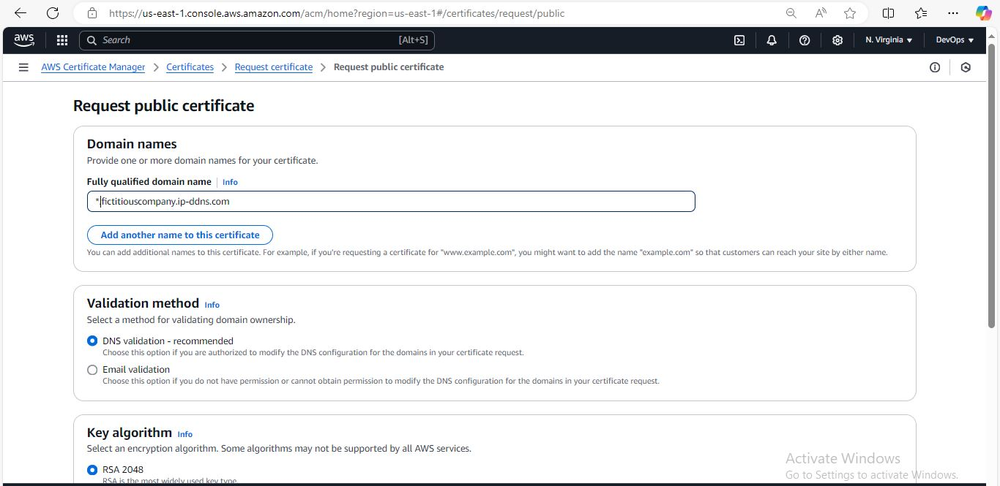

NOTE: Because we are using DNS verification is going to automatically write to the Rout53 to confirm

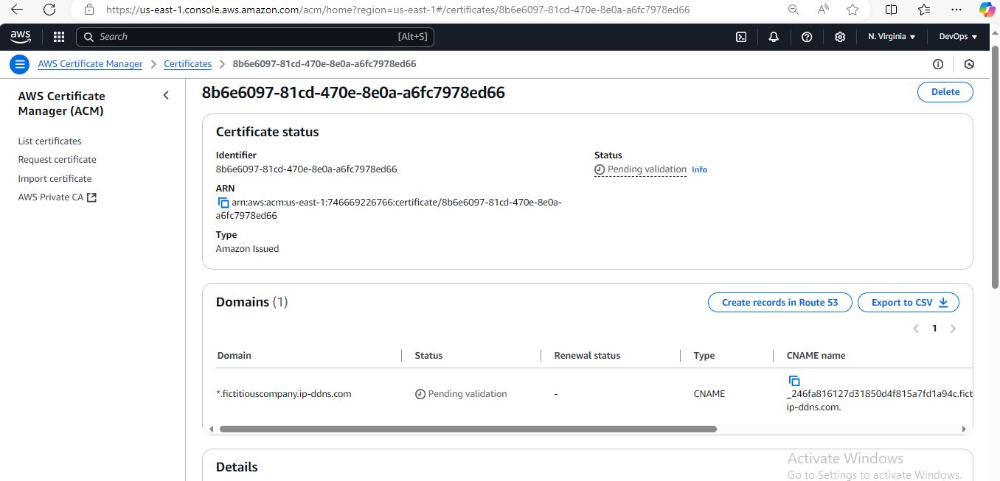

> NOTE : As you proceed with configuration, ensure that all resources are appropriately tagged, for example:

Project: Give your project a name `Project-15`

Environment: `dev`

Automated:`No` (If you create a recource using an automation tool, it would be `Yes`)


## SET UP A VIRTUAL PRIVATE NETWORK (VPC)

Set Up a Virtual Private Network (VPC)
Always make reference to the architectural diagram and ensure that your configuration is aligned with it.

1. Create a [VPC](https://docs.aws.amazon.com/vpc/latest/userguide/what-is-amazon-vpc.html)


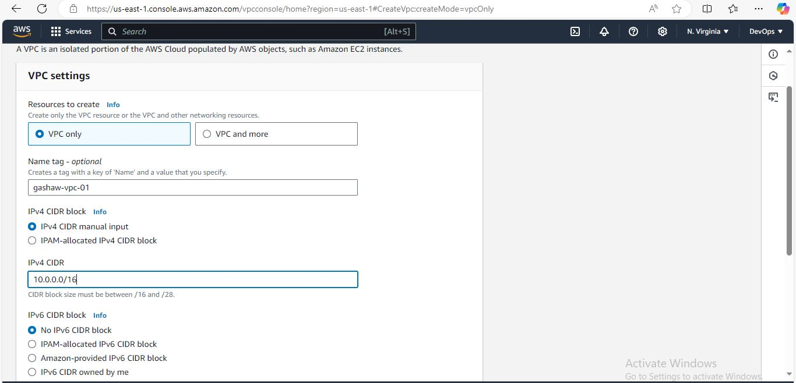

**Enable DNS hosting**

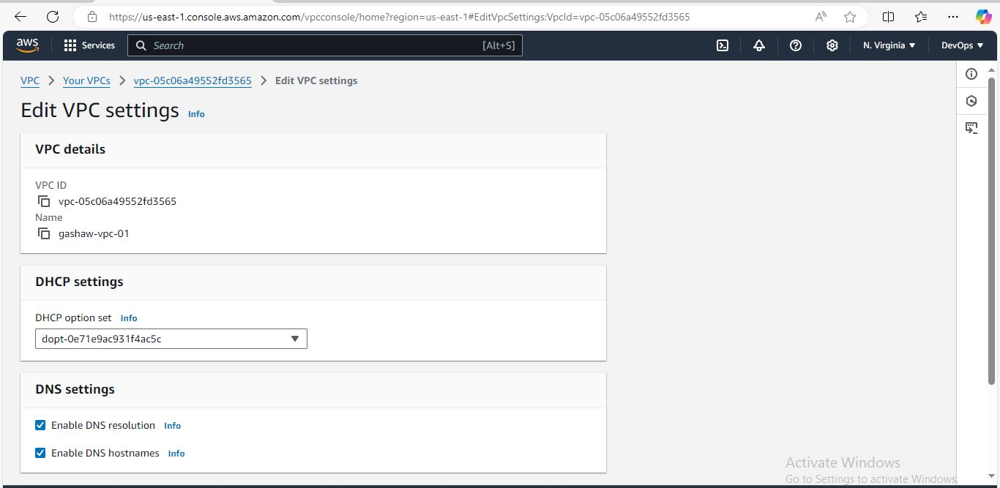


2. Create subnets as shown in the architecture  On the left panel menu of the VPC UI, click on Subnet > Create Subnet.

VPC: 10.0.0.0/16

- Public Subnet 1: 10.0.1.0/24  in Zone A
- Public Subnet 2: 10.0.2.0/24  in Zone B
- Private Subnet 1: 10.0.3.0/24  in Zone A
- Private Subnet 2: 10.0.4.0/24  in Zone B
- Private Subnet 3: 10.0.5.0/24  in Zone A
- Private Subnet 4: 10.0.6.0/24   in Zone B

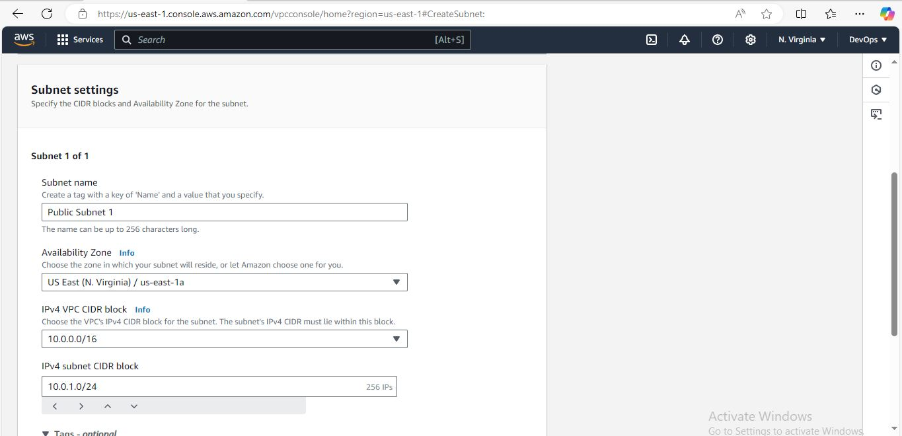

  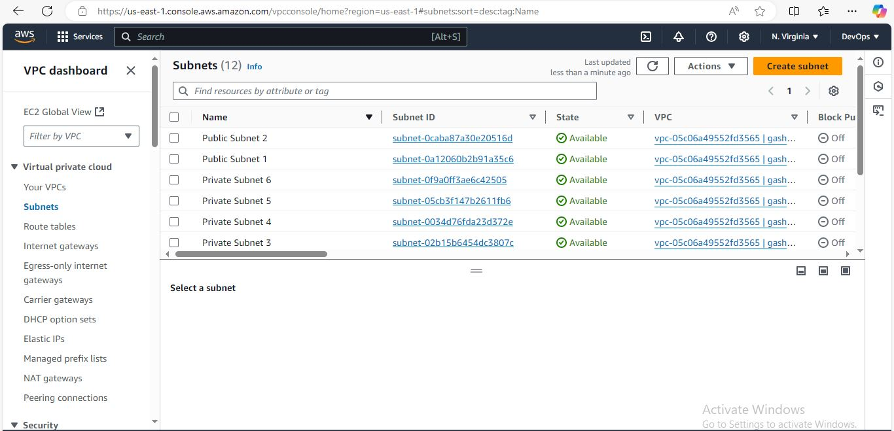


3. Create a route table and associate it with public subnets

**In the left-hand navigation pane, click on Route Tables** >  **Create route table button**

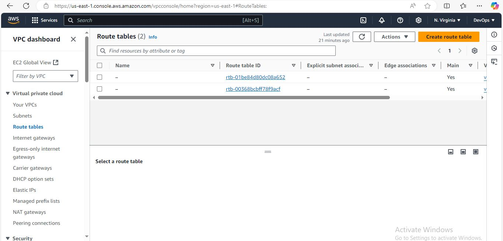
 
 **Enter the following details:**

   - Name tag: Provide a name for your route table  Public Route Table
   - VPC: Select the VPC you created earlier.
   - Click Create route table.

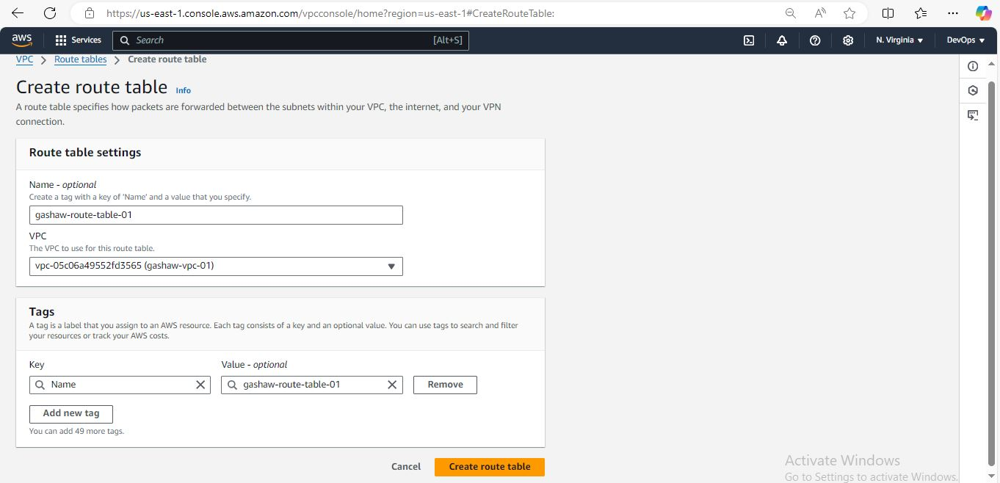


**Associate Route Table with Public Subnets**
- Select the Public Route Table from the list.
- Click on the Subnet associations tab.
- Click Edit subnet associations.
- In the Select subnets section, check the boxes for Public Subnet 1 and Public Subnet 2.
- Click Save associations.

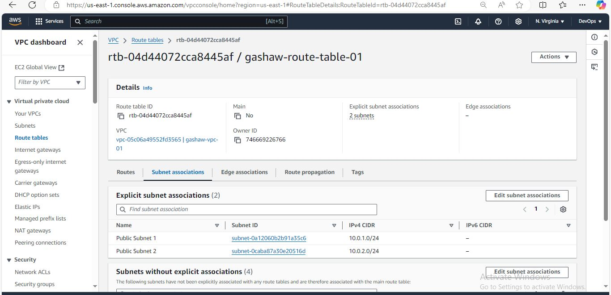


4. Create a Private route table and associate it with private subnets

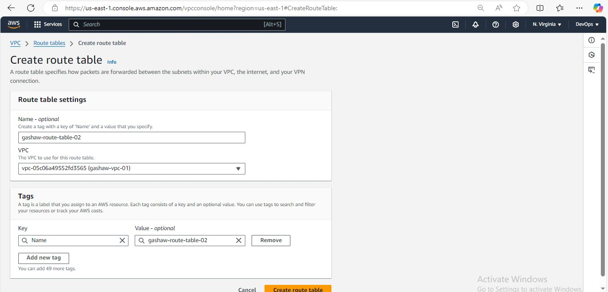

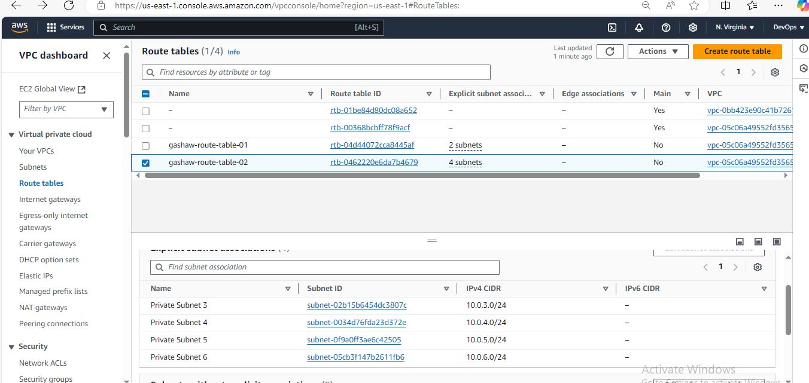


**Route Tables**


5. Create an [Internet Gateway](https://docs.aws.amazon.com/vpc/latest/userguide/VPC_Internet_Gateway.html)

Click on Internet Gateways on the left-hand side >  Create internet gateway > Enter a name for your internet gateway > Create internet gateway

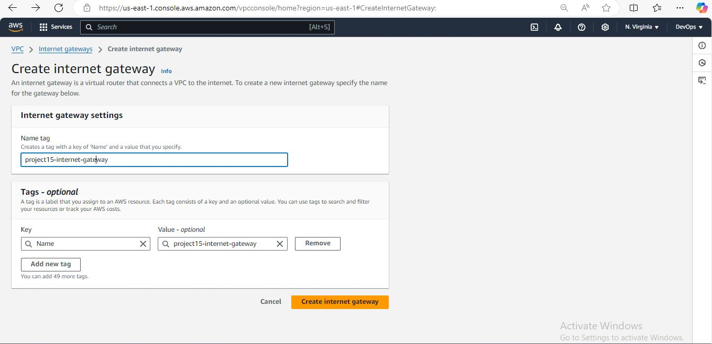


**Attach Internet Gateway to VPC**: Select the internet gateway you just created > Click the Actions dropdown, then select Attach to VPC >Select the VPC you created earlier >Click Attach internet gateway.

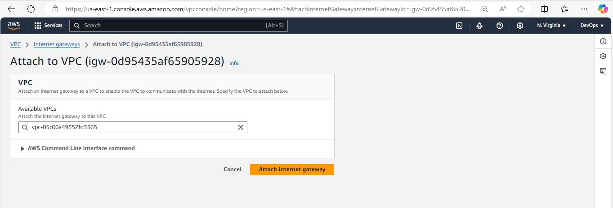

6. Edit a route in public route table, and associate it with the Internet Gateway. (This is what allows a public subnet to be accisble 
from the Internet)

Go back to Route Tables and select the Public Route Table  >  Click on the Routes tab > Click Edit routes.
Click Add route > Destination: 0.0.0.0/0 > Target: Select the internet gateway you created > Click Save routes

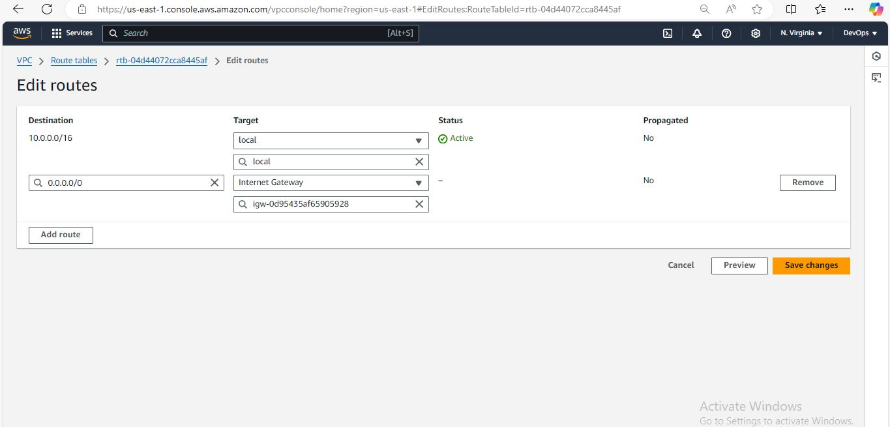


7. Create 3 [Elastic IPs](https://docs.aws.amazon.com/AWSEC2/latest/UserGuide/elastic-ip-addresses-eip.html) one for `Nat getway` and the other `2 will be used by Bastion hosts`

Create Elastic IP to configured with the NAT gateway. The NAT gateway enables connection from the public subnet to private subnet and it needs a static ip to make this happen. VPC > Elastic IP addresses > Allocate Elastic IP address - add a name tag and click on allocate


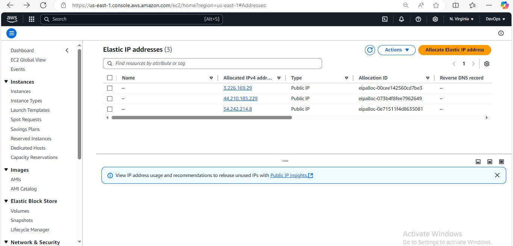

8. Create a Nat Gateway and assign one of the Elastic IPs the other 2 will be used by [Bastion hosts](https://aws.amazon.com/solutions/implementations/linux-bastion/))

Create a Nat Gateway and assign the Elastic IPs Click on VPC > NAT gateways > Create NAT gateway

Select a Public Subnet
Connection Type: Public
Allocate Elastic IP

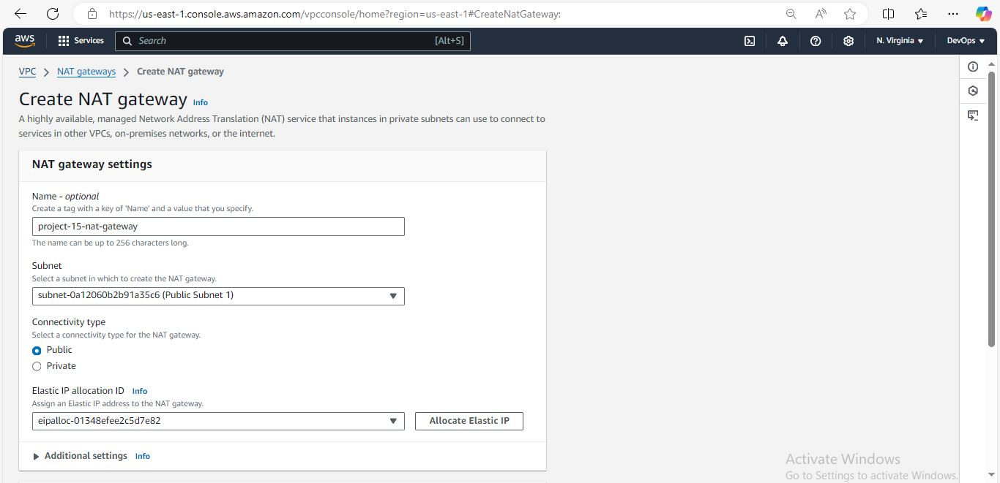

Update the Private route table - add allow anywhere ip and associate it the NAT gateway

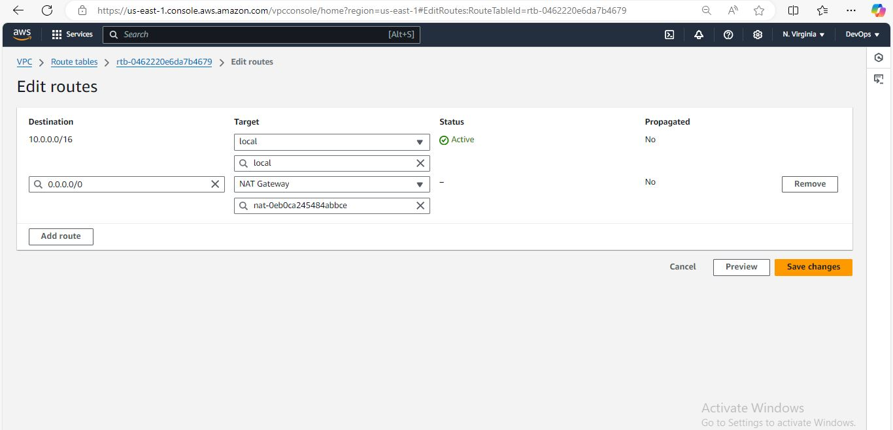

9. Create a Security Group for:


- **Nginx Servers**: Access to Nginx should only be allowed from a Application Load balancer (ALB). At this point, we have not created a 
load balancer, therefore we will update the rules later. For now, just create it and put some dummy records as a place holder.

- **Bastion Servers**: Access to the Bastion servers should be allowed only from workstations that need to SSH into the bastion servers.
Hence, you can use your workstation public IP address. To get this information, simply go to your terminal and type 
curl www.canhazip.com

- **Application Load Balancer**: ALB will be available from the Internet give it both HTTPS and HTTP from anywhere 0.0.0.0/0

- **Webservers** : Access to Webservers should only be allowed from the Nginx servers. Since we do not have the servers created yet, just put some dummy records as a place holder, we will update it later.

- **Data Layer** : Access to the Data layer, which is comprised of Amazon Relational Database Service (RDS) and Amazon Elastic File 
System (EFS) must be carefully desinged – only webservers should be able to connect to RDS, while Nginx and Webservers will have 
access to EFS Mountpoint.

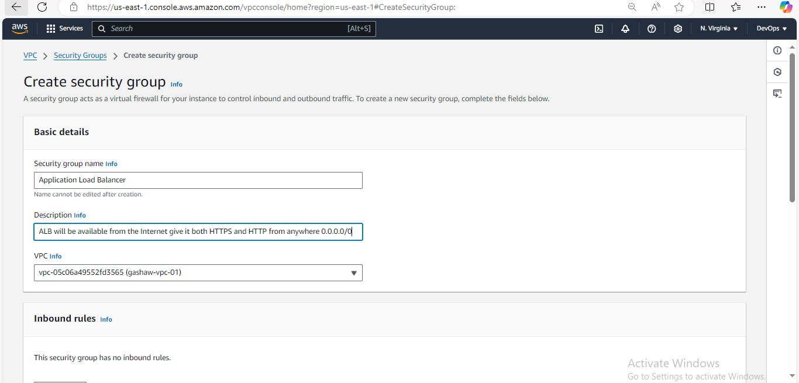

Create others like above

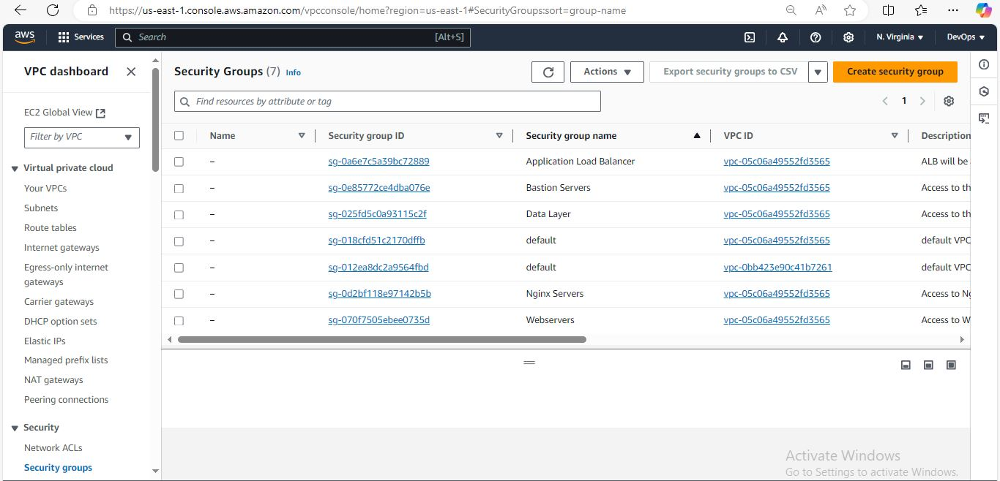


**Proceed With Compute Resources**
You will need to set up and configure compute resources inside your VPC. The recources related to compute are:

- EC2 Instances
- Launch Templates
- Target Groups
- Autoscaling Groups
- TLS Certificates
- Application Load Balancers (ALB)

## Set Up Compute Resources for Nginx  Provision EC2 Instances for Nginx

1. Create an EC2 Instance based on CentOS Amazon Machine Image (AMI) in any 2 Availability Zones (AZ) in any AWS Region 
(it is recommended to use the Region that is closest to your customers). Use EC2 instance of T2 family (e.g. t2.micro or similar)


2. Ensure that it has the following software installed:

- python
- ntp
- net-tools
- vim
- wget
- telnet
- epel-release
- htop

**Nginx ami installation**
```
sudo yum install -y https://dl.fedoraproject.org/pub/epel/epel-release-latest-9.noarch.rpm

sudo yum install -y https://rpms.remirepo.net/enterprise/remi-release-9.rpm

yum install wget vim python3 telnet htop git mysql net-tools chrony -y

systemctl start chronyd

systemctl enable chronyd
```
**Configure selinux policies for the webservers and nginx servers**
```
setsebool -P httpd_can_network_connect=1
setsebool -P httpd_can_network_connect_db=1
setsebool -P httpd_execmem=1
setsebool -P httpd_use_nfs 1
```
**This section will instll amazon efs utils for mounting the target on the Elastic file system**
```
git clone https://github.com/aws/efs-utils

cd efs-utils

yum install -y make

yum install -y rpm-build

make rpm 

yum install -y  ./build/amazon-efs-utils*rpm
```
**Seting up self-signed certificate for the nginx instance**
```
sudo mkdir /etc/ssl/private

sudo chmod 700 /etc/ssl/private

openssl req -x509 -nodes -days 365 -newkey rsa:2048 -keyout /etc/ssl/private/ACS.key -out /etc/ssl/certs/ACS.crt

sudo openssl dhparam -out /etc/ssl/certs/dhparam.pem 2048
```

3. Create an AMI out of the EC2 instance
Select the EC2 instance you want to create an AMI from  > Click on Actions > Image and templates > Create image.
- Provide a name and description for the image.
- Configure any additional options like reboot behavior.
- Click Create image
  
Prepare Launch Template For Nginx (One Per Subnet)
1. Make use of the AMI to set up a launch template
2. Ensure the Instances are launched into a public subnet
3. Assign appropriate security group
4. Configure Userdata to update yum package repository and install nginx

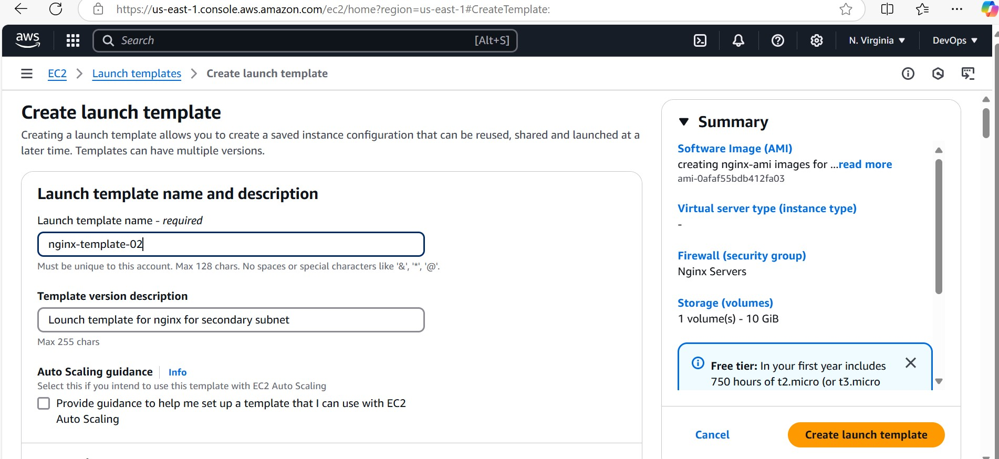

## Configure Target Groups

1. Select Instances as the target type
2. Ensure the protocol HTTPS on secure TLS port 443
3. Ensure that the health check path is /healthstatus
4. Register Nginx Instances as targets
5. Ensure that health check passes for the target group

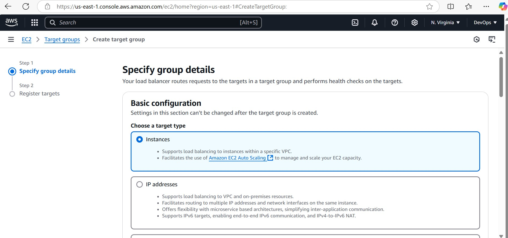


## CONFIGURE AUTOSCALING FOR NGINX

1. Select the right launch template
2. Select the VPC
3. Select both public subnets
4. Enable Application Load Balancer for the AutoScalingGroup (ASG)
5. Select the target group you created before
6. Ensure that you have health checks for both EC2 and ALB
7. The desired capacity is 2
8. Minimum capacity is 2
9. Maximum capacity is 4
10. Set scale out if CPU utilization reaches 90%
11. Ensure there is an SNS topic to send scaling notifications

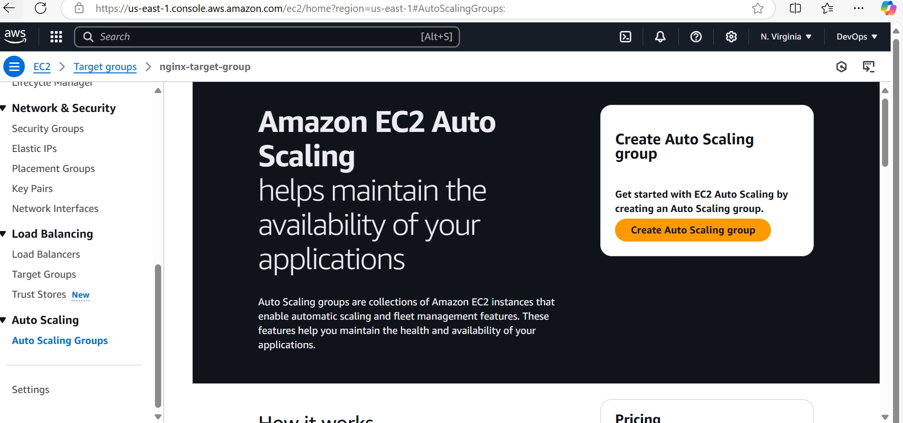

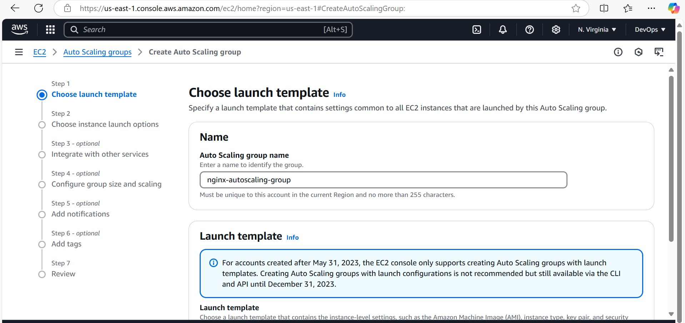

## Set Up Compute Resources for Bastion
Provision the EC2 Instances for Bastion

1. Create an EC2 Instance based on CentOS Amazon Machine Image (AMI) per each Availability Zone in the same Region and same AZ 
where you created Nginx server
2. Ensure that it has the following software installed

- python
- ntp
- net-tools
- vim
- wget
- telnet
- epel-release
- htop

We will use instance to create an ami for launching instances 

```
sudu su -
sudo yum install -y https://dl.fedoraproject.org/pub/epel/epel-release-latest-9.noarch.rpm

sudo yum install -y https://rpms.remirepo.net/enterprise/remi-release-9.rpm
yum install wget vim python3 telnet htop git mysql net-tools chrony -y 
systemctl start chronyd 
systemctl enable chronyd
```
3. Associate an Elastic IP with each of the Bastion EC2 Instances

4. Create an AMI out of the EC2 instance

 Here is sample for the one available zone

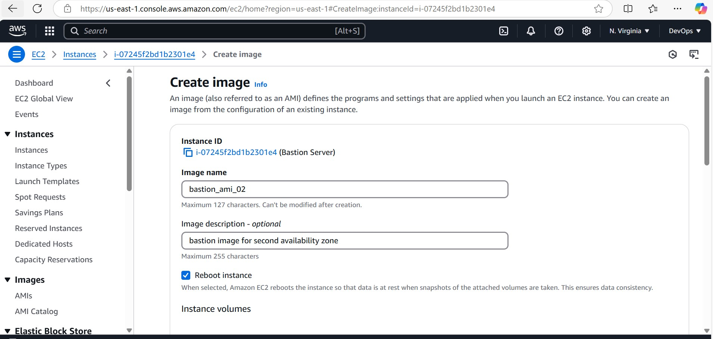

Prepare Launch Template For Bastion (One per subnet)

1. Make use of the AMI to set up a launch template
2. Ensure the Instances are launched into a public subnet
3. Assign appropriate security group
4. Configure Userdata to update yum package repository and install Ansible and git
 
 Here is sample for the one available zone

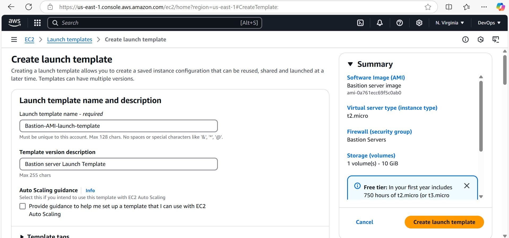

## Configure Target Groups

1. Select Instances as the target type
2. Ensure the protocol is TCP on port 22
3. Register Bastion Instances as targets
4. Ensure that health check passes for the target group

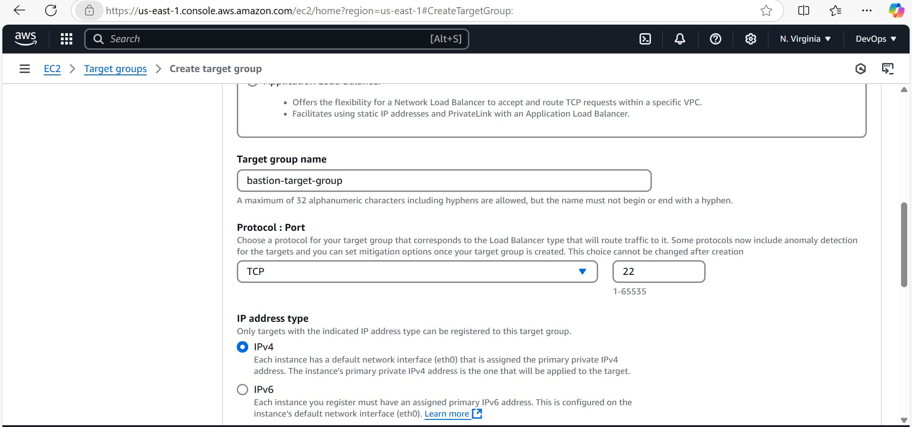

## CONFIGURE AUTOSCALING FOR BASTION

1. Select the right launch template
2. Select the VPC
3. Select both public subnets
4. Enable Application Load Balancer for the AutoScalingGroup (ASG)
5. Select the target group you created before
6. Ensure that you have health checks for both EC2 and ALB
7. The desired capacity is 2
8. Minimum capacity is 2
9. Maximum capacity is 4
10. Set scale out if CPU utilization reaches 90%
11. Ensure there is an SNS topic to send scaling notifications

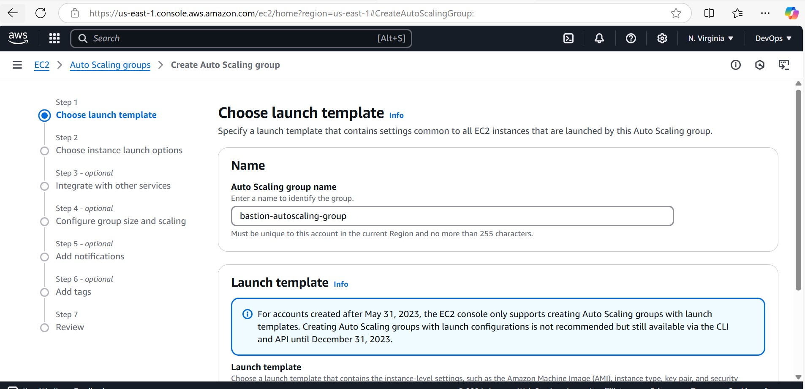

## Set Up Compute Resources for Webservers

Provision the EC2 Instances for Webservers
Now, you will need to create 2 separate launch templates for both the WordPress and Tooling websites

1. Create an EC2 Instance (Centos) each for WordPress and Tooling websites per Availability Zone (in the same Region).

2. Ensure that it has the following software installed

- python
- ntp
- net-tools
- vim
- wget
- telnet
- epel-release
- htop
- php

```
sudo yum install -y https://dl.fedoraproject.org/pub/epel/epel-release-latest-9.noarch.rpm
sudo yum install -y https://rpms.remirepo.net/enterprise/remi-release-9.rpm

yum install wget vim python3  php telnet htop git mysql net-tools chrony -y

systemctl start chronyd

systemctl enable chronyd
```

3. Create an AMI out of the EC2 instance select the EC2 instance you want to create an AMI from  > Click on Actions > Image and templates > Create image.
- Provide a name and description for the image.
- Configure any additional options like reboot behavior.
- Click Create image

**configure selinux policies for the webservers and nginx servers**
```
setsebool -P httpd_can_network_connect=1
setsebool -P httpd_can_network_connect_db=1
setsebool -P httpd_execmem=1
setsebool -P httpd_use_nfs 1
```
**instll amazon efs utils for mounting the target on the Elastic file system**
```
git clone https://github.com/aws/efs-utils

cd efs-utils

yum install -y make

yum install -y rpm-build

make rpm 

yum install -y  ./build/amazon-efs-utils*rpm
```
Setting up self-signed certificate for the apache webserver instance
```
yum install -y mod_ssl

openssl req -newkey rsa:2048 -nodes -keyout /etc/pki/tls/private/ACS.key -x509 -days 365 -out /etc/pki/tls/certs/ACS.crt

vi /etc/httpd/conf.d/ssl.conf
```

Prepare Launch Template For Webservers (One per subnet)

1. Make use of the AMI to set up a launch template
2. Ensure the Instances are launched into a public subnet
3. Assign appropriate security group
4. Configure Userdata to update yum package repository and install wordpress (Only required on the WordPress launch template)

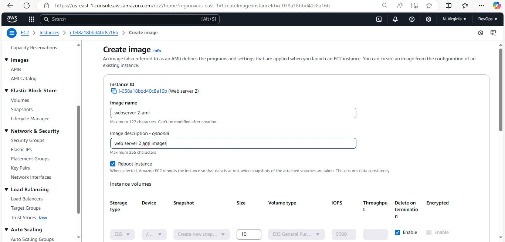

   **Instances are listed**
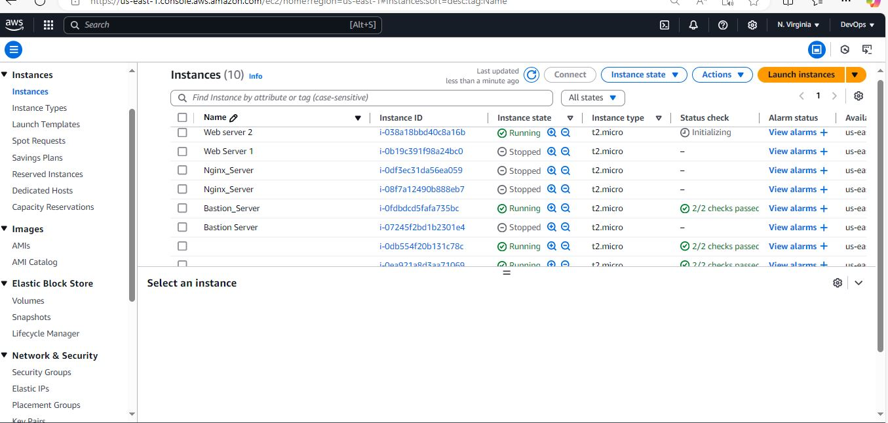

**Creating AMI from the instances**
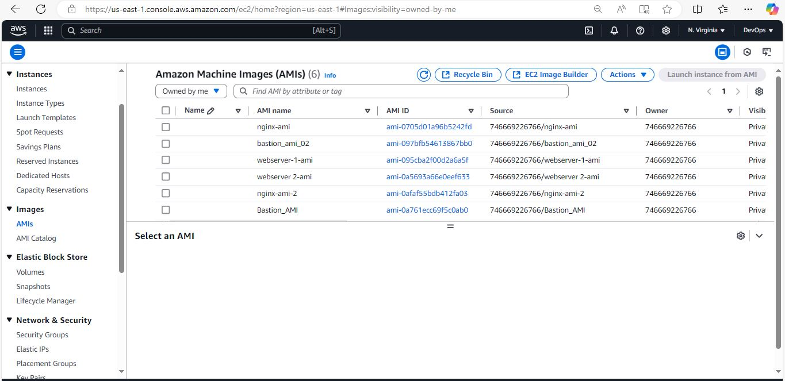

**Creating Target Groups**
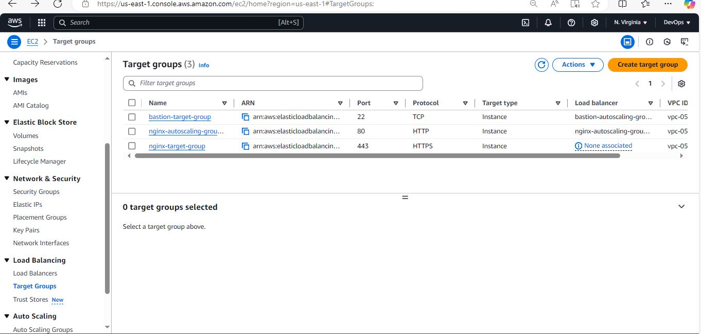


**Create Launch Templates**
The lunch templates requires AMIs (Amazon Machine Images) - Create AMIs from the instances and terminate them.From the created custom AMIs, create Launch templates for each of the instances


**Configure Autoscaling For Bastion**


1. Select the right launch template


2. Select the VPC
3. Select both public subnets
4. Enable Application Load Balancer for the AutoScalingGroup (ASG)


5. Select the target group you created before
6. Ensure that you have health checks for both EC2 and ALB
7. The desired capacity is 2
8. Minimum capacity is 2
9. Maximum capacity is 4
10. Set scale out if CPU utilization reaches 90%


11. Ensure there is an SNS topic to send scaling notifications


## Configure Autoscaling For Nginx repate same thing for this also

1. Select the right launch template
2. Select the VPC
3. Select both public subnets
4. Enable Application Load Balancer for the AutoScalingGroup (ASG)
5. Select the target group you created before
6. Ensure that you have health checks for both EC2 and ALB
7. The desired capacity is 2
8. Minimum capacity is 2
9. Maximum capacity is 4
10. Set scale out if CPU utilization reaches 90%

**TLS Certificates From Amazon Certificate Manager (ACM) you will need TLS certificates to handle secured connectivity to your Application Load Balancers (ALB)**

1. Navigate to AWS ACM
2. Request a public wildcard certificate for the domain name you registered in Freenom
3. Use DNS to validate the domain name
4. Tag the resource

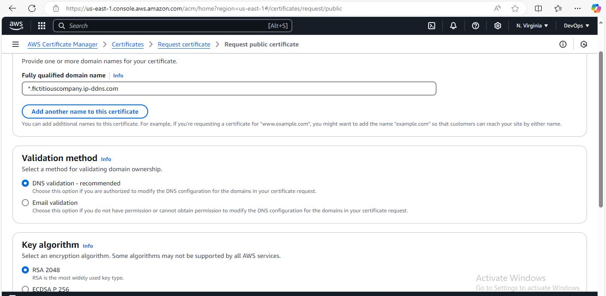


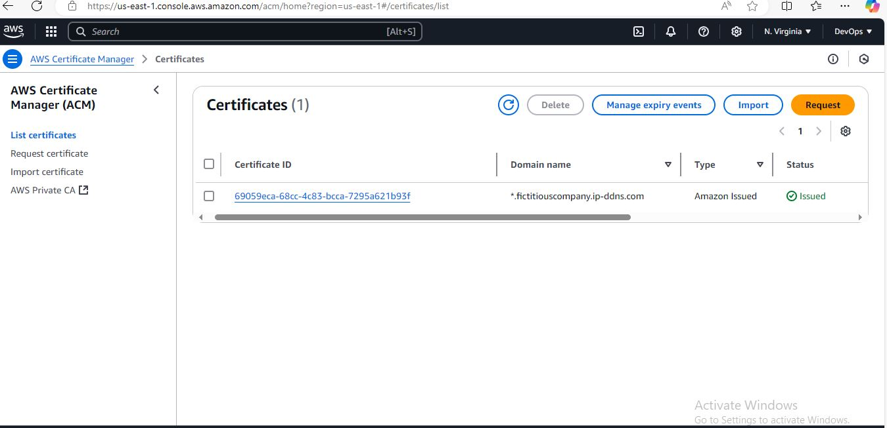

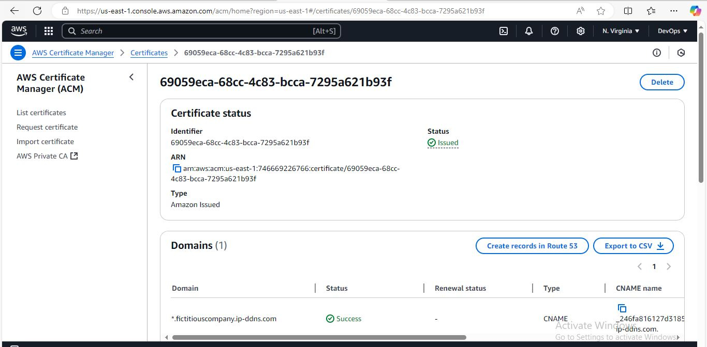


## CONFIGURE APPLICATION LOAD BALANCER (ALB) Application Load Balancer To Route Traffic To NGINX
Nginx EC2 Instances will have configurations that accepts incoming traffic only from Load Balancers. No request should go directly
to Nginx servers. With this kind of setup, we will benefit from intelligent routing of requests from the `ALB` to Nginx servers 
across the 2 `Availability Zones`. We will also be able to `offload SSL/TLS certificates` on the ALB instead of Nginx. Therefore, 
Nginx will be able to perform faster since it will not require extra compute resources to validate certificates for every request.

1. Create an Internet facing ALB

Open the Amazon EC2 console > Navigate to Load Balancers under the Load Balancing section > Click Create Load Balancer and select Application Load Balancer >  Configure the ALB > 

- Name: Enter a name for your ALB
- Scheme: Choose Internet-facing
- IP address type: Choose ipv4
- Listeners: Add a listener for HTTPS (port 443).
- Availability Zones: Select the appropriate VPC and Availability Zones (AZs). Ensure that the ALB is created within subnets that have internet access.


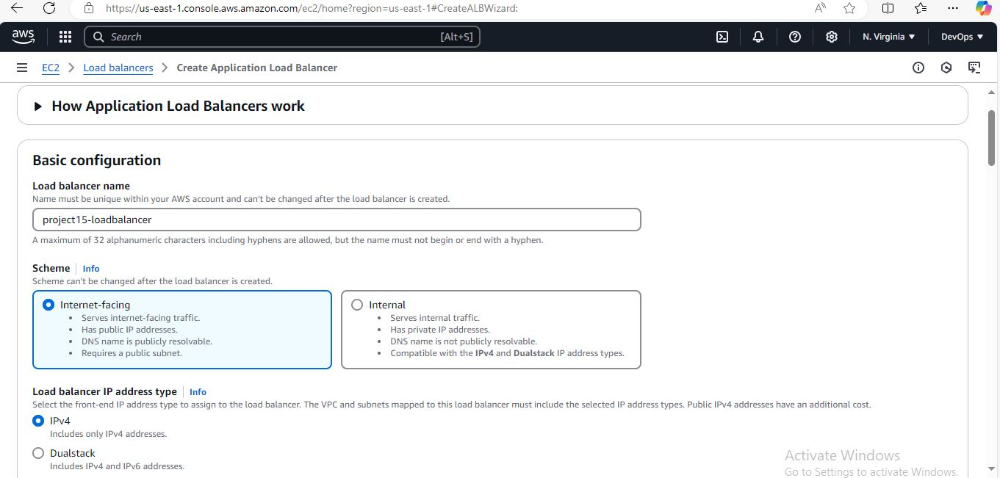


2. Ensure that it listens on HTTPS protocol (TCP port 443)
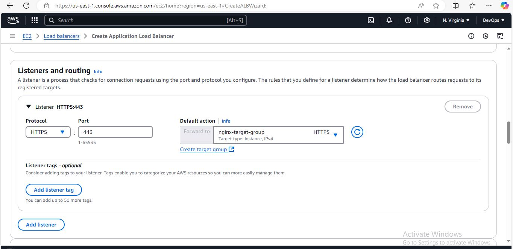

3. Ensure the ALB is created within the appropriate VPC | AZ | Subnets
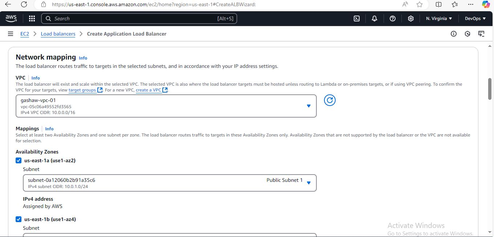


4. Choose the Certificate from ACM
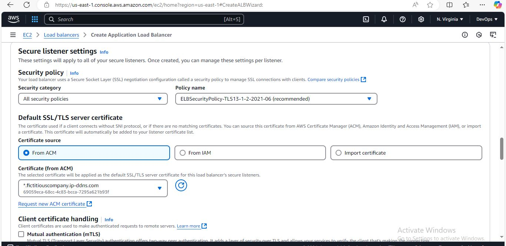

5. Select Security Group


6. Select Nginx Instances as the target group


## Application Load Balancer To Route Traffic To Web Server
Since the webservers are configured for auto-scaling, there is going to be a problem if servers get dynamically scalled out or in. 
Nginx will not know about the new IP addresses, or the ones that get removed. Hence, Nginx will not know where to direct the traffic.

To solve this problem, we must use a load balancer. But this time, it will be an internal load balancer. Not Internet facing since
the webservers are within a private subnet, and we do not want direct access to them.


1. Create an Internal ALB


2. Ensure that it listens on HTTPS protocol (TCP port 443)


3. Ensure the ALB is created within the appropriate VPC | AZ | Subnets


4. Choose the Certificate from ACM


5. Select Security Group


6. Select webserver Instances as the target group
7. Ensure that health check passes for the target group


> NOTE: This process must be repeated for both WordPress and Tooling websites.

### Setup EFS
Amazon Elastic File System (Amazon EFS) provides a simple, scalable, fully managed elastic Network File System (NFS) for use with
AWS Cloud services and on-premises resources. In this project, we will utulize EFS service and mount filesystems on both Nginx 
and Webservers to store data.

1. Create an EFS filesystem


2. Create an EFS mount target per AZ in the VPC, associate it with both subnets dedicated for data layer
3. Associate the Security groups created earlier for data layer.


4. Create an EFS access point. Create Access Points mount the applications wordpress and tooling


### Setup RDS
Pre-requisite: Create a KMS key from Key Management Service (KMS) to be used to encrypt the database instance. Create KMSa Key Management Service to encrypt the Database

Open the AWS Management Console > Navigate to the AWS Key Management Service (KMS) > Click Create Key >
- Key Type: Choose Symmetric.
- Key Usage: Select Encrypt and decrypt.


**Configure Key:**
- Key Alias: Enter an alias for your key  `project15_key_RDS`
- Key Description: Optionally add a description.


Define Key Administrative Permissions: Add IAM roles or users who can manage this key.


Define Key Usage Permissions:


Review and Create:


Review the settings and click Create Key.


Amazon Relational Database Service (Amazon RDS) is a managed distributed relational database service by Amazon Web Services. 
This web service running in the cloud designed to simplify setup, operations, maintenans & scaling of relational databases. 
Without RDS, Database Administrators (DBA) have more work to do, due to RDS, some DBAs have become jobless

To ensure that your databases are highly available and also have failover support in case one availability zone fails, we will 
configure a multi-AZ set up of RDS MySQL database instance. In our case, since we are only using 2 AZs, we can only failover to
one, but the same concept applies to 3 Availability Zones. We will not consider possible failure of the whole Region, but for 
this AWS also has a solution – this is a more advanced concept that will be discussed in following projects.

To configure RDS, follow steps below:

1. Create a subnet group and add 2 private subnets (data Layer)


2. Create an RDS Instance for mysql 8.*.*


3. To satisfy our architectural diagram, you will need to select either Dev/Test or Production Sample Template. But to minimize AWS 
cost, you can select the Do not create a standby instance option under Availability & durability sample template (The production 
template will enable Multi-AZ deployment)


4. Configure other settings accordingly (For test purposes, most of the default settings are good to go). In the real world, you will
need to size the database appropriately. You will need to get some information about the usage. If it is a highly transactional 
database that grows at 10GB weekly, you must bear that in mind while configuring the initial storage allocation, storage autoscaling, 
and maximum storage threshold.


5. Configure VPC and security (ensure the database is not available from the Internet)


6. Configure backups and retention


7. Encrypt the database using the KMS key created earlier


8.Enable CloudWatch monitoring and export Error and Slow Query logs (for production, also include Audit)


> Note This service is an expensinve one. Ensure to review the monthly cost before creating. **(DO NOT LEAVE ANY SERVICE RUNNING FOR LONG)Create other records such as CNAME, alias and A records**

**NOTE:** You can use either CNAME or alias records to achieve the same thing. But alias record has better functionality because it is 
a faster to resolve DNS record, and can coexist with other records on that name. Read here to get to know more about the differences.


- Create an alias record for the root domain and direct its traffic to the ALB DNS name.
- Create an alias record for tooling.<yourdomain>.com and direct its traffic to the ALB DNS name.

You need to ensure that the main domain for the WordPress website can be reached, and the subdomain for Tooling website can also be 
reached using a browser.


 Worpress website


### The end of Project 15 
In this project We have just created a secured, scalable and cost-effective infrastructure to host 2 enterprise websites using various Cloud services
from AWS. At this point, your infrastructure is ready to host real websites’ load. Since it is a pretty expensive infrastructure
to keep it up and running, we are going to start using Infrastructure as Code tool `Terraform` to easily provision and destroy this set up.
